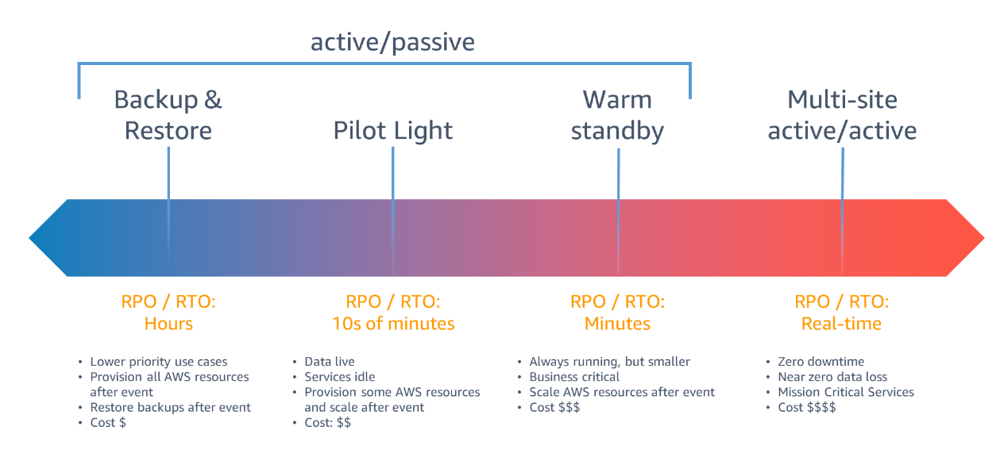

# Backup and Recovery

## Các yếu tố cần quan tâm

- **RPO**: Recovery Point Objective. Khi sự cố xảy ra thì có bao nhiêu data sẽ có thể mất và không thể phục hồi.
- **RTO**: Recovery Time Objective. Khi sự cố xảy ra thì mất bao lâu để khôi phục lại hệ thống.
- Hai thông số này sẽ ảnh hưởng tới việc lựa chọn chiến lược backup, tần suất backup cũng như disaster recovery.

- Các chiến lược disaster recovery

## Một vài hình thức backup

- **Backup EC2**
  - Snapshot Data volume
  - Create AMI of whole instance
  - Enable Life cycle policy
- **Backup RDS (or database)**
  - Dump data to External Volume, and/or copy to S3 Bucket
  - Enable default backup (create snapshot daily)
  - Create custom backup using AWS Backup (custom plan, retention policy)
  - Enable Backtracking feature (Aurora only)
- **Backup EFS**
  - Backup ondemand thủ công, auto backup hoặc sử dụng AWS Backup.
  - Sử dụng tính năng data replication sang một EFS khác (có thể khác region).
- **Backup S3 bucket**
  - Backup liên tục (Continous backup) cho phép recovery lại bất kỳ thời điểm nào trong 35 days.
  - Backup định kỳ: vd 1hour, 12hours, 1 day, 1 week, 1 month.
  - Replica data liên tục sang một bucket khác (có thể khác region).
- **... and more**

## AWS Backup

- AWS Backup là một dịch vụ của AWS được thiết kế để quản lý việc backup và khôi phục dữ liệu trên các AWS Service khác nhau. Nó cung cấp một giao diện đơn giản để tạo, quản lý và kiểm soát các hoạt động backup dữ liệu, giúp người dùng dễ dàng duy trì tính toàn vẹn và khả dụng của dữ liệu trong môi trường AWS.
- AWS Backup hỗ trợ việc backup và khôi phục dữ liệu cho các dịch vụ như EBS, Amazon RDS, Amazon DynamoDB, EFS, và Amazon Storage Gateway. Dịch vụ này cung cấp các tính năng như:
  - Tạo và quản lý các backup plan tự động.
  - Quản lý và theo dõi backup: Người dùng có thể xem và quản lý tất cả các hoạt động backup từ một giao diện duy nhất.
  - Khôi phục dữ liệu: AWS Backup cho phép khôi phục dữ liệu từ các backup đã tạo. Người dùng có thể khôi phục toàn bộ dữ liệu hoặc chỉ các phần cụ thể của nó, và có khả năng khôi phục vào các vùng khác nhau trong cùng một hoặc khác một tài khoản AWS.
