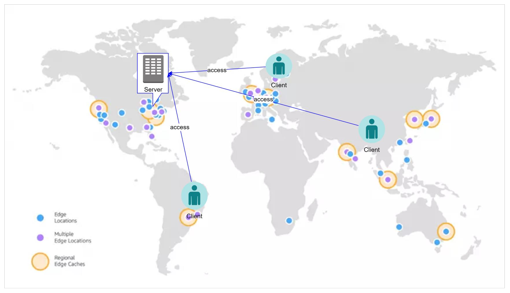

# Content Delivery Service (CDN) - CloudFront

- [What?](#what)
- [Mô hình hoạt động của một mạng CDN](#mô-hình-hoạt-động-của-một-mạng-cdn)
- [Các khái niệm cơ bản của CloudFront](#các-khái-niệm-cơ-bản-của-cloudfront)
- [How CloudFront deliver content to user?](#how-cloudfront-deliver-content-to-user)
- [Usecase](#usecase)
- [Usecase sample](#usecase-sample)
  - [Hosting static website](#hosting-static-website)
  - [Server media (video, image)](#server-media-video-image)
  - [Customize at the edge](#customize-at-the-edge)
- [CloudFront pricing](#cloudfront-pricing)
- [CloudFront behavior](#cloudfront-behavior)
- [CloudFront Cache Policy](#cloudfront-cache-policy)
- [CloudFront Origin request policy](#cloudfront-origin-request-policy)

## What?

- Là một CDN service của AWS.
- CDN(Content Delivery Network): là một mạng lưới giúp delivery nội dung tới người dùng cuối một cách nhanh chóng nhờ vào việc điều hướng request của họ tới các máy chủ chứa tài nguyên gần nhất.

## Mô hình hoạt động của một mạng CDN

- **Khi không có CDN**:
  - Tài nguyên của server sẽ được deliver tới client một cách trực tiếp.
  - Tuỳ vào khoảng cách địa lý mà tốc độ truy cập sẽ nhanh hay chậm.
  

- **Khi có CDN**:
  - Tài nguyên của server sẽ được cache trên các máy chủ Edge
  - Request của user tới một tài nguyên trên CloudFront sẽ được redirect tới máy chủ Edge gần nhất.
  

## Các khái niệm cơ bản của CloudFront

- **Distribution**: AWS CloudFront phân phối nội dung từ origin đến các edge location thông qua một distribution. Một distribution định nghĩa cách CloudFront phân phối nội dung, bao gồm địa chỉ của origin, các edge location được sử dụng, các thiết lập security & caching.
- **Edge Location**: AWS CloudFront sử dụng một mạng lưới toàn cầu các edge location, là các điểm đặt máy chủ trên khắp thế giới, để phân phối nội dung đến người dùng ở gần nhất vị trí đó.
- **Origin**: Đây là nơi lưu trữ nội dung gốc (origin content) của bạn, bao gồm các tập tin, ứng dụng web, API và Database. Origin có thể là một Web server, S3 bucket, hoặc các dịch vụ AWS khác.
- **Cache**: AWS CloudFront lưu trữ các tài nguyên tại edge location để giảm thời gian phản hồi và tăng tốc độ tải trang web. Các tài nguyên này bao gồm hình ảnh, tập tin CSS và JavaScript.
- **Logging and Reporting**: AWS CloudFront cung cấp các báo cáo về hoạt động của distribution, bao gồm lưu lượng và số lần truy cập.
- **Security**: AWS CloudFront hỗ trợ nhiều tính năng bảo mật, bao gồm kết nối HTTPS, chữ ký số (Certificate) và xác thực người dùng.
- **Customize at the Edge**: thông qua cơ chế Lambda@Edge, cho phép bạn thực thi các function trên các sự kiện CloudFront. Lợi thế về tốc độ và hiệu suất so với thực thi ở Origin. Một số use-case có thể kể đến như: Authen/Author, xử lý tính toán đơn giản, SEO, Intelligent routing, Anti Bot, Realtime image transformation, A/B Testing, User prioritilization

## How CloudFront deliver content to user?

- User access website, request một tài nguyên vd HTML file, Image, CSS..
- DNS điều hướng request của user tới CloudFront edge location gần nhất (dựa theo độ trễ).
- Gồm 3 bước:
  - CloudFront forward request tới Origin server (một HTTP server hoặc s3 bucket).
  - Origin server trả kết quả cho edge location.
  - Ngay sau khi nhận được firstbyte response, edge location forward object tới end-user đồng thời cache lại nội dung cho request lần sau.

*Từ lần request thứ 2 trở đi, mặc định edge location sẽ trả về object được yêu cầu mà không gọi tới origin server -> tăng tốc độ truy cập.*

## Usecase

- Tăng tốc website (Image, CSS, Document, Video,...)
- On demand video & video streaming.
- Field level encrypt: CloudFront tự động mã hoá data được gửi lên từ người dùng, chỉ có backend application có key có thể giải mã.
- Customize at the edge: Trả về mã lỗi khi server maintain hoặc authorize user trước khi forward request tới backend. Cần sử dụng Lambda@Edge

## Usecase sample

### Hosting static website

- Website static (chỉ gồm HTML/css/js...) có thể được
deploy lên S3 kết hợp với CloudFront.
- Hầu hết các framework hiện nay như Angular, Vue, Nodejs đều hỗ trợ build website thành dạng satic chỉ gồm HTML, css, javascript để deploy lên S3.

### Server media (video, image)

Media được phân phối tới end user thông qua CloudFront cho trải nghiệm tốt hơn do nội dung được redirect tới
Edge Location gần với User nhất.

### Customize at the edge

Sử dụng Lambda@Edge để phân biệt user sử dụng subsciption information lưu ở DynamoDB (có enable Global
table).
Tuỳ theo subscription khác nhau (premium/normal) mà
sẽ có các ưu tiên về xử lý khác nhau, vd user premium được redirect tới máy chủ mạnh hơn user normal.

## CloudFront pricing

- No Up-front fee, người dùng chỉ trả tiền cho những gì sử dụng.
- Lượng data thực tế tranasfer out to internet.
- CloudFront function, Lambda@Edge.
- Invalidation Request (clear cache).
- Real-time log.
- Field level encrypt.

## CloudFront behavior

- Một CloudFront distribution có thể có nhiều hơn một Origin server phía sau.

**Ex:** một hệ thống gồm có 1 S3 bucket host static website, 1 backend server gồm ALB + Container muốn sử dụng chung một CloudFront distribution.

=> Cần có cơ chế phân biệt request nào sẽ điều hướng tới đâu.

- Behavior cho phép định nghĩa request với các pattern khác nhau sẽ được forward tới các origin khác nhau

- Bằng việc cấu hình các behavior khác nhau, CloudFront giúp điều hướng request của người dùng tới đúng origin mong muốn.

*Lưu ý khi setting behavior cần quan tâm tới thứ tự trước sau của các behavior, vì khi match 1 path rồi sẽ không đánh giá path tiếp theo.*

## CloudFront Cache Policy

- CloudFront cache policy là một cấu hình định nghĩa CloudFront sẽ cache và serves content như thế nào đối với User.
- Cache policy có thể được định nghĩa riêng cho từng distribution hoặc behavior.
- **Ex:** *thời gian content được cache, compress hay không?, forward cookies & query strings hay không?*
- Việc apply caching policy khác nhau cho từng distribution hoặc behavior, cho phép tinh chỉnh việc control caching cho từng URL hoặc request pattern. Việc này giúp tối ưu hoá caching behavior cho từng loại content khác nhau, **Ex:** *Static assets (image, css, js, video...) hoặc dynamic API response.*

## CloudFront Origin request policy

- CloudFront origin request policy định nghĩa cách CloudFront xử lý request tới origin.
- Khi user request content trên CloudFront, request được forward tới các origin như S3, EC2, ALB. Origigin Request Policy cho phép modify request trước khi forward tới origin.
- Có thể add/modify/remove header hoặc query string để optimize caching, tăng performance.
- Có thể cấu hình CloudFront sign hoặc encrypt request để bảo vệ backend khỏi những access unauthorized.
- Origin request policy hữu dụng khi có kiến trúc backend phức tạp ví dụ như có nhiều loại origin server.
