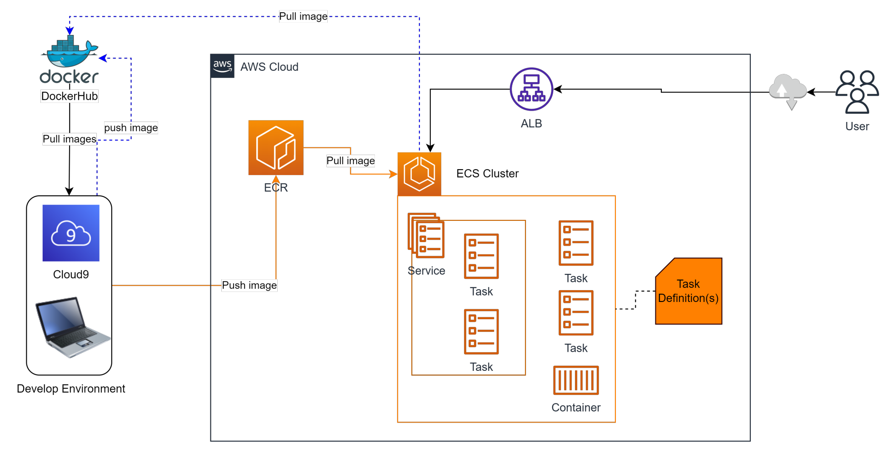

# Container Service - ECS, ECR

- [Elastic Container Registry - ECR](#elastic-container-registry---ecr)
- [Elastic Container Service - ECS](#elastic-container-service---ecs)
- [Tính năng của ECS](#tính-năng-của-ecs)
- [Các thành phần của ECS](#các-thành-phần-của-ecs)
- [Sample hệ thống triển khai use ECS, ECR](#sample-hệ-thống-triển-khai-use-ecs-ecr)
- [Cloud Map](#cloud-map)

## Elastic Container Registry - ECR

- Elastic Container Registry (ECR) là một dịch vụ của AWS cung cấp khả năng quản lý và lưu trữ các Docker Image.
- ECR là một Registry dựa trên cloud computing, được thiết kế đặc biệt để làm việc với các container hóa và môi trường chạy container của AWS.
- **Registry**: đơn vị quản lý của ECR (giống một repository). Thông thường một Registry sẽ chỉ lưu image của một ứng dụng.
- **Image**: Tương tự Docker Image. Các Image trên Registry cần đánh tag để quản lý.

## Elastic Container Service - ECS

- Elastic Container Service (ECS) là một dịch vụ quản lý container đám mây do Amazon Web Services (AWS) cung cấp. - Nó cho phép bạn chạy và quản lý các ứng dụng container trên nền tảng AWS một cách dễ dàng và linh hoạt.

## Tính năng của ECS

- Quản lý đơn giản.
- Tích hợp với công cụ container: ECS tích hợp tốt với Docker, cho phép bạn chạy các container Docker trực tiếp trên nền tảng AWS mà không cần thay đổi mã nguồn hoặc cấu hình.
- Mở rộng linh hoạt: Kết hợp với AutoScaling, ECS cho phép scale in-out linh hoạt dựa trên nhu cầu workload.
- Tích hợp với các dịch vụ AWS khác: ECS tích hợp tốt với các dịch vụ AWS khác như Elastic Load Balancer (ELB), Elastic Container Registry (ECR), IAM, CloudWatch và nhiều dịch vụ khác.
- Sự linh hoạt về kiến trúc: ECS hỗ trợ hai kiểu triển khai: EC2 Launch Type và Fargate Launch Type. Giúp bạn dễ dàng lựa chọn dựa theo nhu cầu cũng như khả năng customize của đội dự án.

## Các thành phần của ECS

- **Cluster**: Đơn vị lớn nhất của ECS, có nhiệm vụ cung cấp tài
nguyên cần thiết (EC2, Fargate) để chạy ứng dụng.
- **Task**: Một đơn vị được cấp phát tài nguyên (CPU,RAM) trong mode Fargate. Một task có thể chứa 1 hoặc nhiều container.
- **Service**: Một nhóm các Task có chung nhiệm vụ được expose ra bên ngoài hoặc nội bộ cluster.
- **Container**: tương tự Docker Container, một runable image.
- **ECS Connect Service**: Cung cấp cơ chế service-to-service communication
- **Task Definition**: chỉ dẫn để ECS biết phải tạo một task như thế nào.

## Sample hệ thống triển khai use ECS, ECR

## Cloud Map

- AWS Cloud Map là một **Cloud Service Discovery**.
- Với Cloud Map, bạn có thể xác định tên tùy chỉnh cho các tài nguyên ứng dụng của mình và dịch vụ này duy trì vị trí cập nhật của những tài nguyên thay đổi linh hoạt đó. Điều này làm tăng tính sẵn sàng của ứng dụng vì dịch vụ web của bạn luôn tìm ra vị trí mới nhất của các nguồn tài nguyên.
- Cloud Map cho phép bạn đăng ký bất kỳ tài nguyên ứng dụng nào, chẳng hạn như DB, queue, micro service và cloud resource khác, với tên tùy chỉnh. Sau đó, Cloud Map liên tục kiểm tra tình trạng của tài nguyên để đảm bảo vị trí được cập nhật.
- Ứng dụng có thể query đến registry để biết vị trí của các tài nguyên cần thiết dựa trên phiên bản ứng dụng và môi trường triển khai.
- Một trong những ứng dụng phổ biến của AWS Cloud Map là trong kiến trúc dựa trên microservices. Bằng cách sử dụng Cloud Map, bạn có thể quản lý và theo dõi các dịch vụ ứng dụng microservice một cách linh hoạt và tự động.
- *Ví dụ: Ta có 2 services và cần communicate với nhau, cơ mà ta không thể hard code IP của chúng, bởi IP sẽ đổi khi ta restart lại do đó ta cần gán cho mỗi service một cái namespace => Cần Cloud Map*
