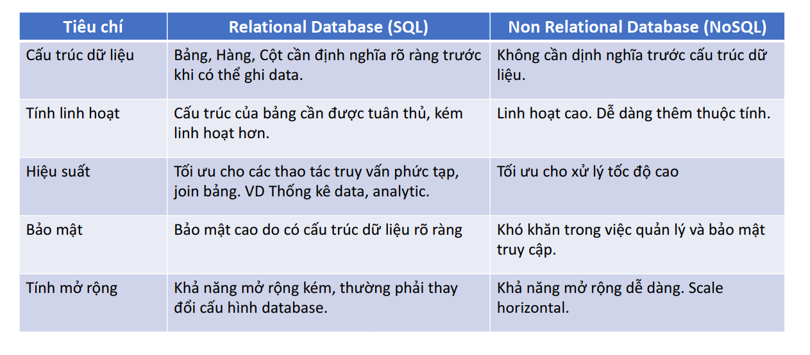
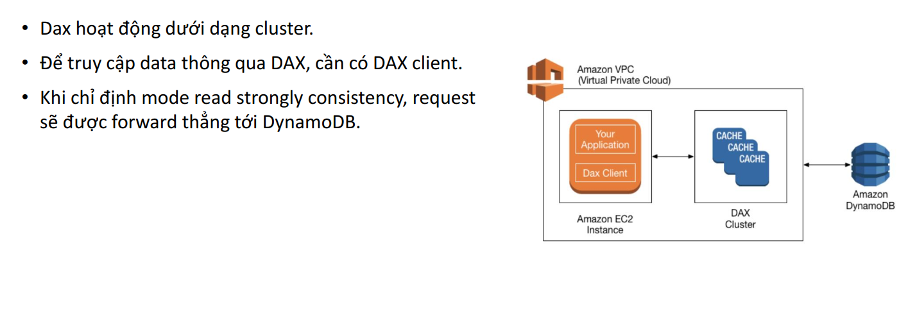

# Database Services - No SQL - DynamoDB

- [NoSQL](#nosql)
  - [What?](#what)
  - [Một số mô hình NoSQL](#một-số-mô-hình-nosql)
  - [So sánh SQL, NoSQL](#so-sánh-sql-nosql)
- [DynamoDB ?](#dynamodb)
- [Đặc trưng của DynamoDB](#đặc-trưng-của-dynamodb)
- [DynamoDB usecases](#dynamodb-usecases)
- [DynamoDB Pricing](#dynamodb-pricing)
  - [RCU](#rcu)
  - [WRU](#wru)
  - [On-demand](#on-demand)
  - [Provisioned](#provisioned)
- [PartiQL](#partiql)
- [DynamoDB Indexing](#dynamodb-indexing)
  - [Local Secondary Index(LSI)](#local-secondary-indexlsi)
  - [Global Secondary Index(GLI)](#global-secondary-indexgli)
- [DynamoDB Global table](#dynamodb-global-table)
- [DynamoDB Acclerator (DAX)](#dynamodb-acclerator-dax)

## NoSQL

### What?

- Non-Relational Database, còn được gọi là NoSQL (Not Only SQL) là một hệ thống cơ sở dữ liệu mà không sử dụng mô hình quan hệ truyền thống dưới dạng các bảng và các quan hệ khóa ngoại.
- Thay vào đó, nó sử dụng một cấu trúc dữ liệu khác, phù hợp hơn với các ứng dụng có khối lượng dữ liệu lớn, tốc độ truy vấn nhanh và tính mở rộng cao hơn

### Một số mô hình NoSQL

- **Key-value**: Lưu trữ dữ liệu dưới dạng các cặp key-value. Các khóa được sử dụng để truy cập và lấy dữ liệu, trong khi giá trị có thể là bất kỳ kiểu dữ liệu nào.
- **Document**: Lưu trữ dữ liệu dưới dạng tài liệu, thường là định dạng JSON hoặc XML. Các tài liệu được lưu trữ theo dạng phi cấu trúc, cho phép dữ liệu được lưu trữ một cách linh hoạt và thêm vào dễ dàng.
- **Column oriented**: Lưu trữ dữ liệu dưới dạng các bảng với hàng và cột, nhưng khác với cơ sở dữ liệu quan hệ, các cột có thể được thêm và loại bỏ một cách độc lập.
- **Graph**: Lưu trữ dữ liệu dưới dạng các nút và mối quan hệ giữa chúng, cung cấp khả năng xử lý dữ liệu phức tạp.

### So sánh SQL, NoSQL



## DynamoDB ?

***Amazon DynamoDB is a fully managed, serverless, key-value NoSQL database designed to run high-performance applications at any scale. DynamoDB offers built-in security, continuous backups, automated multiRegion replication, in-memory caching, and data import and export tools.***

## Đặc trưng của DynamoDB

- Serverless: hạ tầng được quản lý bởi AWS. User tương tác với DynamoDB thông qua Console, CLI, Các tool client hoặc Software SDK.
- Data được tổ chức thành các đơn vị **table**
- Độ trễ thấp (single digit milisecond)
- SLA: 99.999% availability
- Automatic Scale Up/Down tuỳ theo workload (WCU, RCU)
- Kết hợp được với nhiều service khác của AWS

- **Ưu điểm:**
  - Serverless nên chi phí vận hành thấp, tính khả dụng cao.
  - Linh hoạt trong cấu hình (zero idle cost, phù hợp cho startup)
  - Khả năng scale không giới hạn (về lý thuyết), độ trễ thấp, hiệu suất cao.
  - Strongly consistency
  - Hỗ trợ mã hoá
- **Nhược điểm:**
  - Không phù hợp với data query và analytic (OLAP)
  - Thiếu tính năng khi so sánh với SQL (relational DB)

## DynamoDB usecases

- Software application: hầu hết các software có nhu cầu về high concurrent cho hàng triệu user đều có thể cân nhắc sử dụng DynamoDB. Ex: E-commerce
- Media metadata store: Lưu trữ metadata cho các media.
- Gaming platform
- Social media: mạng xã hội, bài đăng, bình luận.
- Logistic system.
- Ứng dụng IoT

## DynamoDB Pricing

- Write Capacity Unit (WCU) và Read Capacity Unit (RCU). Hai đơn vị này lại có 2 mô hình tính giá là
On-demand và Provisioned Capacity.
- Dung lượng lưu trữ (tính theo đơn vị KB). Ex: Singapore: $0.285/GB/Month
- Data backup & restore: Ex: Singapore: $0.228/GB/Month
- Tần suất query data
- Indexing
- Data import/export
- DAX (caching cluster)
- Data transfer ra bên ngoài
- ...and more
[Tham khảo](https://aws.amazon.com/dynamodb/pricing/on-demand/)

### RCU

DynamoDB read requests can be either **strongly consistent**, **eventually consistent**, or **transactional**.

- A **strongly consistent** read request of an item up to 4 KB requires one read request unit.
- An **eventually consistent** read request of an item up to 4 KB requires one-half read request unit.
- A **transactional** read request of an item up to 4 KB requires two read request units.

If you need to read an item that is larger than 4 KB, DynamoDB needs additional read request units. The total number of read request units required depends on the item size, and whether you want an **eventually consistent** or **strongly consistent** read.

- ***For example***, if your item size is 8 KB, you require:
  - 2 read request units to sustain one **strongly consistent** read
  - 1 read request unit if you choose **eventually consistent** reads
  - 4 read request units for a **transactional** read request

### WRU

- **One write request** unit represents one write for an item up to 1 KB in size.
- **Transactional** write requests require 2 write request units to perform one write for items up to 1 KB.
- The total number of write request units required depends on the item size.
- If you need to write an item that is larger than 1 KB, DynamoDB needs to consume additional write request units.
- ***For example***, if your item size is 2 KB, you require:
  - 2 write request units to sustain **one write request**
  - 4 write request units for a **transactional** write request

### On-demand

DynamoDB sẽ tự động scale WCU, RCU khi có nhu cầu tăng cao, tuy nhiên sẽ có khả năng bị bottle neck nếu workload tăng đột ngột.

- Giá tiền tính như sau:
  - **$1.25** per million write request units
  - **$0.25** per million read request units

### Provisioned

DynamoDB sẽ reserve một số WCU, RCU cố định cho từngbảng hoặc index. Sử dụng cho những table muốn duy trì workload cao.

- Giá tiền tính như sau (giá theo giờ):
  - **$0.00065** per WCU
  - **$0.00013** per RCU

## PartiQL

*google for win bruhh :))*

```sh
-- search base on name
SELECT * 
FROM "student"
WHERE CONTAINS(name, 'huy');

-- search base on is_married
SELECT * 
FROM "student"
WHERE is_married = false;

-- search base on skill
SELECT * 
FROM "student"
WHERE CONTAINS (skills, 'guitar');

-- search base on hobbies
SELECT * 
FROM "student"
WHERE CONTAINS (hobbies, 'piano');
```

## DynamoDB Indexing

### Local Secondary Index(LSI)

- Phụ thuộc vào table và sử dụng partition key của table để xác định vị trí index. LSI giới hạn số lượng index của mỗi table là 5 và chỉ có thể tạo lúc tạo table.
- Các Attribute của LSI phải nằm trong bảng gốc.

### Global Secondary Index(GLI)

- Độc lập với table và có thể xác định các attribute khác ngoài partition key để tìm kiếm nhanh dữ liệu. Với GSI, bạn có thể tạo ra các index mới mà không cần phải thay đổi cấu trúc của table gốc. DynamoDB hỗ trợ tối đa 20 GSI trên mỗi table.
- Khi tạo index, ta có thể setting attribute projection như sau:
  - Project all: Secondary index sẽ bao gồm luôn các attribute của bảng chính
  - Project key only: Secondary index chỉ bao gồm thông tin primary key.
  - Project selected attribute: chỉ những attributes được chỉ định sẽ bao gồm trong index.

## DynamoDB Global table

- Là một tính năng của Amazon DynamoDB, cho phép bạn sao chép và đồng bộ dữ liệu giữa các khu vực khác nhau trên toàn cầu.
- Nó cho phép bạn tạo các bảng DynamoDB trên nhiều khu vực và tự động sao chép dữ liệu giữa chúng để đảm bảo dữ liệu được phân phối đồng đều trên toàn cầu và có sẵn cho các ứng dụng trong nhiều vùng địa lý khác nhau.

## DynamoDB Acclerator (DAX)

*Amazon DynamoDB Accelerator (DAX) is a fully managed, highly available, in-memory cache for Amazon DynamoDB that delivers up to a 10 times performance improvement—from milliseconds to microseconds—even at millions of requests per second.*


