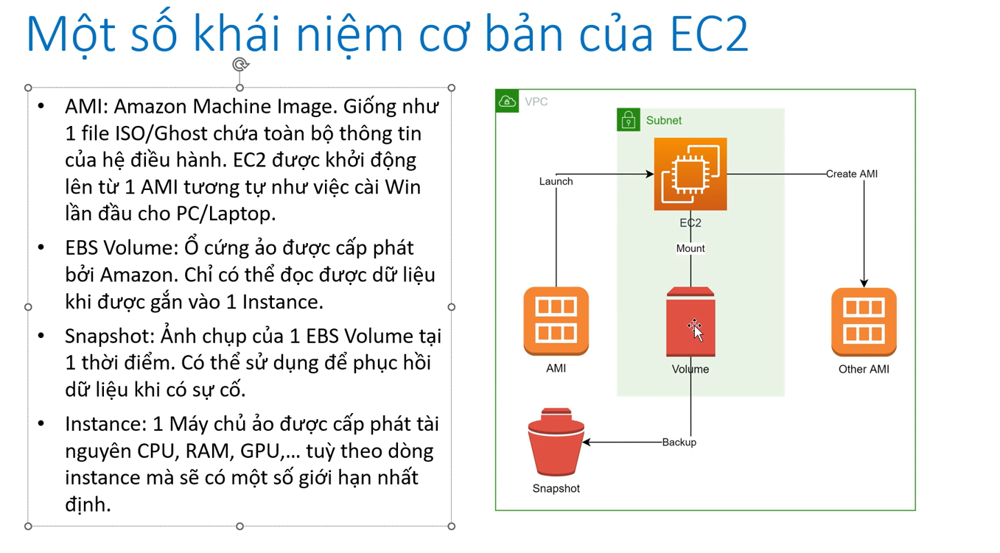
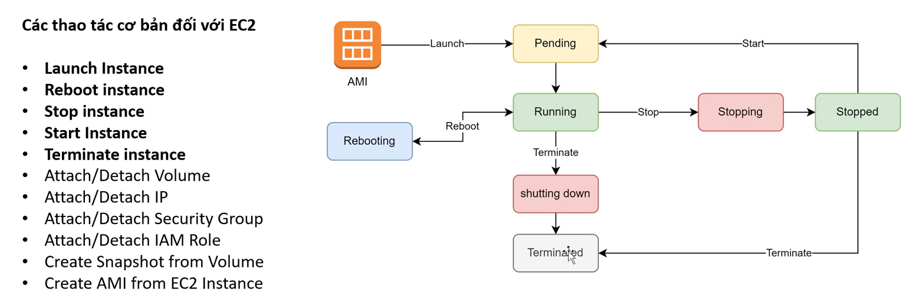
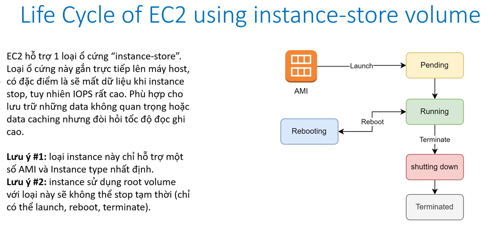
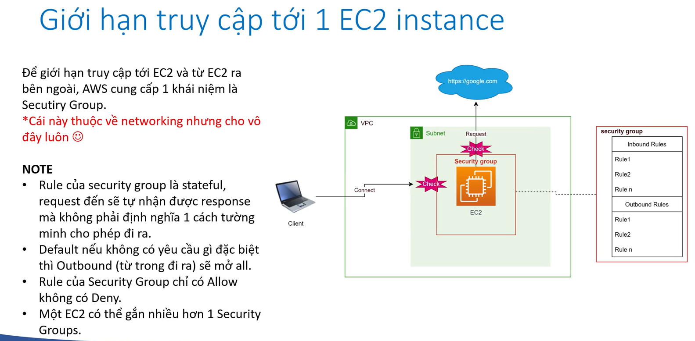
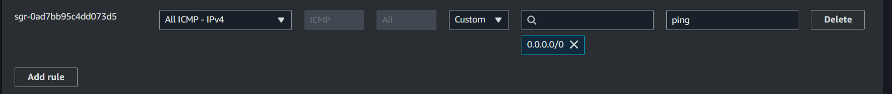
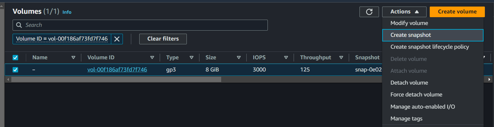
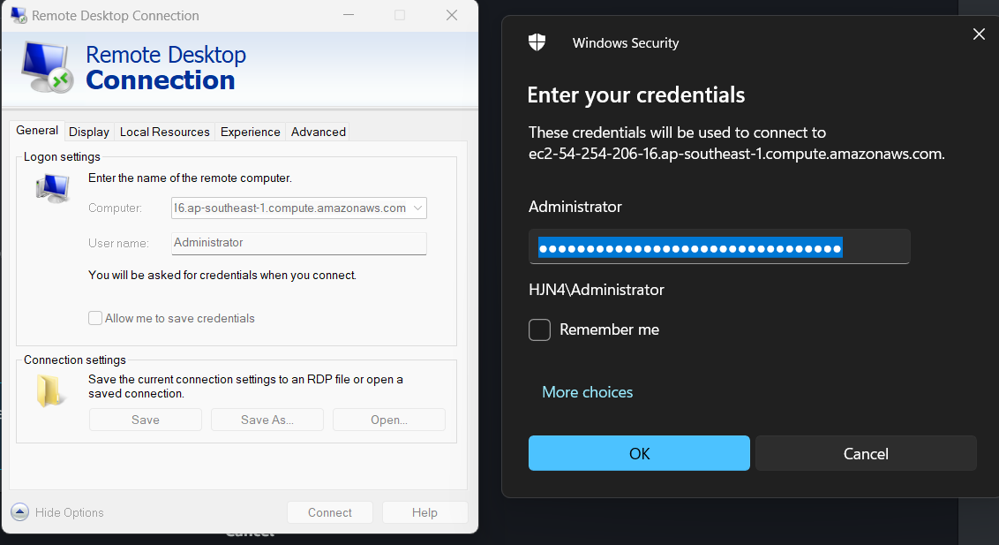
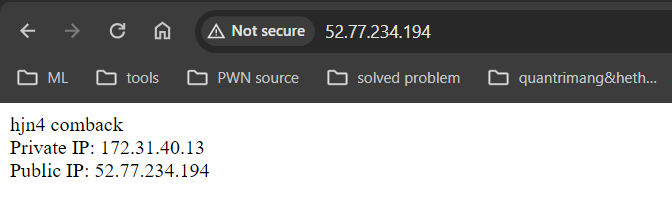
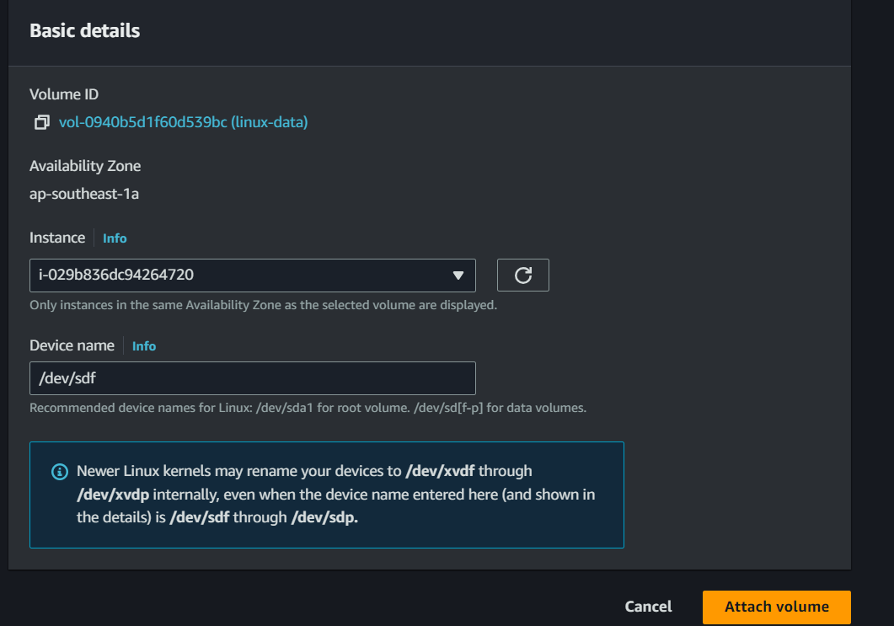

# EC2

- [what's EC2?](#whats-ec2)
- [Life cycle](#life-cycle-of-ec2)
- [Secutiy group](#secutiy-group)
- [httpd](#httpd-with-ec2)
- [snapshot](#create-snapshot-for-volume)
- [AMI](#create-ami)
- [window instance](#create-window-instance)
- [userdata & metadata](#user-data--meta-data)
- [Usecase](#usecase)
- [pricing](#ec2-pricing)
- [EBS](#elastic-block-storage-ebs)
- [extend volume windows](#add-and-extend-esternal-volume-for-windows)
- [extend volume linux](#add-and-extend-esternal-volume-for-linux)
- **For more reference**:
  - [attach volume](https://docs.aws.amazon.com/AWSEC2/latest/UserGuide/ebs-using-volumes.html)
  - [create partition](https://www.tecmint.com/fdisk-commands-to-manage-linux-disk-partitions/)
  - [extend volume](https://docs.aws.amazon.com/AWSEC2/latest/UserGuide/recognize-expanded-volume-linux.html)

## what's EC2?



## Life cycle of EC2





## Secutiy group



config for ping from everywhere to EC2 instance:



## httpd with EC2

```shell
sudo yum update -y
sudo yum install httpd -y

sudo su
echo "abc" > /var/www/html/index.html

systemctl enable httpd
service httpd start

```

access to http://<public-ip-of-ec2> to view website

## create snapshot for volume



khi mà có sự cố, mình cần khôi phục lại trạng thái trc đó đã được snapshot, thì ta cần create volume from snapshot và mount nó vào instance.

## Create AMI

## Create Window instance

add rule RDP allow 0.0.0.0 để remote to window

use remote desktop:



## user-data & meta-data

- userdate : là data mà mình truyền lên để khi launch instance thì nó sẽ chạy thêm các script đó như là cài đặt các tool, cấu hình gì đó,...
- metadata : là các thông tin của instance sau khi launch như là puplic, private IP, security group,...
- Metadata được lưu tại:  ***<http://169.254.169.254/latest/meta-data>*** cố định cho cả linux và window

```bash
export TOKEN=`curl -X PUT "http://169.254.169.254/latest/api/token" -H "X-aws-ec2-metadata-token-ttl-seconds: 21600"`

echo "<br>Private IP: " >> index.html
curl -H "X-aws-ec2-metadata-token: $TOKEN" -v http://169.254.169.254/latest/meta-data/local-ipv4 >> index.html

echo "<br>Public IP: " >> index.html
curl -H "X-aws-ec2-metadata-token: $TOKEN" -v http://169.254.169.254/latest/meta-data/public-ipv4 >> index.html 

```



## Usecase

EC2 là 1 dịch vụ rất mạnh của AWS, xuất hiện trong hầu hết các hệ thống. Ngoài ra EC2 còn là nền tảng cơ bản của các dịch vụ Container như ECS và EKS (k8s).
Usecase cơ bản:

- Lift and shift: Migrate 1:1 các ứng dụng đang chạy trên On-premise của cty, không có nhu cầu tái cấu trúc.
- Chạy các website cơ bản all in one.
- Compute cluster
- Dùng làm database trong trường hợp không muốn xài dịch vụ database sẵn của AWS.
- Dùng làm node của cluster K8S.

## EC2 pricing

- **On-Demand**: Xài nhiêu trả nhiêu, không cần trả trước. Phù hợp cho đa số mục đích (học tập, môi trường dev,…)
- **Reserve Instance or Saving Plan**: Mua trước 1-3 năm hoặc commit số tiền sẽ xài hằng tháng để được discount so với On-Demand (tối đa discount lên tới ~72%). Phù hợp cho môi trường production.
- **Spot Instance**: Đấu giá để được sd EC2 instance vào các khung giờ thấp điểm. Phù hợp cho các tác vụ xử lý hàng loạt, cần giá rẻ, xử lý có thể resume lại khi bị dừng đột ngột.
- **Dedicated Host**: Thuê riêng phần cứng nếu có yêu cầu đặc biệt về compliance.

## Elastic Block Storage (EBS)

- Đặc trưng:
  - Là một cơ chế lưu trữ dạng block.
  - Đơn vị quản lý là các EBS Volume.
  - Chỉ có thể access data khi được gắn vào 1 EC2 instance (dùng làm ổ
    root, C: hoặc ổ data)
  - Một số loại EBS đặc biệt cho phép gắn vào nhiều hơn 1 EC2 instance
    (multi attach).
  - Có thể tăng size một cách dễ dàng ngay cả khi server đang chạy (**không thể giảm size**).
- Tính tiền:
  - Dung lượng của volume ($/GB/Month), không xài hết cũng mất tiền
    100% trên dung lượng vì đã cấp phát rồi.
  - IOPS: Tốc độ đọc ghi càng cao, càng phát sinh phí.
  - Dung lượng của các bản snapshot của ổ cứng ($/GB/Month) tuy nhiên
    giá rẻ hơn lưu trữ.
- Các loại EBS:
  - **General purpose (default)**: *gp2*, *gp3*: Phù hợp cho hầu hết các mục đích
sử dụng.
  - **IOPS Provisioned**: *io1*, *io2*: Phù hợp cho các ứng dụng đòi hỏi tốc độ đọc
ghi cao.
  - **Throughput optimized HDD**: Dùng cho các hệ thống về Bigdata, Data
warehouse, cần throughput cao.
  - **Cold HDD**: Lưu trữ giá rẻ cho các file ít khi được access (VD File server của
công ty).
  - **Magnetic**: Thế hệ trước của HDD, ít được sd

## Add and Extend Esternal volume for Windows

- Create volume lưu ý phải cùng Availability Zone với instance
- Attach volume vừa tạo vào instance mong muốn
- Vào instance windows > disk management >  create new disk

## Add and Extend Esternal volume for Linux



Sau khi attach thì ta kiểm tra thì thấy nó chỉ mới mount vô thoi chứ chưa sử dụng được:

```bash
[root@ip-172-31-40-13 html]# lsblk
NAME      MAJ:MIN RM SIZE RO TYPE MOUNTPOINTS
xvda      202:0    0   8G  0 disk
├─xvda1   202:1    0   8G  0 part /
├─xvda127 259:0    0   1M  0 part
└─xvda128 259:1    0  10M  0 part /boot/efi
xvdf      202:80   0  10G  0 disk


[root@ip-172-31-40-13 html]# df -h
Filesystem      Size  Used Avail Use% Mounted on
devtmpfs        4.0M     0  4.0M   0% /dev
tmpfs           475M     0  475M   0% /dev/shm
tmpfs           190M  2.9M  188M   2% /run
/dev/xvda1      8.0G  1.6G  6.5G  20% /
tmpfs           475M     0  475M   0% /tmp
/dev/xvda128     10M  1.3M  8.7M  13% /boot/efi
tmpfs            95M     0   95M   0% /run/user/1000
```

Nếu muốn volume sau này có thể extend được thì ta sẽ tạo thêm 1 layer là partition:

```bash
[root@ip-172-31-40-13 html]# sudo fdisk /dev/xvdf

Welcome to fdisk (util-linux 2.37.4).
Changes will remain in memory only, until you decide to write them.
Be careful before using the write command.

Device does not contain a recognized partition table.
Created a new DOS disklabel with disk identifier 0x531b6dd7.

Command (m for help): m

Help:

  DOS (MBR)
   a   toggle a bootable flag
   b   edit nested BSD disklabel
   c   toggle the dos compatibility flag

  Generic
   d   delete a partition
   F   list free unpartitioned space
   l   list known partition types
   n   add a new partition
   p   print the partition table
   t   change a partition type
   v   verify the partition table
   i   print information about a partition

  Misc
   m   print this menu
   u   change display/entry units
   x   extra functionality (experts only)

  Script
   I   load disk layout from sfdisk script file
   O   dump disk layout to sfdisk script file

  Save & Exit
   w   write table to disk and exit
   q   quit without saving changes

  Create a new label
   g   create a new empty GPT partition table
   G   create a new empty SGI (IRIX) partition table
   o   create a new empty DOS partition table
   s   create a new empty Sun partition table


Command (m for help): n
Partition type
   p   primary (0 primary, 0 extended, 4 free)
   e   extended (container for logical partitions)
Select (default p): p
Partition number (1-4, default 1): 1
First sector (2048-20971519, default 2048):
Last sector, +/-sectors or +/-size{K,M,G,T,P} (2048-20971519, default 20971519):

Created a new partition 1 of type 'Linux' and of size 10 GiB.

Command (m for help): w
The partition table has been altered.
Calling ioctl() to re-read partition table.
Syncing disks.

```

### check lại

```bash
[root@ip-172-31-40-13 html]# lsblk
NAME      MAJ:MIN RM SIZE RO TYPE MOUNTPOINTS
xvda      202:0    0   8G  0 disk
├─xvda1   202:1    0   8G  0 part /
├─xvda127 259:0    0   1M  0 part
└─xvda128 259:1    0  10M  0 part /boot/efi
xvdf      202:80   0  10G  0 disk
└─xvdf1   202:81   0  10G  0 part
```

Thì ta thấy cái xvdf ban đầu đã có thêm 1 partition giúp mình sau này có thể extend volume. Phải làm thế sau này mới extend được, nếu làm trực tiếp trên thằng xvdf thì sau này không extend được

```bash
[root@ip-172-31-40-13 html]# sudo mkfs -t xfs /dev/xvdf1
meta-data=/dev/xvdf1             isize=512    agcount=4, agsize=655296 blks
         =                       sectsz=512   attr=2, projid32bit=1
         =                       crc=1        finobt=1, sparse=1, rmapbt=0
         =                       reflink=1    bigtime=1 inobtcount=1
data     =                       bsize=4096   blocks=2621184, imaxpct=25
         =                       sunit=0      swidth=0 blks
naming   =version 2              bsize=4096   ascii-ci=0, ftype=1
log      =internal log           bsize=4096   blocks=16384, version=2
         =                       sectsz=512   sunit=0 blks, lazy-count=1
realtime =none                   extsz=4096   blocks=0, rtextents=0
[root@ip-172-31-40-13 html]# sudo mkdir /data
[root@ip-172-31-40-13 html]# sudo mount /dev/xvdf1 /data
[root@ip-172-31-40-13 html]# lsblk
NAME      MAJ:MIN RM SIZE RO TYPE MOUNTPOINTS
xvda      202:0    0   8G  0 disk
├─xvda1   202:1    0   8G  0 part /
├─xvda127 259:0    0   1M  0 part
└─xvda128 259:1    0  10M  0 part /boot/efi
xvdf      202:80   0  10G  0 disk
└─xvdf1   202:81   0  10G  0 part /data
```

```bash
[root@ip-172-31-40-13 html]# sudo blkid
/dev/xvda128: SEC_TYPE="msdos" UUID="A208-E305" BLOCK_SIZE="512" TYPE="vfat" PARTLABEL="EFI System Partition" PARTUUID="1bba082f-4fd3-4536-ba50-1468a8741f84"
/dev/xvda127: PARTLABEL="BIOS Boot Partition" PARTUUID="7e86a24a-2fe2-4aff-a1c2-5ff59eeb2729"
/dev/xvda1: LABEL="/" UUID="66eb3733-37f3-4398-9990-e97c15b01e5b" BLOCK_SIZE="4096" TYPE="xfs" PARTLABEL="Linux" PARTUUID="9c63c137-580c-47df-a666-4e9d4ec5d6b4"
/dev/xvdf1: UUID="3cba17cc-169d-4b89-b96d-6696f868bf4a" BLOCK_SIZE="512" TYPE="xfs" PARTUUID="531b6dd7-01"
[root@ip-172-31-40-13 html]# sudo lsblk -o +UUID
NAME      MAJ:MIN RM SIZE RO TYPE MOUNTPOINTS UUID
xvda      202:0    0   8G  0 disk
├─xvda1   202:1    0   8G  0 part /           66eb3733-37f3-4398-9990-e97c15b01e5b
├─xvda127 259:0    0   1M  0 part
└─xvda128 259:1    0  10M  0 part /boot/efi   A208-E305
xvdf      202:80   0  10G  0 disk
└─xvdf1   202:81   0  10G  0 part /data       3cba17cc-169d-4b89-b96d-6696f868bf4a
[root@ip-172-31-40-13 html]# sudo vim /etc/fstab
[root@ip-172-31-40-13 html]# lsblk
NAME      MAJ:MIN RM SIZE RO TYPE MOUNTPOINTS
xvda      202:0    0   8G  0 disk
├─xvda1   202:1    0   8G  0 part /
├─xvda127 259:0    0   1M  0 part
└─xvda128 259:1    0  10M  0 part /boot/efi
xvdf      202:80   0  10G  0 disk
└─xvdf1   202:81   0  10G  0 part /data
[root@ip-172-31-40-13 html]# sudo umount /data
[root@ip-172-31-40-13 html]# lsblk
NAME      MAJ:MIN RM SIZE RO TYPE MOUNTPOINTS
xvda      202:0    0   8G  0 disk
├─xvda1   202:1    0   8G  0 part /
├─xvda127 259:0    0   1M  0 part
└─xvda128 259:1    0  10M  0 part /boot/efi
xvdf      202:80   0  10G  0 disk
└─xvdf1   202:81   0  10G  0 part
[root@ip-172-31-40-13 html]# sudo mount -a
[root@ip-172-31-40-13 html]# lsblk
NAME      MAJ:MIN RM SIZE RO TYPE MOUNTPOINTS
xvda      202:0    0   8G  0 disk
├─xvda1   202:1    0   8G  0 part /
├─xvda127 259:0    0   1M  0 part
└─xvda128 259:1    0  10M  0 part /boot/efi
xvdf      202:80   0  10G  0 disk
└─xvdf1   202:81   0  10G  0 part /data
```

### extend volume

```bash
[root@ip-172-31-40-13 html]# lsblk
NAME      MAJ:MIN RM SIZE RO TYPE MOUNTPOINTS
xvda      202:0    0   8G  0 disk
├─xvda1   202:1    0   8G  0 part /
├─xvda127 259:0    0   1M  0 part
└─xvda128 259:1    0  10M  0 part /boot/efi
xvdf      202:80   0  30G  0 disk
└─xvdf1   202:81   0  10G  0 part /data

```

```bash
[root@ip-172-31-40-13 html]# sudo growpart /dev/xvdf 1
CHANGED: partition=1 start=2048 old: size=20969472 end=20971520 new: size=62912479 end=62914527

[root@ip-172-31-40-13 html]# lsblk
NAME      MAJ:MIN RM SIZE RO TYPE MOUNTPOINTS
xvda      202:0    0   8G  0 disk
├─xvda1   202:1    0   8G  0 part /
├─xvda127 259:0    0   1M  0 part
└─xvda128 259:1    0  10M  0 part /boot/efi
xvdf      202:80   0  30G  0 disk
└─xvdf1   202:81   0  30G  0 part /data

```
