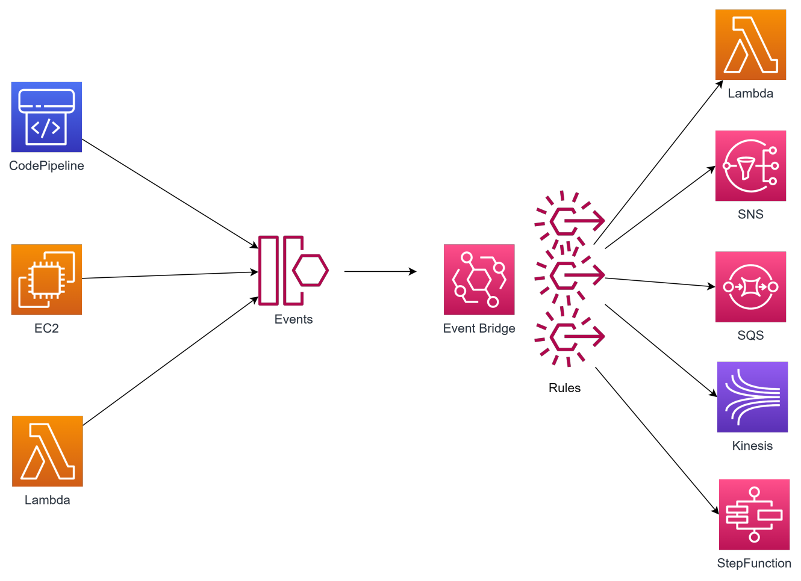

# Event Bridge

## What?

- AWS EventBridge là một dịch vụ dùng để quản lý và định tuyến sự kiện trong hệ thống. Nó cho phép bạn theo dõi, xử lý và phản ứng tự động với các sự kiện từ các nguồn khác nhau trong môi trường AWS Cloud.
- EventBridge hoạt động dựa trên kiến trúc publish-subscribe, trong đó event source gửi sự kiện của mình tới EventBridge. EventBridge sau đó định tuyến sự kiện tới các event targets đã được đăng ký, ví dụ các Lambda function, SQS, WorkFlow, các dịch vụ AWS khác hoặc các ứng dụng tự xây dựng.
- EventBridge cung cấp cho bạn khả năng linh hoạt trong việc quản lý các quy tắc định tuyến sự kiện (event rules), cho phép bạn lọc và xử lý sự kiện theo các tiêu chí như kiểu sự kiện, nguồn sự kiện, hoặc nội dung sự kiện. Bạn có thể sử dụng các quy tắc này để triển khai tự động các tác vụ, như kích hoạt các hàm Lambda để xử lý sự kiện, gửi thông báo qua email hoặc SMS, hoặc đưa sự kiện vào các workflow phức tạp hơn.
- Với EventBridge, bạn có thể xây dựng các hệ thống ứng dụng phản ứng thời gian thực, tự động và linh hoạt hơn trong môi trường đám mây AWS, giúp bạn giảm thời gian triển khai và tăng khả năng mở rộng và module hóa của hệ thống

## Các thành phần của Event Bridge

- **Event**: Một sự kiện nào đó xảy ra trong hệ thống AWS hoặc được chủ động tạo ra.
- **Rule**: Quy định các event và message sẽ được xử lý như thế nào nếu match rule.
- **Event Bus**: kênh giao tiếp để nhận và gửi event.
- **Schema**: Định nghĩa cấu trúc của event được gửi tới EventBridge
- **Schema registry**: nơi lưu trữ những schema được detect tự động hoặc tạo bởi user.
- **Pipes**: một phương thức nhanh chóng để kết nối source và target. Có thể apply filter hoặc enrichmen (transform) cho data.
- **Scheduler**: đặt lịch cho các tác vụ.
