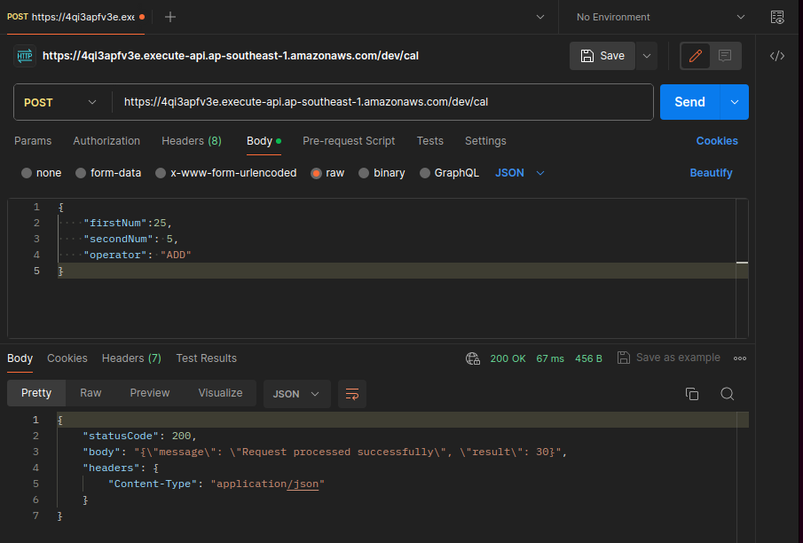
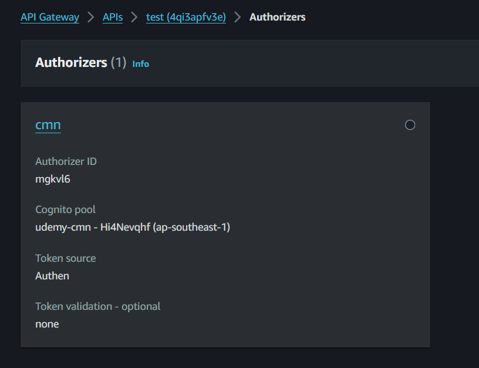
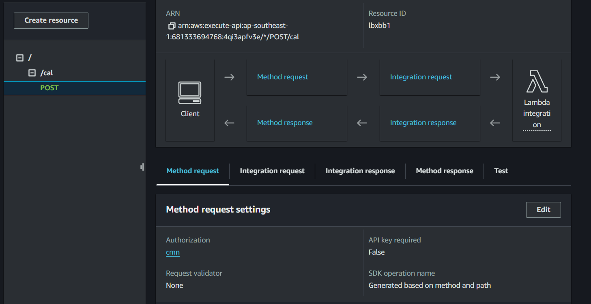
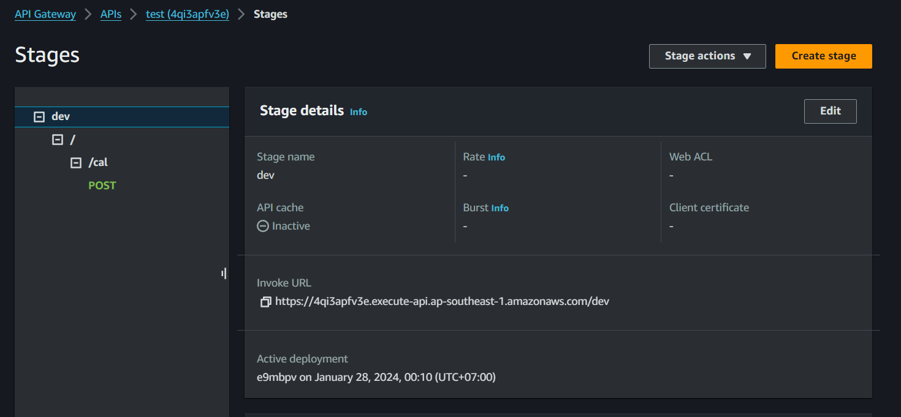
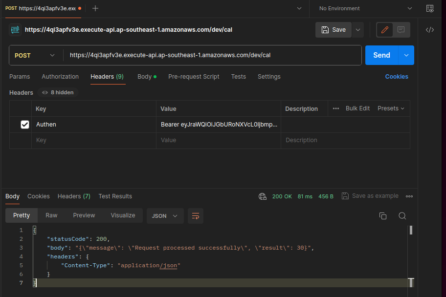

# API Gateway & Cognito

- [What?](#what)
- [Đặc trưng của API Gateway](#đặc-trưng-của-api-gateway)
- [Hệ sinh thái API Gateway](#hệ-sinh-thái-api-gateway)
- [Khi nào nên sử dụng API Gateway?](#khi-nào-nên-sử-dụng-api-gateway)
- [API Gateway Pricing](#api-gateway-pricing)
- [Authentication cho API Gateway](#authentication-cho-api-gateway)
- [Cognito?](#cognito)
- [Tính năng của Cognito](#tính-năng-của-cognito)
- [Pricing của Cognito](#pricing-của-cognito)
- [Hạn chế của Cognito](#hạn-chế-của-cognito)
- [Lưu ý về cơ chế verify token của Cognito](#lưu-ý-về-cơ-chế-verify-token-của-cognito)
- [API Gateway with Lambda, test by Postman](#api-gateway-with-lambda-test-by-postman)
- [Login Cognito Hosted UI Get Token](#login-cognito-hosted-ui-get-token)
- [API Gateway + Cognito](#api-gateway--cognito-1)

## What?

- Một dịch vụ API Gateway được cung cấp bởi AWS. Nó cung cấp một cách đơn giản để xây dựng, quản lý và bảo mật các RESTful API hoặc WebSocket.
- AWS API Gateway là một dịch vụ quan trọng trong kiến trúc dựa trên các dịch vụ của AWS (AWS-based microservices architecture)
- Thường được sử dụng cùng với các dịch vụ AWS khác như AWS Lambda, EC2, S3, Amazon DynamoDB
- AWS API Gateway cung cấp các tính năng:
  - Cho phép thiết kế và phát triển API RESTful hoặc WebSocket thông qua web GUI.
  - Điều phối các yêu cầu API đến các hệ thống hoặc dịch vụ khác nhau.
  - Authen/Author request tới các API.
  - Quản lý và giám sát các yêu cầu API, vd số lượng request, response time...
  - AWS API Gateway cũng cung cấp các tính năng bảo mật, bao gồm chứng thực và ủy quyền các yêu cầu API và mã hóa secure communication giữa các hệ thống khác nhau.

## Đặc trưng của API Gateway

- Là một fully managed service của AWS.
- Khả năng scale và High Availablity không giới hạn.
- Zero idle cost
- Easy to setup
- Dễ dàng kết hợp với các dịch vụ khác như CloudWatch, WAF cho mục
đích monitor & security.

## Hệ sinh thái API Gateway

API Gateway là một service chủ yếu có nhiệm vụ nhận request của client sau đó forward tới các service phía sau.


## Khi nào nên sử dụng API Gateway?

API Gateway phù hợp cho những bài toán sau:

- Kiến trúc Micro-service sử dụng lambda làm backend
- Backend API cho hầu hết các usecase (web API, IoT)
- Gateway nhận data trực tiếp từ client sau đó lưu vào DynamoDB (DB First)
- Web Socket cho những hệ thống realtime communication.

## API Gateway Pricing

API Gateway là một dịch vụ có idle cost = 0. Người dùng chỉ trả tiền cho chi phí chạy thực tế, cụ thể:

- **Với REST API**
  - Số lượng request (Vd Singapore region:$ 4.25/1M requests)
  - Data transfer out ($/GB)
  - Caching size tính theo GB/hour
- **Với Web socket**
  - Message number (đối với Web socket). Vd $1.15/1M message với block 32KB.
  - Connection minutes: $0.288/1M connection minutes

## Authentication cho API Gateway

API Gateway cung cấp 2 phương thức authen tích hợp trực tiếp (authorizer) thường được sử dụng đó là:

- **Cognito Authorizer**
Liên kết trực tiếp với một Cognito User Pool sử dụng làm authorizer. Khi access API, client passing trực tiếp token lấy được thông qua login với
Cognito, API Gateway sẽ check token và allow access nếu token hợp lệ.
- **Lambda Authorizer (custom authorizer)**
Khi sử dụng loại authorizer này, bạn sẽ tự implement logic authen trên Lambda. Có 2 hình thức là authen dựa vào TOKEN (JWT) hoặc request parameter based (VD username/password).

## Cognito?

- AWS Cognito là một dịch vụ quản lý danh tính và xác thực người dùng của Amazon Web Services (AWS).
- Dịch vụ này cho phép bạn tạo ra các ứng dụng web và di động an toàn với khả năng xác thực người dùng, phân quyền, và đăng nhập với nhiều tùy chọn như user account, Social login hoặc đăng nhập qua Identity Provider.

## Tính năng của Cognito

- Đăng ký & Xác thực người dùng sử dụng username/passwd/email hoặc tài khoản mạng xã hội.
- Phân quyền người dùng vào các ứng dụng hoặc tài nguyên
- Xác thực email/số điện thoại.
- Tích hợp với các dịch vụ khác (API Gateway, Lambda) để xây dựng ứng dụng.
- Hỗ trợ cho ứng dụng di động (iOS,Android) thông qua SDK
- Cognito sync: sync data giữa các mobile device với nhau
- Advanced Security: giám sát & phân tích truy cập của user để phát hiện và ngăn chặn truy cập bất thường (optional).

## Pricing của Cognito

- Số lượng Monthly Active User. VD ở Singapore là $0.0055/MAU (càng lên cao càng rẻ)
- User sign in thông qua SAML hoặc OIDC: $0.015/MAU
- Tính năng Advance Security: $0.05/MAU nếu enable
- SMS trong trường hợp gửi message MFA: Tuỳ theo khu vực.

## Hạn chế của Cognito

- Số lượng User trên 1 user pool: 40M (contact AWS nếu muốn tăng)
- Số lượng user pool tối đa: default 1,000, max 10,000
- Custom attribute: 50
Hạn chế về tần suất Admin API call vd:
- UserCreation: 50 RPS. Tăng thêm 10RPS cho mỗi 1 triệu MAU
- AdminUserRead: 120 RPS. Tăng thêm 40 RPS cho mỗi 1 triệu MAU
- RevokeToken: 120 RPS. Tăng thêm 40 RPS cho mỗi 1 triệu MAU
- UserUpdate: 25 RPS không thể tăng thêm.
- ...

### Lưu ý về cơ chế verify token của Cognito

- JWT token do Cognito phát hành thông thường sẽ dùng client side verify (sử dụng Public Key do Cognito cung cấp. *Lưu ý AWS không cung cấp private key của Cognito).
- Việc này đồng nghĩa với việc nếu user logout thì access-token vẫn có hiệu lực cho tới khi expired (vd 30 min).
- Nếu hệ thống có nhu cầu revoke access-token đã phát hành khi user có các hành động như change password, log-out thì không thể thực hiện với Cognito.
- Tất nhiên có thể workaround sử dụng các kỹ thuật Caching/DB.

## API Gateway with Lambda, test by Postman

- Đầu tiên tạo 1 Lambda function để xửa lí input và trả về 1 chuỗi jdon

```sh
import json

def lambda_handler(event, context):
    
    # for debug
    print('DEBUG INPUT FROM CLIENT:')
    print(event)

    firstNum = event['firstNum']
    secondNum = event['secondNum']
    operator = event['operator'] # ADD, MULTIPLE, DEVIDE, SUBSTRACT
    # Process the request
    result = calculate(firstNum, secondNum, operator)
    
    # Create the response body
    response_body = {
        'message': 'Request processed successfully',
        'result': result
    }
    
    # Create the HTTP response
    response = {
        'statusCode': 200,
        'body': json.dumps(response_body),
        'headers': {
            'Content-Type': 'application/json'
        }
    }
    
    return response

def calculate(num1, num2, operator):
    if operator == 'ADD':
        return num1 + num2
    elif operator == 'SUBSTRACT':
        return num1 - num2
    elif operator == 'MULTIPLE':
        return num1 * num2
    elif operator == 'DEVIDE':
        return num1 / num2
    else:
        return 0

```

- Tạo REST API Gateway => Tạo resource (Path) => create method Post => tích hợp Lambda Function
- Deploy => stage
- Test by Postman:


## Login Cognito Hosted UI Get Token

[Refer](https://docs.aws.amazon.com/cognito/latest/developerguide/cognito-user-pools-configuring-app-integration.html)

*Syntax*:
***https://your_domain/login?response_type=token&client_id=your_app_client_id&redirect_uri=your_callback_url***

*Note:* Nhớ chọn optipon **Implicit grant** cho **OAuth 2.0 grant types** mới get token được

```sh
https://www.google.com/#
id_token=
eyJraWQiOiJGbURoNXVcL0ljbmpGUklWbnVQMXo2S3pxZUJOSURIQUpUQmNGUzJOeXJaVT0iLCJhbGciOiJSUzI1NiJ9.eyJhdF9oYXNoIjoiWWhzcGxwZDRtbjlMaFFuWVp4Rkl6ZyIsInN1YiI6IjY5MGY4ZDc4LTkwODUtNDdhYi1iNmJhLTM4ZTRmODQ0MjYyNiIsImlzcyI6Imh0dHBzOlwvXC9jb2duaXRvLWlkcC5hcC1zb3V0aGVhc3QtMS5hbWF6b25hd3MuY29tXC9hcC1zb3V0aGVhc3QtMV9IaTROZXZxaGYiLCJjb2duaXRvOnVzZXJuYW1lIjoiYWRtaW4iLCJhdWQiOiJzbDFvbzY0aXA5MnU1ajNpdmg3bHVwMmVjIiwiZXZlbnRfaWQiOiI3NWFmMTRiNS03YTMxLTQxNjItOWFiZS0zYmU4NDc3NmU5Y2IiLCJ0b2tlbl91c2UiOiJpZCIsImF1dGhfdGltZSI6MTcwNjM3NDg5OSwiZXhwIjoxNzA2Mzc4NDk5LCJpYXQiOjE3MDYzNzQ4OTksImp0aSI6Ijc4NTg1ZDM4LWJjZTgtNDZiZi04ZDQ2LTM0ODI4ZjA0N2M4ZCIsImVtYWlsIjoiMjE1MjA5MTZAZ20udWl0LmVkdS52biJ9.VRJlB9yN52P62tCTU57ViSrPd7mbyPzMc3L-fXF3VeTYg9ZsL94h5OrkcQTEkSpIuwSgzOIgm5p5TbhY8ok86yRbG9lzuRvPqw8vRWg62N9Qc3IQ8UnyhUNk043AKa4L_yZ2g-C747kW97aXq1edYaR7d268eUJcRq1ipcxkQwCqQo4JgwTJ498zAa5ImGJzF4AbvNKZvi7-oHgiKHh-R3x9VqoI-tqyCUeHnYp5K3c7vlLH-7_gz1U66NKLz8GjJKR4NwmZt-Y9QKbUpJEcGB66EetztjtvPPsFgLpJ9bKuL9o6zuRcw1TXIC8dOLC3einhXu7dyQmEKPi58X7u3w
&access_token=
eyJraWQiOiJYaWtQVjFWckw4TElBbzdpQ3gyWUNoc25iZm5vXC9QMVd6djJ0NllcL0ZuVmM9IiwiYWxnIjoiUlMyNTYifQ.eyJzdWIiOiI2OTBmOGQ3OC05MDg1LTQ3YWItYjZiYS0zOGU0Zjg0NDI2MjYiLCJpc3MiOiJodHRwczpcL1wvY29nbml0by1pZHAuYXAtc291dGhlYXN0LTEuYW1hem9uYXdzLmNvbVwvYXAtc291dGhlYXN0LTFfSGk0TmV2cWhmIiwidmVyc2lvbiI6MiwiY2xpZW50X2lkIjoic2wxb282NGlwOTJ1NWozaXZoN2x1cDJlYyIsImV2ZW50X2lkIjoiNzVhZjE0YjUtN2EzMS00MTYyLTlhYmUtM2JlODQ3NzZlOWNiIiwidG9rZW5fdXNlIjoiYWNjZXNzIiwic2NvcGUiOiJwaG9uZSBvcGVuaWQgZW1haWwiLCJhdXRoX3RpbWUiOjE3MDYzNzQ4OTksImV4cCI6MTcwNjM3ODQ5OSwiaWF0IjoxNzA2Mzc0ODk5LCJqdGkiOiJkMjQxNWVmZi02YTM0LTQwMTQtOTkxMi01ZTBkODUzOWNkNjIiLCJ1c2VybmFtZSI6ImFkbWluIn0.VPjWOBwQrf-NmUdVQu_7gDLT8oSiW8tzyCfmY3efuzUQJz3XAn5-qVy951LlENOcoglkzqGHi-9OsmIdDqQ7t5kJSrGUmernsGcJKO1ffAS0QSwsRTk09OUDiBy2I7LJqf02lCsXzrkUoD9vG0A3KbMuSzxm86JWFLfuzwhqG5haSBGtzv0qcz6Yv1mf7gm45wMs32tKvgo5_bQCpeMqai-E2D1sZrO_qBGLdrhXuWzpK4Ile0iMmDwZlwpsBXiiLl9c7fXvfUUsk0zHxFB3wHXzNx4dhPxAPWPGqOWlGE8iWmGFto1XK5lrGDknvOIi_9TwfLJkpBOxwvKlu0Oxew&expires_in=3600&token_type=Bearer

```

## API Gateway + Cognito

Mục đích là Authen trước khi mà tương tác với API Gateway

- Đầu tiên create Authorization

- Sau đó attach cái Authorizer đó vào API

- Check

- Test với Postman
Header => Authen: Bearer **id-token**

