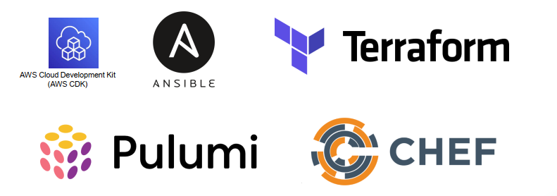

# Infra as Code - CloudFormation

## IAC?

- Infrastructure as Code (IaC) là một phương pháp trong quản lý hạ tầng công nghệ thông tin (IT infrastructure) bằng cách sử dụng template hoặc code để triển khai hạ tầng.
- IaC nhằm tự động hóa quy trình triển khai, cấu hình và quản lý hạ tầng, thay vì thực hiện các tác vụ này bằng tay.

## CloudFormation?

- AWS CloudFormation là một dịch vụ trong Amazon Web Services (AWS) cung cấp cách tự động hóa việc triển khai và quản lý các nguồn tài nguyên AWS.
- Nó cho phép bạn xác định các nguồn tài nguyên AWS của mình dưới dạng mã (infrastructure as code), sử dụng cú pháp JSON hoặc YAML, và sau đó triển khai và quản lý các tài nguyên này trong một cấu trúc tổ chức gọi là stack.

## Benefit

Lợi ích khi sử dụng Infra-as-code (cũng như CloudFormation)

- Tăng tốc độ triển khai.
- Đảm bảo tính nhất quán về kiến trúc cũng như setting của resources giữa các môi trường.
- Giảm thiểu sai sót do triển khai & cấu hình bằng tay (console, cli).
- Tăng tính tái sử dụng của resource (cho các dự án khác nhau).

## CloudFormation Template

CloudFormation hỗ trợ 2 định dạng

- Json
- Yaml

*Định dạng YAML thường được sử dụng hơn do dễ đọc và có thể comment.*

Cấu trúc template

- Version
- Description
- Metadata
- Parameters
- Rules
- Mapping
- Condition
- Transform
- Ressources
- Outputs

*Trong đó Resources là thành phần bắt buộc*

## Các tool IAC khác

