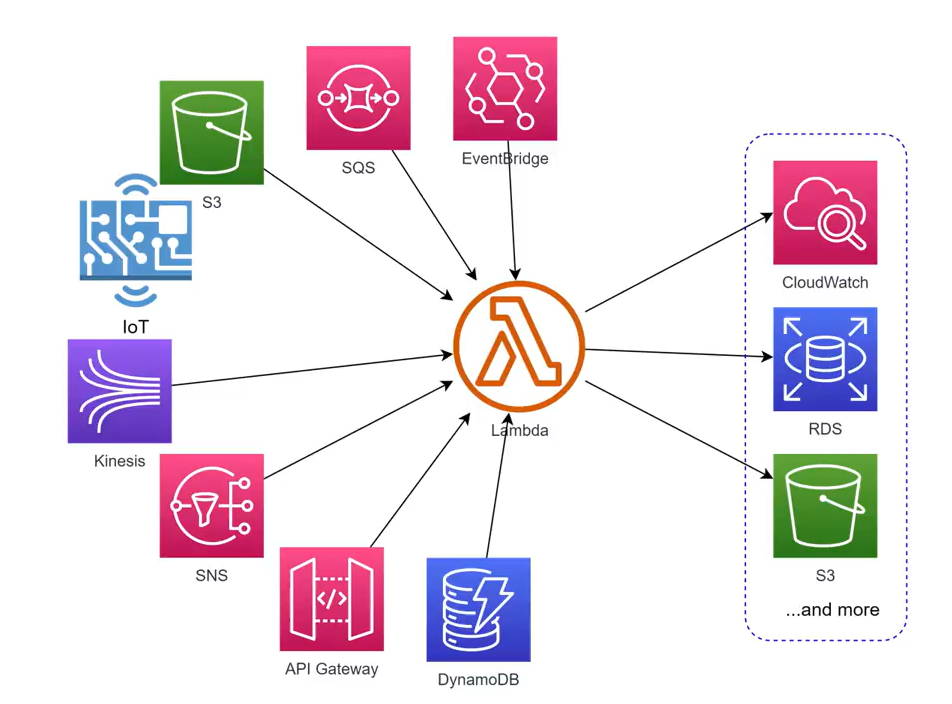
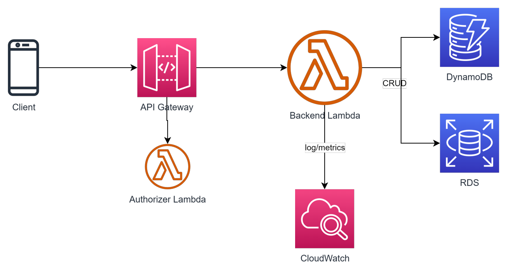
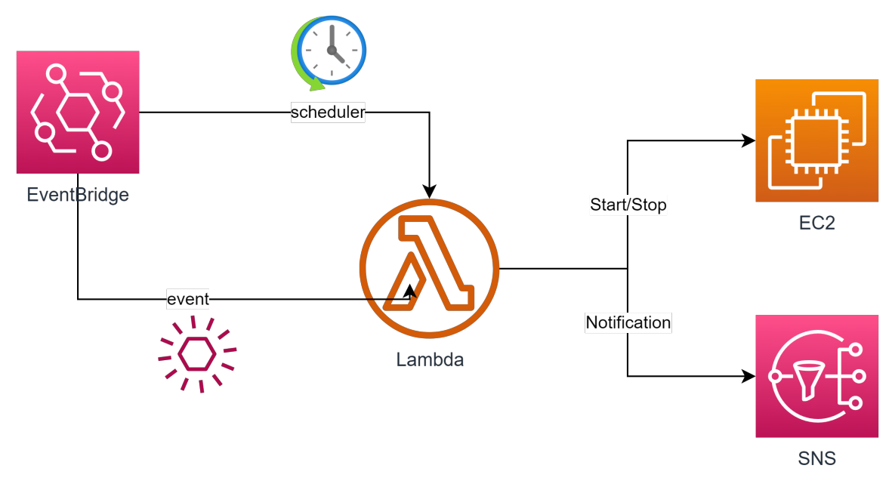
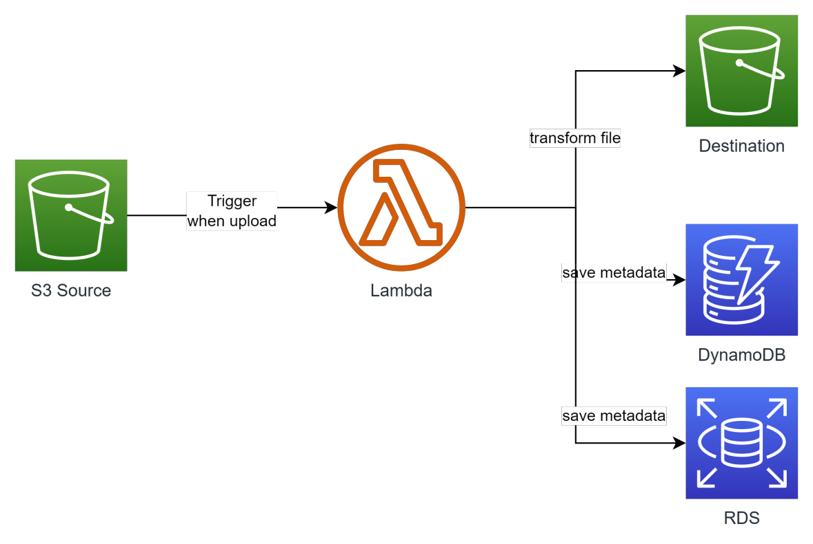
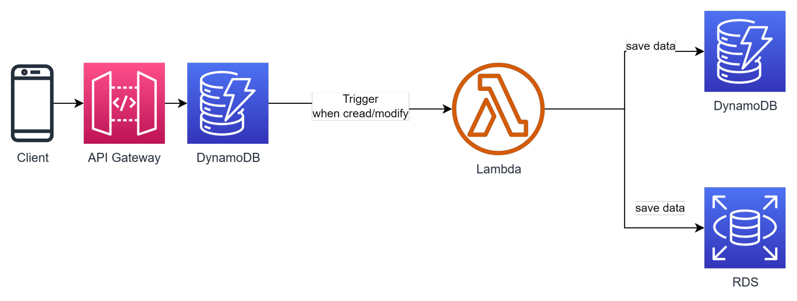
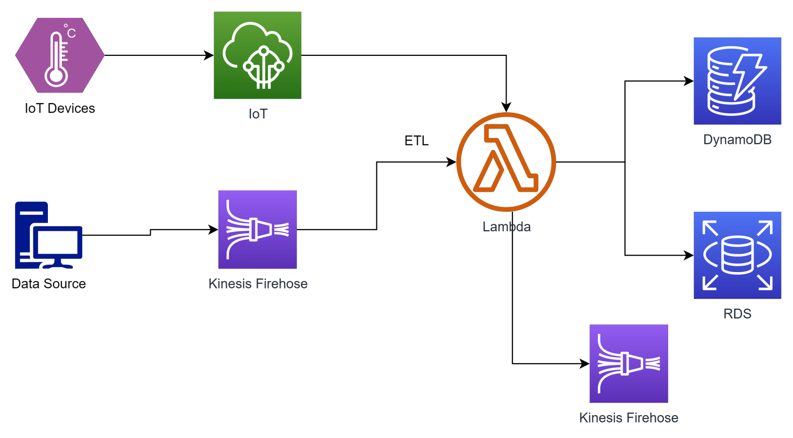
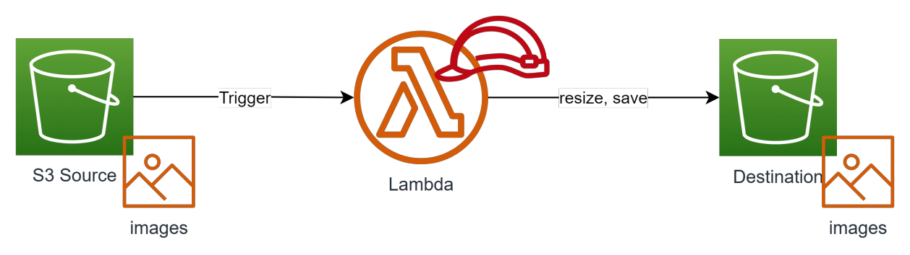
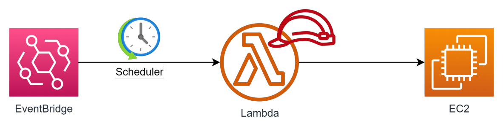
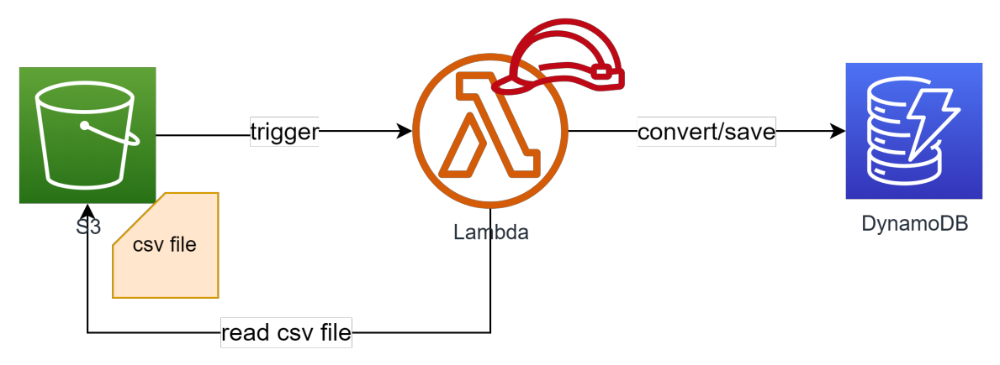

# Serverless Lambda

- [What?](#what)
- [Đặc trưng của Lambda](#đặc-trưng-của-lambda)
- [Lambda Pricing](#lambda-pricing)
- [Hệ sinh thái Lambda](#hệ-sinh-thái-lambda)
- [Ưu điểm](#ưu-điểm)
- [Nhược điểm](#nhược-điểm)
- [Khi nào nên sử dụng Lambda?](#khi-nào-nên-sử-dụng-lambda)
- [Khi nào KHÔNG nên sử dụng Lambda?](#khi-nào-không-nên-sử-dụng-lambda)
- [Usecase](#usecase)
- [S3 trigger resize image](#s3-trigger-resize-image)
- [Schedule EC2 instance Start/Stop](#schedule-ec2-instance-startstop)
- [Trigger upload, move file from S3 to DynamoDB](#trigger-upload-move-file-from-s3-to-dynamodb)

## What?

Một service serverless của AWS cho phép người dùng thực thi code mà không cần quan tâm tới hạ tầng phía sau.

Lamda hỗ trợ các ngôn ngữ (runtime) sau:

- Java
- Python
- .NET
- GO
- Ruby
- Custom Runtime
- Container

## Đặc trưng của Lambda

- Khi tạo 1 lambda function, bạn quyết định cấu hình thông qua thông số Memory. Min = 128MB, Max = 10GB. Memory càng cao, CPU được allocate càng lớn.
- Lambda khi khởi chạy được cấp phát 1 vùng nhớ tạm min = 512MB max =10GB, sẽ bị xoá khi lambda thực thi xong.
- Timeout tối đa 15 phút (quá thời gian này nếu execute chưa xong vẫn tính là failed và bị thu hồi resource).
- Lambda có thể được trigger từ nhiều nguồn: Trigger trực tiếp (Console or CLI), API Gateway, event từ các service khác (S3, SQS, DynamoDB, Kinesis, IoT...), hoặc chạy theo lịch (trigger từ EventBridge).
- Lambda có 2 mode chạy là chạy ngoài VPC và chạy trong VPC. Thông thường nếu lambda cần kết nối với RDS Database thì nên để trong VPC. *Lưu ý đến số lượng IP của subnet chứa lambda.*
- Lambda sau khi chạy xong sẽ không lưu lại bất cứ gì.
  - Log -> CloudWatch log
  - File output -> S3 hoặc EFS
  - Data output -> RDS Database hoặc DynamoDB.
- Lambda cũng cần được cấp IAM Role để có thể tương tác với các resource khác. Mặc định Lambda khi tạo ra sẽ được gán Role có các quyền cơ bản (vd write log to CloudWatch).
- Lambda không chỉ chứa 1 file code mà có thể chứa các file library, file common,... Để tiện dụng ta có thể gom nhóm chúng lại thành các layer và tái sử dụng ở nhiều function, tránh duplicate code.
- Khi có nhiều request từ client, Lambda scale horizontal bằng cách gia tăng số lượng concurent execute. Giới hạn này mặc định khi tạo account AWS là 10 concurent executions. Cần request tăng số này lên trước khi release production.
- Lambda có thể được set một số reserve concurent để tránh bị ảnh hưởng bởi các lambda khác.

## Lambda Pricing

Lambda là một dịch vụ có idle cost = 0. Tức là nếu tạo ra mà không chạy thì cost ~ 0. Người dùng chỉ trả tiền cho chi phí chạy thực tế, cụ thể:

- Thời gian execute của lambda. Đơn vị GB*second.
Ex: Singapore price: $0,0000167/GB*second
=> $0.2 / 1 millions requests

Ex: Có 1 lambda 512Mb memory, mỗi request chạy trong 5s, 1 tháng có 100,000 requests

- 250,000 GB*second = $4.175
- (250,000/1,000,000)*0.2 = $0.05
Total: $4.225

## Hệ sinh thái Lambda

Lambda là một service có thể liên kết với gần như tất cả các service khác của AWS, miễn là nó được cấp IAM Role phù hợp.

## Ưu điểm

- Không tốn effort cho quản trị hạ tầng, High Availablity.
- Zero idle cost. Do lambda chỉ phát sinh chi phí khi chạy, nếu hệ thống không phát sinh nhu cầu sử dụng -> cost gần như zero.
- Kết hợp được với nhiều service của AWS.
- Khả năng scale mạnh mẽ (bằng cách nhân bản số lượng concurrent).
- Support nhiều ngôn ngữ.
- Dễ dàng triển khai bằng nhiều tool do AWS phát hành hoặc 3rd party

## Nhược điểm

- Cold start: Code cần thời gian để nạp lên memory trước khi thực sự bắt đầu chạy. *Gần đây AWS đã cải thiện được vấn đề này rất nhiều.
- Giới hạn về bộ nhớ: 10GB. Không phù hợp cho các tác vụ nặng.
- Khó tích hợp. Hệ thống để deploy lên lambda cần chia nhỏ do đó làm tăng tính phức tạp và khó debug.
- Giới hạn về thời gian chạy, max 15min. Không phù hợp với các tác vụ tính toán tốn thời gian.
- Không lưu lại trạng thái sau khi chạy. Cần có external storage, database, logging.

## Khi nào nên sử dụng Lambda?

• Tác vụ automation trên AWS, nhận trigger từ các AWS service như S3, DynamoDB, SNS, SQS,...
• Backend cho API hoặc IoT.
• Xử lý data trong bài toán data ETL.
• Hệ thống có kiến trúc microservice nói chung.
• Công ty start up muốn tối ưu cost cho giai đoạn đầu.

## Khi nào KHÔNG nên sử dụng Lambda?

• Hệ thống Monolithic (do souce code quá nặng) hoặc team không có kinh nghiệm phát triển hệ thống microservice.
• Xử lý dữ liệu lớn, phân tích, tổng hợp data (hoặc chạy nhiều hơn 15p).
• Machine Learning.

## Usecase

- Dùng làm backend API khi kết hợp với API Gateway

- Thực hiện các tác vụ đơn giản theo lịch kết hợp với EventBridge

- Xử lý async khi nhận trigger từ S3

- Xử lý async khi nhận trigger từ DynamoDB

- Sử dụng trong bài toán ETL khi kết hợp với Kinesis, IoT

## S3 trigger resize image

Tạo Lambda Funciton có chức năng xử lý hình (.jpg, .png) được upload lên S3 thành các size khác nhau, output được lưu vào thư mục tương ứng.

- Đầu tiên do phần code python này có sử dụng thư viện Pillow mà lambda không support sẵn nên ta cần import Pillow vào layer
- Sau khi có layer chứa thư viện cần thiết, ta sẽ tạo function, add code, add layer vừa tạo vào
- Nhớ config timeout
- Add role để Lambda có thể tương tác với S3
- Qua S3 tạo bucket, event trỏ từ lambda function
- Xem log ở CloudWatch

**Reference:**

- [Maybe useful](https://medium.com/@bhatia.sandeep/importing-python-libraries-in-aws-lambda-f6e8b2a31a24)
- [Lambda-Layer-Python-Packages](https://github.com/keithrozario/Klayers.git)
- [Slide Udemy Course](#Nothing-here-for-you-bruh)

## Schedule EC2 instance Start/Stop

Tạo Lambda Function có chức năng bật tắt EC2 instance theo lịch. Lambda nhận 2
tham số là “instance_id” và “action” (START, STOP). Tiến hành setting schedule cho
lambda sử dụng EventBridge. EventBridge sẽ truyền sang 2 tham số cần thiết =>

- Đầu tiên ta sẽ tạo Lambda Funtion, add code vào
- Config timeout
- Add Role => inline policy EC2 => Write => Start/Stop Instance
- Sang EventBridge tiến hành schedule

## Trigger upload, move file from S3 to DynamoDB

Tạo lambda function trigger event upload csv file từ S3, sau đó lưu vào table trong

- Đầu tiên tạo Lambda Function, với code python xử lý
- Config timeout, setup policy cho phép tương tác với S3, DynamoDB
- Tạo table bên DynamoDB
- Tạo thư mục bên S3
- Upload và view log, result
