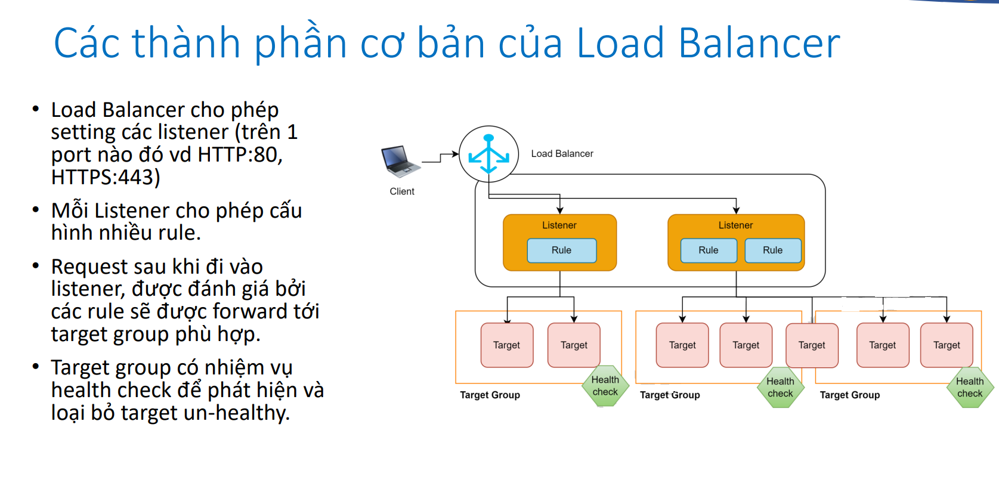
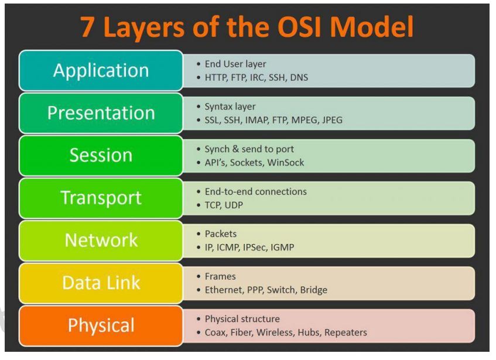
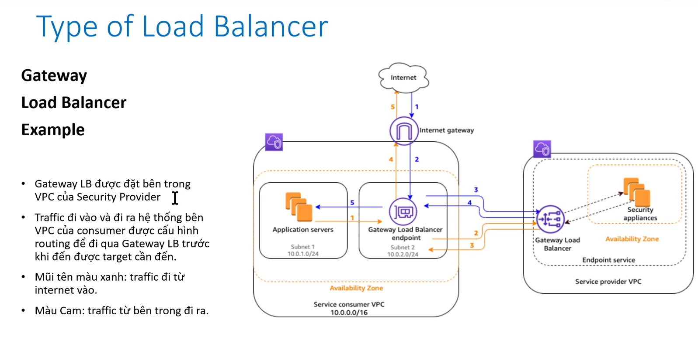
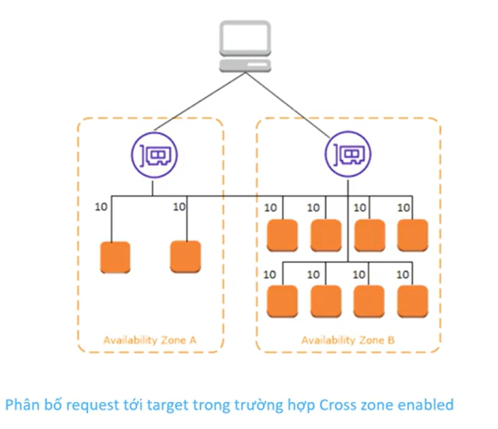
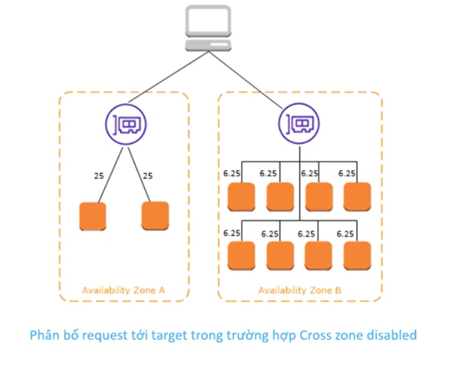
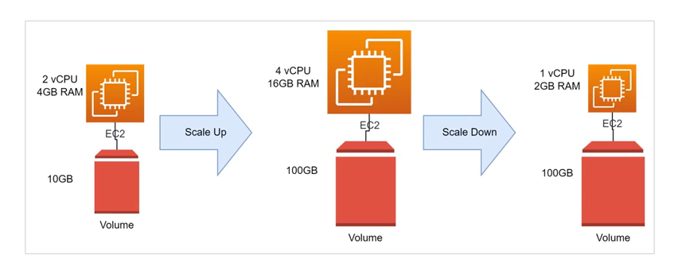
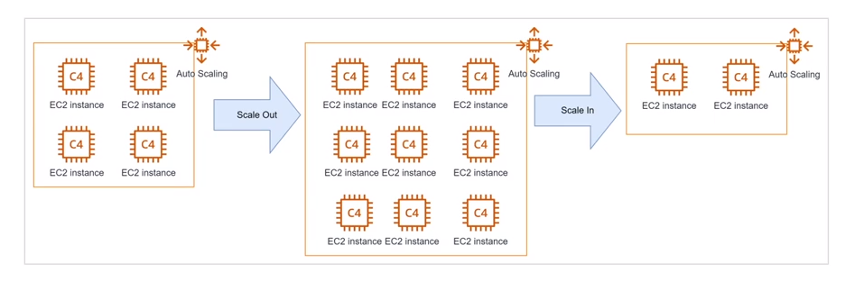
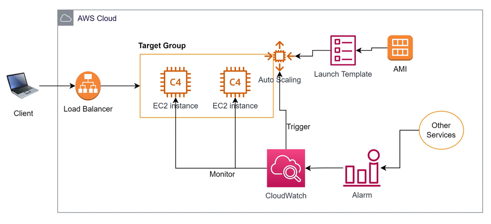
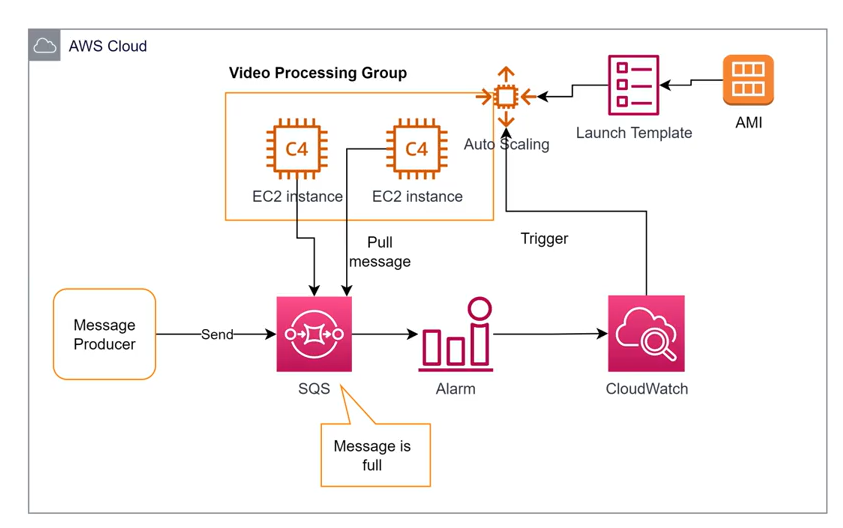

# Load balancing and autoscaling

- [Load Balancing](#load-balance)
- [Type of Balancing](#type-of-load-balancer)
- [Auto scaling](#auto-scaling)
- [Elastic Load Balancing](#elb-elastic-load-balancing)
- [Auto Scaling Group](#auto-scaling-group)
- [More](#more)

## Load Balance

Nếu hệ thống có nhiều hơn 1 thành phần, cần có cơ chế để phân phối requesrs từ client đến các thành phần ở backemd = > sự ra đời của Load Balancer

*Ta có mỗi Availability Zone (AZ) tương ứng với 1 data center cách nhau vài chục tới vài trăm km. Bằng việc phân bổ các instance nằm trên nhiều hơn 1 AZ, hệ thống có thể chịu được các sự cố cấp độ data center của AWS mà vẫn hoạt động bình thường*

## ELB (Elastic Load Balancing)

Elastic Load Balancing là:

- Một dịch vụ của AWS có nhiệm vụ điều hướng request từ client đến các target backend, đảm bảo request được cân bằng giữa các target.
- ELB là 1 dịch vụ managed hoàn toàn bởi AWS, dễ dàng setup, có đầy đủ các đặc tính cần thiết như:
  - High Availability
  - Scalability: về lý thuyết là không giới hạn
  - High Security: nếu kết hợp với các dịch vụ khác như WAF, Security Group.
- ELB có thể dễ dàng kết hợp với đa dạng backend sử dụng EC2, Container, Lambda.

## Type of Load Balancer

Các loại Elastic Load Balancer được phân chia phụ thuộc vào việc nó hoạt động trên layer nào của mô hình OSI 7 layers

- Application Load Balancer
  - Thường dùng, phụ hợp cho đa số nhu cầu phổ thông
  - Hoạt động trên layer 7
  - Ưu thế:
    - Hỗ trợ Path routing condition
    - Hỗ trợ host condition, cho phéo dùng nhiều domain cùng trỏ vào một ALB
    - Hỗ trợ routing dựa trên thuộc tính của request
    - Tích hợp được với Lambda, Container service
    - Hỗ trợ trả về custom HTTP response

- Network Load Balancer
  - Hoạt độngt trên layer 4
  - Hỗ trợ 2 giao thức TCP, UDP
  - Không hỗ trợ nhiều hình thức rule routing
  - Thường dùng cho những hệ thống có workload rất cao, lên tới hàng triệu request/s

- Classic Load Balancer

- Gateway Load Balancer
  - Giúp triển khai, scale và quản lý các Virtual Applicance (3rd party)
  - Mục đích: Firewall, phát hiện ngăn chặn xâm nhập (instrusion detection and prevention systems), kiếm tra gói tin chuyên sâu
  - Hoạt động trên layer 3 và layer 4
  - GLB listen trên tất cả các port và forward traffic đến các target group dựa trên các rule
  - GLB sử dụng GLB Endpoint để trao đổi traffic giữa VPC vủa service provider & VPC của consumer
  

Tổng kết nhỏ là: Mỗi listener sẽ ứng với 1 port, 1 ALB sẽ có nhiều listener, mà mỗi listener có thể có nhiều target, ta có thể xét tỉ lệ cho mỗi target.

## Cross zone load balancer

ELB là 1 dịch vụ hoạt động cross zone (AWS suggest chọn tất cả các zone có thể khi khởi tọa ELB)

- Nếu Cross zone LoadBalancer được enable thì:

Lúc này ELB chia điều số lượng request đến các EC2, mỗi con nhận 10% không phân biệt là nó ở AZ nào

- Nếu Cross zone LoadBalancer bị disable thì:

Lúc này ELB sẽ chia đều số lượng request cho các AZ mà không quan tâm trong zone đó có bao nhiều EC2. Dẫn đến các EC2 sẽ làm việc không cân bằng

- Note:
  - *Application LoadBalancer mặc định sẽ enable cross zone và không thể tắt*
  - *Network LoadBalancer mặc định sẽ disable cross zone và ta cần enable sau khi tạo*

## Auto scaling

- Là việc điều chỉnh cấu hình của các tài nguyên để đáp ứng với nhu cầu workload (số request từ người dung, số lượng công việc phải xử lý,…)
- Có 2 hình thức scale:
  - Scale Up/Down: Tăng/Giảm cấu hình của resources (vd tăng CPU/Ram cho Server, database, tăng dung lượng ổ cứng,…)

  

  - Scale Out/In: Tăng/giảm số lượng thành phần trong 1 cụm chức năng. (Vd add thêm server vào cụm application, add thêm node vào k8s cluster,…)

  

## Auto Scaling Group

- Có nhiệm vụ điều chỉnh số lượng của instance cho phù hợp với workload
- Mục đích:
  - Tiết kiệm chi phí
  - Tự động hóa việc mở rộng và phục hồi sự cố

- **Launch Template:** Đơn giản là 1 cái chỉ dẫn để Auto Scaling biết được nó phải launch instance như thế nào, cần cài software gì
- **Cloud watch** : để monitor các instance trong cluster để biết được nên scale out hay scale in thông qua các alarm, alarm này sẽ đến từ chính bản thân cluster hoặc service khác
- **Load Balance** : Làm nhiệm vụ distribute, phân phối các request của client

## Launch Configuration and Launch Template

- đích: Chỉ dẫn cho Auto Scaling Group biết được cần phải launch instance như thế nào.
- Các thông tin có thể định nghĩa trong launch template:
  - AMI
  - Instance Type
  - Keypair (trong trường hợp bạn cần login vào instance sau khi tạo)
  - Subnet (Thường không chọn mà để Auto Scaling Group quyết định)
  - Security Group(s)
  - Volume(s)
  - Tag(s)
  - Userdata (script tự động chạy khi instance start)
  - ................

***Một số thông tin như Instance Type, Subnet, Security Group có thể được overwrite bởi Auto
Scaling Group.***

***Launch Template thường được sử dụng hơn bởi nó có thể quản lý được version.***

## Các phương pháp scale hệ thống

- **No Scale**: Duy trì 1 số lượng cố định instances (nếu instance die thì tạo con mới để bổ sung, ngoài ra không làm gì cả)

- **Manually Scaling**: điều chỉnh 3 thông số: min/max/desire để quyết định số lượng instance trong ASG.

- **Dynamic Scaling**: Scale tự động dựa trên việc monitor các thông số.

  - **Target tracking scaling**: Monitor thông số ngay trên chính cluster, vd CPU, Memory, Network in-out.

  - **Step scaling**: điều chỉnh số lượng instance (tăng/giảm) dựa trên 1 tập hợp các alarm (có thể đến từ các resource khác không phải bản thân cluster).

  - **Simple scaling**: Tương tự Step scaling tuy nhiên có apply “cool down period”, tức là sau khi scale xong sẽ đợi một lúc rồi scale tiếp tránh việc scale liên tục

- **Schedule Scaling**: Đặt lịch để tự động tăng giảm số instance theo thời gian, phù hợp với các hệ thống có workload tăng vào 1 thời điểm cố định trong ngày. Như các hệ thống : ***chấm công, đặt cơm trưa,...***

- **Predict Scaling**: AWS đưa ra dự đoán dựa vào việc học từ thông số hằng ngày, hằng tuần để điều chỉnh số lượng instance một cách tự động. Độ chính xác phụ thuộc vào thời gian application đã vận hành và tính ổn định của traffic đi vào hệ thống

## More

### Hiểu rõ về 3 thông số Min, Max, Desire capacity

Về bản chất ASG nhìn vào thông số **Desire capacity** để
biết được cần thêm hay bớt instance trong cluster.

***Ex:***

- Cluster đang có 2 instances, set desire = 4 => ASG sẽ
add thêm 2 instance.
- Cluster đang có 4 instances, set desire = 3 => ASG sẽ
terminate bớt 1 instance

**Min**: Sau khi số lượng instance bằng với min, ASG sẽ
không terminate bớt instance vì bất cứ lý do gì.

**Max**: Sau khi số lượng instance bằng với max, ASG sẽ
không add thêm instance vì bất cứ lý do gì.

### Elastic Load Balancer stickiness session

- Cho phép điều hướng một client cụ thể tới target cố định trong
một khoảng thời gian.
- Phù hợp cho các website sử dụng công nghệ cũ quản lý session
của user trên RAM

*Chỉnh trong Edit Listen trong Load balancer listener, và trong target group tương ứng*
