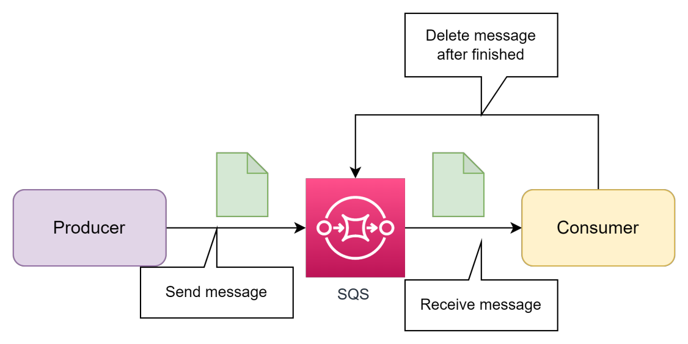
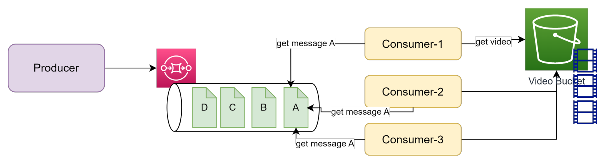
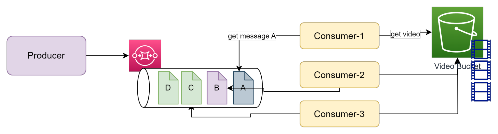
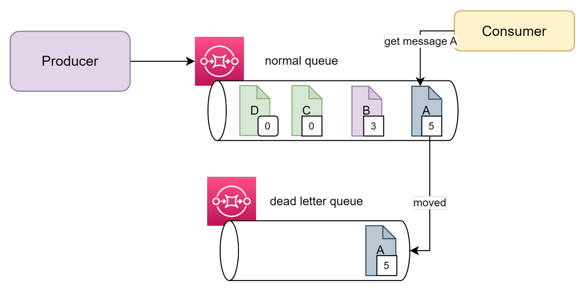
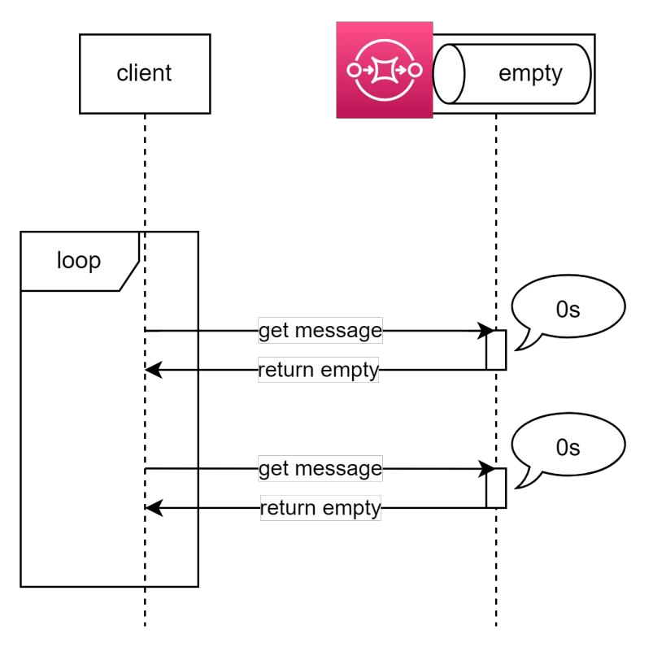
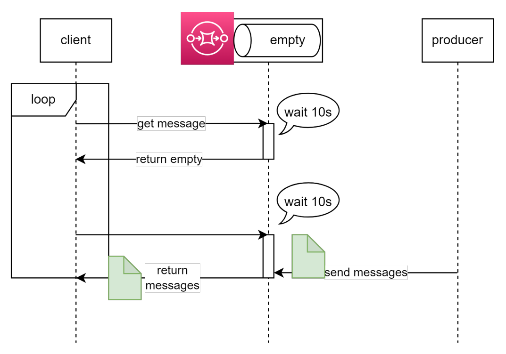
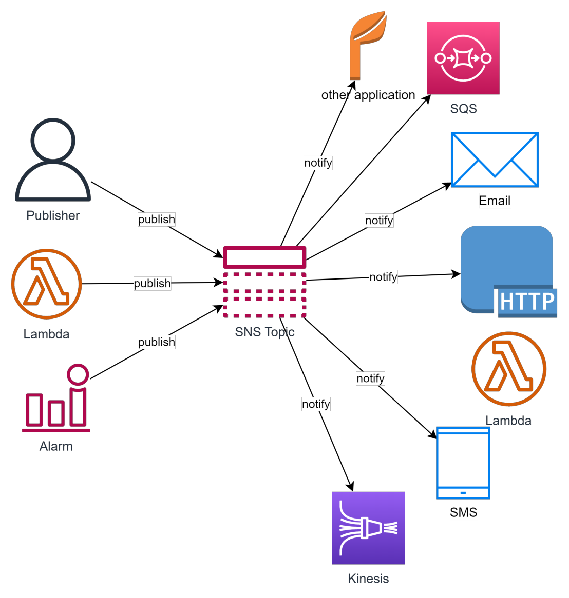

# Messaging service - SNS, SQS, SES

- [Simple Queue Service - SQS](#simple-queue-service---sqs)
  - [Đặc trưng của SQS](#đặc-trưng-của-sqs)
  - [SQS Concepts](#sqs-concepts)
  - [SQS Limitation](#sqs-limitation)
  - [Một số thông số liên quan monitor](#một-số-thông-số-liên-quan-monitor)
  - [SQS Usecase](#sqs-usecase)
  - [SQS Pricing](#sqs-pricing)
- [Simple Notification Service - SNS](#simple-notification-service---sns)
  - [Đặc trưng của SNS](#đặc-trưng-của-sns)
  - [SNS Concepts](#sns-concepts)
  - [SNS Limitation](#sns-limitation)
  - [SNS Usecase](#sns-usecase)
  - [SNS Pricing](#sns-pricing)
- [Simple Email Service - SES](#simple-email-service---ses)
  - [Tính năng của SES](#tính-năng-của-ses)
  - [SES Concept](#ses-concept)
  - [SES Pricing](#ses-pricing)
  - [SES Production mode](#ses-production-mode)

## Simple Queue Service - SQS

- Simple Queue Service (SQS) là một dịch vụ hàng đợi thông điệp mạnh mẽ và dễ sử dụng từ AWS.
- SQS cho phép bạn truyền tin nhắn giữa các thành phần của hệ thống phân tán một cách đáng tin cậy và có khả năng mở rộng.
- Với SQS, bạn có thể tạo ra các message queue và gửi/nhận message trên queue đó. Hàng đợi được quản lý bởi SQS, đảm bảo tính đáng tin cậy và khả năng mở rộng cao. Việc các ứng dụng khác nhau có gửi nhận message trên queue một cách độc lập giúp tăng tính chịu lỗi và sự phân tán trong hệ thống của bạn (de-coupling).
- SQS cung cấp hai loại queue: standard & FIFO (First-In-First-Out). Standard queue cung cấp khả năng mở rộng cao và đáng tin cậy, trong khi FIFO queue đảm bảo tin nhắn được xử lý theo tuần tự (nhược điểm là bị giới hạn về tần suất gửi nhận).
- SQS cũng cung cấp các tính năng như chế độ retry tự động, message filtering và khả năng xác nhận (acknowledge) tin nhắn. Ngoài ra, SQS tích hợp với các dịch vụ AWS khác, cho phép bạn xây dựng các hệ thống phức tạp và đáng tin cậy.

### Đặc trưng của SQS

- SQS là một managed service do đó bạn không quản lý hạ tầng phía sau.
- SQS được tạo và quản lý dưới các đơn vị message queue.
- Tương tác gửi nhận message với queue thông qua Console, SDK, API
- Khả năng mở rộng của SQS là không giới hạn (về lý thuyết).
- Về cơ bản message nào được gửi vào queue trước sẽ được xử lý trước (khi có hành động get message). Tuy nhiên với Queue type standard, AWS không đảm bảo 100%.
- Với FIFO Queue, SQS đảm bảo deliver đúng thứ tự tuy nhiên tần suất gửi nhận message bị giảm xuống 300/s và 3000/s đối với batch process.
- SQS có thể được cấu hình notify message sang Lambda mỗi khi có mesage mới, sử dụng cho bài toán xử lý tự động hoặc ETL.

### SQS Concepts

- Về cơ bản SQS là nơi có nhiệm vụ trung chuyển giữa một bên là Message Producer (Sender) và một bên là Message Consumer(Receiver).
- Với Standard Queue, message khi được gửi vào queue sẽ tồn tại ở đó cho tới khi bị xoá hoặc hết thời gian retention. Do vậy Consumer phải chủ động xoá message đã xử lý xong.
- Với FIFO Queue, message sẽ được delivery chính xác 1 lần tới consumer (tự động bị xoá sau khi có event receive message).

- SQS có một thông số gọi là Visibility Timeout, là thời gian message tạm bị ẩn đi đối với các consumer trong khi message đó đang được receive bởi một consumer. Quá thời gian này nếu message chưa bị xoá sẽ quay trở lại queue.

- **Ex:** *KHÔNG apply visibility timed out (hoặc timed out quá ngắn) trong trường hợp có nhiều consumer. Các consumer có thể get message đang được xử lý bởi một consumer khác (chưa finished).*

- Việc apply Visibility Timeout như thế nào cho phù hợp hoàn toàn phụ thuộc vào nghiệp vụ của bạn. Ex: *một tác vụ xử lý decode một video mất 10 mins thì bạn nên để Visibility Timeout >10 mins để tránh tình trạng xung đột xử lý giữa các consumers.*
- **Ex:** *CÓ apply visibility timed out trong trường hợp có nhiều consumer. Message đang được xử lý bởi một consumer sẽ tạm thời được ẩn đi đối với các consumer khác.*

- Message mỗi khi được receive sẽ có một thông số receive count (được cộng lên +1 mỗi khi message đó được receive bởi một consumer), ta có thể dựa vào đó để setting dead letter queue (tự động move message đã bị xử lý quá số lần mà vẫn chưa thành công).
- **Ex:** hình dưới ta có 2 queue, apply dead-letter queue với receive count = 5, khi tới ngưỡng giới hạn mà message vẫn chưa được xử lý thành công và xoá khỏi queue, ta sẽ move sang một queue khác (dead-letter queue) để xử lý sau.

- Long polling wait time: thời gian để SQS chờ trước khi return empty cho consumer trong  trường hợp không có message nào trên queue.
- **Flow khi wait time = 0s:**

- **Flow khi wait time = 10s:**

### SQS Limitation

- Giới hạn về số lượng message trên một queue: unlimited
- Queue name: 80 characters
- Queue tag: 50 tags
- Long polling: 20s
- Message Visibility Timeout: min: 0s, max: 12 hours
- Message size max: 256KB
- Message attributes: 10 metadata attributes
- Message content: có thể bao gồm XML, Json, Text
- Message retention: default 4 days, min: 1 mininutes max 14 days.

### Một số thông số liên quan monitor

- **Approximage age of oldest message**
- **Approximate number of message not visible**: Số lượng mesage đang được xử lý (in-flight) nên bị tạm ẩn khỏi queue.
- **Approximate number of message visible**: Số lượng message chưa được xử lý.
- **Number of message sent**
- **Number of message receivednhận**
- **Number of message deleted**

### SQS Usecase

- Đồng bộ dữ liệu giữa các hệ thống hoặc ứng dụng.
- Xử lý hàng đợi, giúp de-coupling hệ thống và chống bottle neck tại những component có thể có workload tăng đột ngột. Giúp chuyển từ xử lý đồng bộ sang bất đồng bộ.
- Hệ thống xử lý thời gian thực bằng cách sử dụng FIFO queue.
- Data migration. **Ex:** *data từ source cần được chia ra nhiều luồng xử lý bất đồng bộ và có phương pháp retry cũng như phân loại message lỗi*

### SQS Pricing

- Số lượng request gửi nhận. **Ex:** *$0.4/ 1 triệu request với Standard và $0.5 /1 triệu request với FIFO queue. Tính theo block 64KB*
- Dữ liệu truyền từ SQS đi ra: $0.12 /GB
- **Zero idle cost**

## Simple Notification Service - SNS

- AWS Simple Notification Service (SNS) là một dịch vụ notification, cho phép bạn gửi thông báo đến các đối tượng khác nhau như các ứng dụng, user, hệ thống, hoặc các dịch vụ khác trên AWS.
- SNS cho phép bạn gửi thông báo bằng nhiều phương thức khác nhau như email, SMS, push notifications, hoặc API Call. Bạn có thể tạo và quản lý các topics trong SNS, và sau đó gửi thông báo đến các topics. Các đối tượng đã đăng ký (subscribed) vào topic sẽ nhận được thông báo.

### Đặc trưng của SNS

- Về cơ bản SNS hoạt động theo mô hình Publisher-Subscriber, message khi được bên publisher gửi lên SNS topic sẽ được đồng loạt gửi tới các subscriber.
- Đa kênh thông báo: SNS hỗ trợ nhiều kênh thông báo như email, SMS, push notifications, và API call.
- Khả năng mở rộng và đáng tin cậy: SNS xử lý việc phân phối thông báo trên cơ sở hạ tầng mở rộng của AWS. Nó tự động xử lý khả năng mở rộng và đảm bảo tính đáng tin cậy của việc gửi thông báo.
- Tích hợp với các dịch vụ AWS khác: SNS tích hợp tốt với các dịch vụ AWS khác như SQS, CloudWatch, AWS Lambda, Amazon EC2, và nhiều dịch vụ khác. Điều này cho phép bạn xây dựng các hệ thống phức tạp và tự động hóa quá trình gửi thông báo.
- SNS có hỗ trợ FIFO tương tự như SQS.
- **Mesage attribute**: cho phép lưu trữ thêm những thông tin tuỳ chọn cho message.
- **Message Filtering**: cho phép đặt các filter để quyết định xem message sẽ notify tới các subscriber nào.
- **Message security**: kết hợp với KMS để mã hoá message, tăng tính bảo mật.

### SNS Concepts

SNS có thể kết hợp được với nhiều dịch vụ khác nhau trên AWS cũng như notify tới nhiều loại target bên ngoài AWS.

### SNS Limitation

- Số lượng topic/account: 100,000, FIFO: 1000
- Subscription: 12,500,000/topic. FIFO: 100/topic
- Delivery rate for email: 10 message/s (extend able)
- Message size: 256KB

### SNS Usecase

- Notify đến email / SMS trong trường hợp dùng làm notification service.
- Kết hợp với các dịch vụ Monitoring, Audit, Security để thông báo tới người phụ trách.
- Notify tới Mobile Application.
- Gửi notification đồng thời tới nhiều target theo thời gian thực.
- Xây dựng hệ thống phân tán.
- Xây dựng hệ thống Chat.

### SNS Pricing

- Cost cho việc gửi notification
  - **Mobile push**: $0.5 per 1M notification
  - **Email**: $1 per 1M notification
  - **HTTP**: $0.6 per 1M notification
- Data transfer
  - **Transfer in**: Free
  - **Transfer out**: $0.12/GB
- Chi phí cho SMS: tuỳ thuộc vào quốc gia.
- Message filter: $0.11/ GB payload data được scan.

## Simple Email Service - SES

Simple Email Service (SES) là một dịch vụ email được cung cấp bởi Amazon Web Services (AWS) để gửi và nhận email một cách đáng tin cậy và có hiệu suất cao.

### Tính năng của SES

- Gửi email: SES cho phép bạn gửi email từ ứng dụng hoặc hạ tầng đám mây của bạn thông qua giao thức SMTP (Simple Mail Transfer Protocol).
- Quản lý danh sách người nhận: SES cho phép bạn quản lý và lưu trữ danh sách người nhận email của bạn.
- Xác thực và bảo mật: SES cung cấp các tính năng xác thực và bảo mật nhằm đảm bảo rằng email của bạn được gửi từ nguồn đáng tin cậy và không bị làm giả mạo. Điều này bao gồm xác thực thông qua DKIM (DomainKeys Identified Mail), SPF (Sender Policy Framework) và DMARC (Domain-based Message Authentication, Reporting, and Conformance).
- Ghi lại hoạt động: SES cung cấp các log chi tiết về hoạt động gửi email, bao gồm thông tin về người gửi, người nhận, thời gian gửi và kết quả gửi. Bạn có thể sử dụng dữ liệu này để theo dõi và phân tích hiệu suất gửi email.

### SES Concept

- SES có thể được tích hợp với các dịch vụ khác trong mạng lưới AWS, như Lambda, S3 và SNS, để tự động hóa quy trình gửi email và xử lý các hành động phản hồi từ người nhận.
- Lưu ý rằng SES chủ yếu là dịch vụ gửi email và có giới hạn về tính năng nhận email. Nếu bạn cần chức năng đầy đủ để nhận và xử lý email, bạn có thể xem xét sử dụng dịch vụ như Amazon Simple Notification Service (SNS) hoặc Amazon WorkMail

### SES Pricing

- Số lương email: $0.1/1000 email
- File đính kèm: $0.12/1GB attachment
- Ngoài ra SES còn tính phí thêm cho các option như Dedicated IP, Virtual Deliverability Manager.

### SES Production mode

- Để có thể gửi email tới bất kỳ đâu, AWS yêu cầu SES cần được enable production mode. *Nếu chưa được bật production mode, bạn chỉ có thể gửi mail trong sand-box mode tức là gửi tới một danh sách email đã đăng ký sẵn*
- Để enable production mode, AWS yêu cầu bạn cung cấp một số thông tin:
  - Nguồn của email lấy từ đâu?
  - Email được gửi trong các use case nào? (marketing, email hướng dẫn thông thường). Bạn có thể gửi sample email để AWS duyệt.
  - Làm sao để user un-subscribe việc nhận email?
  - Bạn làm sao để hạn chế gửi bounce email (gửi mail đến địa chỉ vô định)?
- ***Sau khi xem xét các yếu tố trên, AWS sẽ cân nhắc có enable production mode cho bạn hay không.***
- Lưu ý sau khi đã enable production mode cho SES
  - Liên tục monitor chỉ số **Bounce Rate, Claim rate** và có alert kịp thời để xử lý.
  - Theo dõi limit của SES để có action kịp thời yêu cầu nâng limit khi giới hạn gửi mail trong ngày/tuần/tháng bị chạm ngưỡng.
