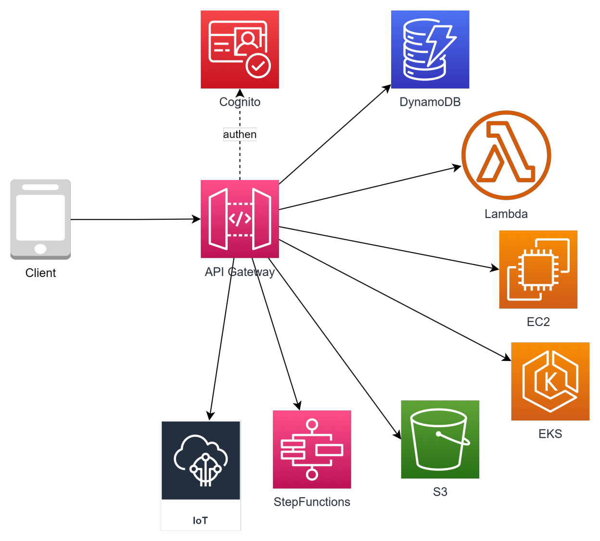
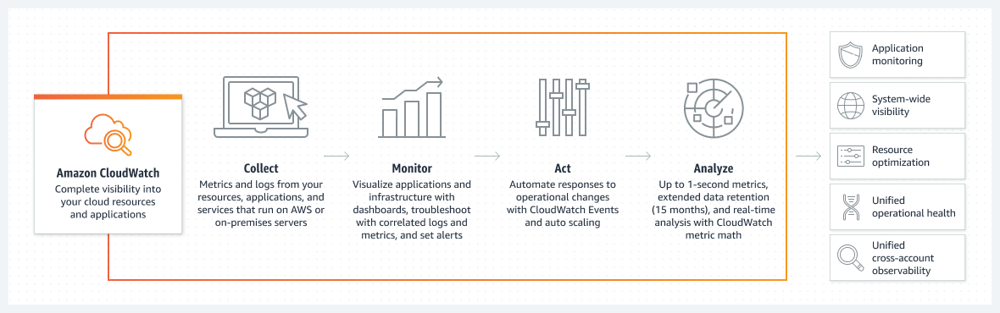
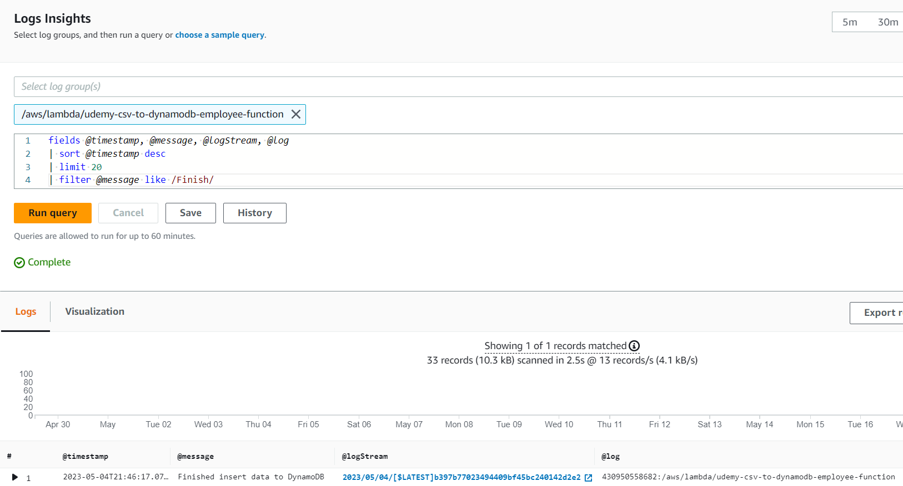
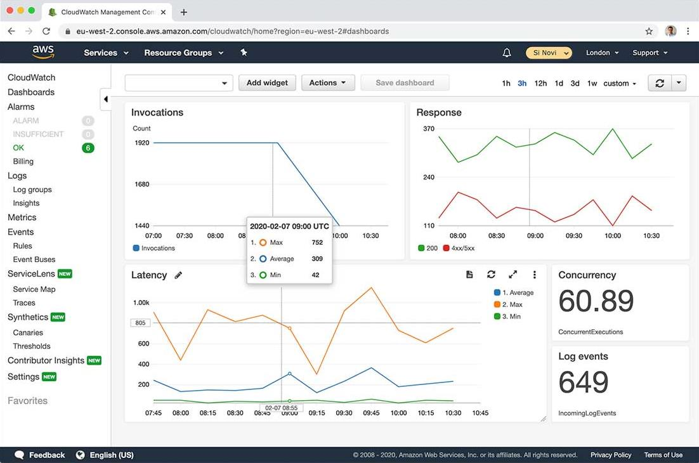

# Monitoring and Auditing - CloudWatch, CloudTrail

- [Why?](#why)
- [What?](#what)
- [Hệ sinh thái CloudWatch](#hệ-sinh-thái-cloudwatch)
- [CloudWatch Overview](#cloudwatch-overview)
- [CloudWatch Metrics](#cloudwatch-metrics)
- [CloudWatch Alarm](#cloudwatch-alarm)
- [CloudWatch Log](#cloudwatch-log)
- [CloudWatch Log Insight](#cloudwatch-log-insight)
- [X-ray](#x-ray)
- [CloudWatch Dashboard](#cloudwatch-dashboard)
- [Khi thiết kế monitor cần quan tâm những gì?](#khi-thiết-kế-monitor-cần-quan-tâm-những-gì)
- [CloudWatch pricing](#cloudwatch-pricing)
- [Cost saving for CloudWatch](#cost-saving-for-cloudwatch)
- [CloudTrail](#cloudtrail)
- [Các chức năng cơ bản của CloudTrail](#các-chức-năng-cơ-bản-của-cloudtrail)

## Why?

- Hệ thống được thiết kế và xây dựng tốt đến đâu thì vẫn sẽ tiềm ẩn các nguy cơ gặp sự cố, nhiệm vụ của giám sát (monitor) là theo dõi sức khoẻ của hệ thống, phát hiện những vấn đề kịp thời, từ đó đưa ra các hành động hợp lý như thông báo cho quản trị viên hoặc recovery action.
- Nhu cầu truy cập, workload của các resource sẽ biến động không ngừng theo thời gian, cần có cơ chế giám sát để có hành động kịp thời, tránh các sự cố (không đủ tài nguyên, workload quá cao giảm trải nghiệm người dùng...)
- Việc giám sát liên tục trạng thái của các resource cũng là tiền đề để hệ thống có thể auto-scale.

## What?

- AWS CloudWatch là một dịch vụ được thiết kế để giám sát và quản lý hệ thống, ứng dụng trên nền tảng AWS. Nó cung cấp khả năng thu thập, xử lý và hiển thị các thông tin liên quan đến hiệu suất, khả năng mở rộng, lỗi của các tài nguyên trong môi trường AWS.
- CloudWatch cho phép bạn theo dõi các thông số quan trọng như CPU usage, network traffic, storage, database. Nó cũng cung cấp các dịch vụ ghi log để lưu trữ và phân tích các sự kiện quan trọng từ các ứng dụng và hệ thống. Bạn có thể sử dụng CloudWatch để tạo ra các đồ thị và báo cáo để theo dõi hiệu suất và tình trạng của các ứng dụng và hệ thống trên AWS.
- CloudWatch cũng hỗ trợ các cảnh báo tự động (Alarm) dựa trên ngưỡng mà bạn đặt để thông báo khi các tài nguyên vượt quá giới hạn hoặc xảy ra lỗi. Điều này cho phép bạn tự động phản ứng kịp thời và giải quyết các vấn đề trong hệ thống của mình.

## Hệ sinh thái CloudWatch

## CloudWatch Overview

## CloudWatch Metrics

- Metrics là các thông số đo lường được thu thập và lưu trữ bởi CloudWatch. Chúng đại diện cho các giá trị số hoặc các điểm dữ liệu liên quan đến hoạt động của các tài nguyên trong môi trường AWS, **Ex:** *EC2, RDS, Elastic Load Balancer, hoặc các dịch vụ tạo ra bởi người dùng*
- Metrics hiểu cơ bản là một tập hợp time-series data. Có 2 loại metrics là default metrics (do AWS thu thập) và custom metric (do người dùng tự định nghĩa).
- Metrics được dùng để làm input cho Alarm hoặc hiển thị trên graph của dashboard phục vụ mục đích giám sát.
- CloudWatch Metrics có quy định về thời gian lưu trữ cho metrics, cụ thể như sau:
  - 1 second metrics are available for 3 hours.
  - 60 second metrics are available for 15 days.
  - 5 minute metrics are available for 63 days.
  - 1 hour metrics are available for 455 days (15 months).
*Điều này đồng nghĩa với việc những khoảng thời gian càng lâu sẽ càng ít detail hơn (độ dày của data point ít hơn)*

### Custom metrics

- Một số thông số trên EC2 instance mặc định không thể được thu thập bởi AWS,
cần phải cài đặt agent lên để thu thập và gửi metrics lên CloudWatch.
**Ex:** *CloudWatch Agent, Prometheus, Data dog agent, Telegraf, StatsD*
- Các metrics có thể được tính toán để tạo ra một metrics khác phục vụ nhu cầu
autoscaling, alarm.
**Ex:** *(số lượng instance) / (số lượng message trên SQS)*

## CloudWatch Alarm

- CloudWatch Alarm cho phép bạn tạo ra cảnh báo tự động dựa trên các giá trị Metrics. Khi một CloudWatch Alarm được định cấu hình, nó kiểm tra liên tục các giá trị Metrics và kích hoạt cảnh báo nếu các giá trị vượt quá hoặc thỏa mãn các ngưỡng xác định.
- Khi một CloudWatch Alarm được kích hoạt, nó có thể thực hiện các hành động xác định trước, bao gồm:
  - Gửi thông báo qua email (kết hợp với SNS, SES)
  - Gửi thông báo qua tin nhắn văn bản (SMS) khi kết hợp với SNS
  - Kích hoạt các hành động tự động: như restart EC2, adjust storage, hoặc call API đến các dịch vụ khác trong AWS.
  - Các CloudWatch Alarm có thể được tạo ra dựa trên nhiều điều kiện khác nhau, bao gồm giá trị Metrics vượt ngưỡng, giá trị Metrics thấp hơn ngưỡng, trung bình hay tổng hợp các giá trị Metrics trong một khoảng thời gian nhất định, và nhiều điều kiện khác nữa.

- Một số chú ý cho CW Alarm trong quá trình thiết kế và setting
  - Naming rule: dễ đọc, dễ hiểu, nhìn vô biết ngay là hệ thống nào, môi trường nào, resource nào, vấn đề gì.
  - Tham khảo naming rule: \<**system-name**\>-\<**env**\>-\<**resource**\>-\<**alarm**\>
  - *VD:* ***ABCBank-dev-master_database-CPU-is-higher-80%-in-10-mins***
  - Threshold phải hợp lý. Điều này phải được kiểm chứng thông qua quá trình performance test và turning, rất khó để setting kiểu “một phát ăn ngay”.
  - Phân chia notification target cho những nhóm resource và người phụ trách phù hợp. Có thể tách mỗi nhóm resource thành 1 topic SNS.
  - Xác nhận với khách hàng/người thiết kế về những thông số cần collect/set alarm từ giai đoạn sớm của dự án.

## CloudWatch Log

- CloudWatch Logs là một dịch vụ cho phép bạn lưu trữ, xem và phân tích các logs từ các ứng dụng và hệ thống trong môi trường AWS cũng như on-premise.
- Nhiều service của AWS có optinion cho export thẳng log ra CloudWatch, chỉ cần enable lên là cóthể xem được.
- CloudWatch Log hỗ trợ các thao tác:
  - Xem các logs theo thời gian thực trong giao diện CloudWatch Logs hoặc sử dụng API để truy xuất logs.
  - Lọc và Tìm kiếm Logs: CloudWatch Logs cung cấp công cụ để lọc và tìm kiếm logs theo các điều kiện xác định. Bạn có thể tìm kiếm các mẫu, từ khóa hoặc các thuộc tính đặc biệt trong logs để tìm kiếm và phân tích thông tin cần thiết.
  - Lưu trữ Logs: CloudWatch Logs cho phép bạn lưu trữ logs trong một kho lưu trữ lâu dài để duy trì lịch sử và thực hiện các phân tích sau này.
  - Phân tích Logs: Bạn có thể sử dụng các dịch vụ và công cụ khác của AWS như Amazon Athena, Amazon Elasticsearch hoặc các công cụ khác để phân tích logs từ CloudWatch Logs và trích xuất thông tin hữu ích.

### Concepts

- **Log Group**: Level cao nhất của CloudWatch Log. Thông thường mỗi nhóm service hoặc resource sẽ push log ra một log group cụ thể.
- **Log Stream**: Đơn vị nhỏ hơn trong log group.
- **Log Metrics Filter**: Định nghĩa các pattern của log để thống kê. Khi log message được set filter, đồng thời bạn cũng tạo ra một metrics trên log group đó.
- **Log retention**: Thời gian log tồn tại trên CloudWatch, được set riêng cho từng log group.
- **Log streaming and archive**: Bạn có thể export log ra các service như S3 nhằm mục đích lưu trữ lâu dài với giá rẻ hoặc stream sang Kinesis phục vụ mục đích realtime analytic.

## CloudWatch Log Insight

Một công cụ cho phép bạn truy vấn log thông qua một cú pháp do AWS định nghĩa.

- Cung cấp công cụ hỗ trợ đơn giản hoá việc collect metrics và log một cách chi tiết.
- Áp dụng cho ứng dụng chạy trên Container và Lambda.

## X-ray

Cung cấp cái nhìn toàn cảnh và chi tiết đường đi của request trong application, giúp điều tra, visualize dựa theo function, api, service.

## CloudWatch Dashboard

- CloudWatch Dashboard cho phép bạn theo dõi nhiều resource (cross regions) trên một view duy nhất.
- Bạn có thể add nhiều biểu đồ (widget) với nhiều hình dạng, customize size, màu sắc, title, đơn vị, vị trí...
- Widget có thể là biểu đồ, con số biểu diễn một metrics của một resource hoặc danh sách log từ một log group.

## Khi thiết kế monitor cần quan tâm những gì?

- Hệ thống có những resource nào cần monitor?
- Với mỗi resource cần monitor những thông số nào?
- Những thông số nào cần set alarm? thông số nào cần visualize (dashboard)?
- Những resource nào cần collect log?
- Với mỗi resource có log, collect những loại log nào?
- Có set alarm cho log không?
- Metrics và Log lưu trữ ở đâu? (Native service or tự dựng?)
- Khi có alarm cần thông báo tới ai?
- Những yêu cầu khác liên quan quy trình vận hành...

## CloudWatch pricing

- Số lượng metrics: $0.3/metrics/month
- Số lượng Alarm: $0.1/alarm/month *Metrics và Alarm sẽ bị tính phí cao hơn nếu sd high resolution*
- Số lượng Dashboard: $3/dashboard/month
- Số lượng event push lên CloudWatch
- Dung lượng log lưu trữ trên CloudWatch: $0.7/GB
- Dung lượng log scan khi sd CloudWatch Log Insight
- and more...

## Cost saving for CloudWatch

- Chỉ monitor những thông số cần thiết thay vì monitor toàn bộ thông số.
- Sử dụng metrics resolution phù hợp (**Ex:** *60s thay vì 5s*), bởi không phải metrics nào cũng cần phải monitor với tần suất cao.
- Đặt retention phù hợp cho các log group (**Ex:** *30d, 90d, ...*) thay vì để unlimited.
- Archive những log cũ không có nhu cầu tra cứu xuống S3, S3-Glacier để giảm cost nhưng vẫn đảm bảo compliance về lưu trữ.
- Tắt log DEBUG, INFO không cần thiết trên môi trường production để giảm lượng log gửi lên CloudWatch.

## CloudTrail

- CloudTrail là một dịch vụ quản lý và giám sát log (log) hoạt động của resource trong môi trường AWS. CloudTrail ghi lại và theo dõi các hoạt động của người dùng, tài khoản, dịch vụ và tài nguyên trong tài khoản AWS của bạn. Dịch vụ này giúp bạn hiểu rõ hơn về những gì đã xảy ra trong tài khoản AWS của bạn, bảo mật hơn và giúp tuân thủ security compliance.
- Khác với CloudWatch có mục đích giám sát tình trạng của resource, CloudTrail có mục đích ghi lại những hành động đã được thực thi trong môi trường AWS (who did what?).

## Các chức năng cơ bản của CloudTrail

- Ghi lại các sự kiện quan trọng: CloudTrail ghi lại các sự kiện như việc create, update, delete resource, truy cập vào resource, tạo, sửa đổi hoặc xóa IAM roles, và các hoạt động khác liên quan đến tài nguyên AWS.
- Giám sát và kiểm tra tuân thủ: CloudTrail cung cấp thông tin chi tiết về các hoạt động trong tài khoản AWS, giúp bạn kiểm tra và đảm bảo tuân thủ các quy định, chính sách và quy trình an ninh nội bộ.
- Phân tích và bảo mật: Dữ liệu log của CloudTrail có thể được sử dụng để phân tích hoạt động, phát hiện sự cố bảo mật, theo dõi và phản ứng kịp thời đối với các sự kiện không mong muốn hoặc đe dọa bảo mật.
- Tương thích với các dịch vụ khác: CloudTrail tích hợp với các dịch vụ AWS khác như IAM, AWS Config và Amazon CloudWatch, tạo ra khả năng theo dõi và quản lý toàn diện.
- CloudTrail cung cấp các log record được lưu trữ trong S3 của AWS, nơi bạn có thể truy cập và phân tích dữ liệu log theo nhu cầu.
