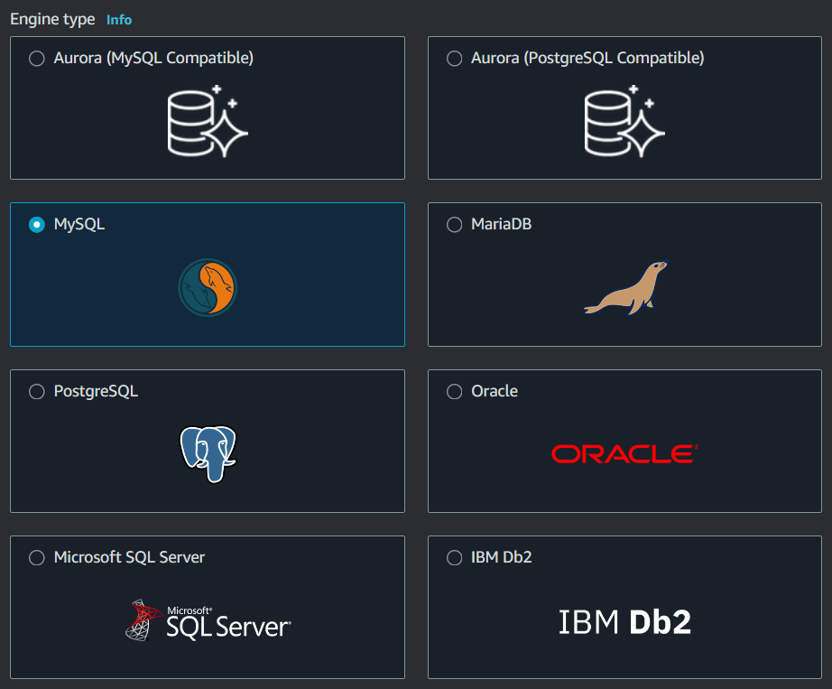
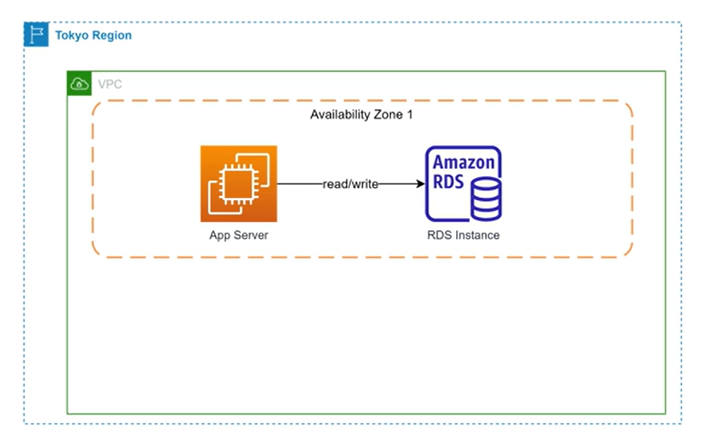
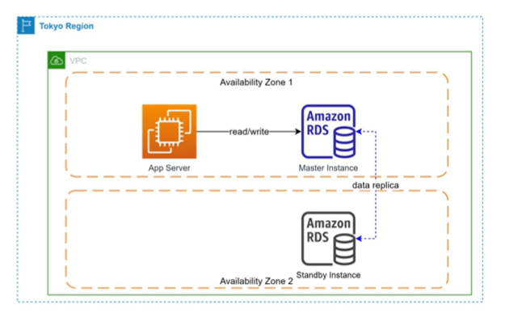
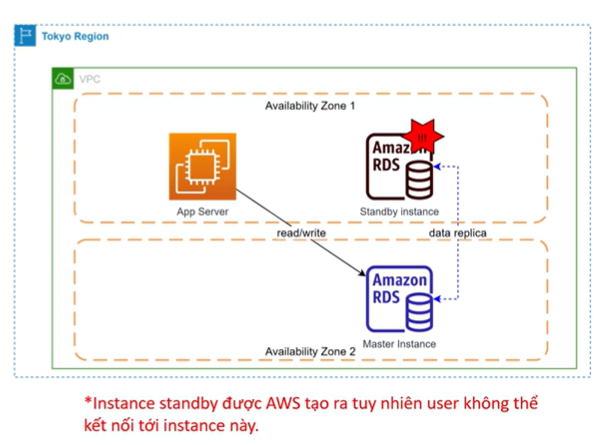
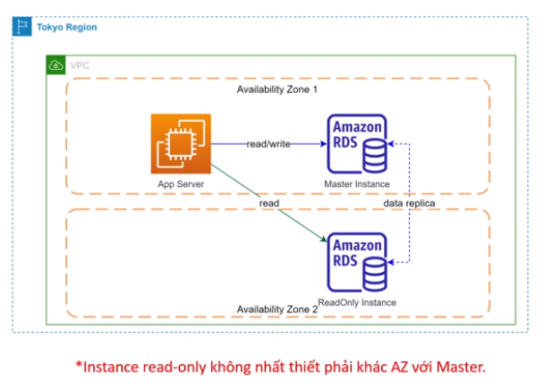
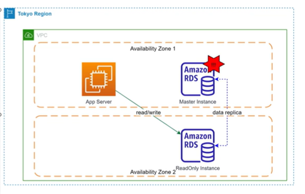
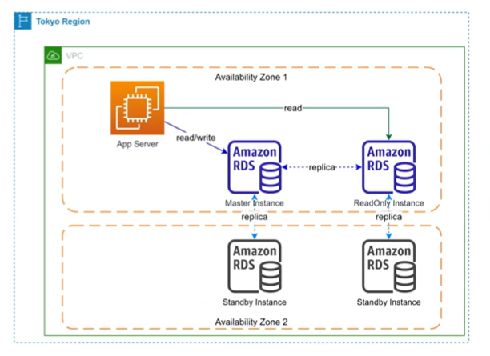
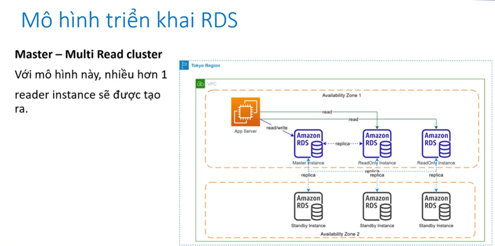
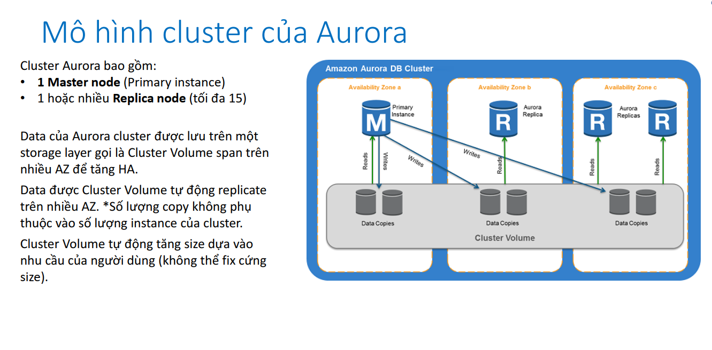
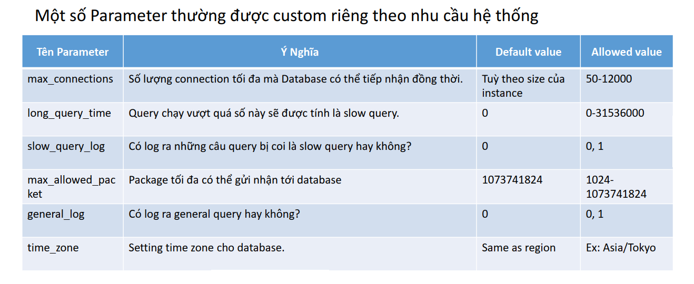

# Relational Database Service

- [What?](#what)
- [Đặc trưng cơ bản](#đặc-trưng-cơ-bản)
- [Features of RDS](#features-of-rds)
- [RDS supported engines](#rds-supported-engines)
- [RDS Usecase](#rds-usecase)
- [RDS Pricing](#rds-pricing)
- [Mô hình triển khai RDS](#mô-hình-triển-khai-rds)
- [Aurora](#aurora)
- [Aurora Global Cluster](#aurora-global-cluster)
- [Mô hình Serverless của Aurora](#mô-hình-serverless-của-aurora)
- [Parameter Groups](#parameter-groups)
- [Option Groups](#option-groups)

## What?

RDS (Relational Database Service) là một service giúp người dụng tạo và quản lí các Relational Database (tức là các database quan hệ như mysql,...)

## Đặc trưng cơ bản

- Là một database as a Service. User không cần quan tâm hạ tầng bên dưới
- Cho phép tạo database instance độc lập hoặc cluster instance
- Không thể login vào instance level như là login vào EC2
- Có thể scale:
  - Scale vertical: tăng hoặc giảm cấu hình instance
  - Scale horizontal: thêm hoặc bớt node tuy nhiên node này chỉ có thể read (read-replica)
- Có giới hạn về dung lượng ở cứng tối đa (64TB đối với MYSQL, Maria,... 16TB đối với Microsoft SQL)

## Features of RDS

- Cho phép tạo các DB instance hoặc cluster instance một cách nhanh chóng
- Tự động fail-over giữa master-slave khi có sự cố
- High-Availability: tự động cấu hình instance stand by, tức là nó sẽ tự tạo 1 con ở zone khác phòng khi có sự cố (optional)
- Tự động scale dung lượng lưu trữ (optional)
- Liên kết với CloudWatch để monitor
- Automate backup & manage retention
- Dễ dàng chỉnh sửa setting ở cấp độ DB sử dụng parameter group

## RDS supported engines

## RDS Usecase

- RDS được sử dụng trong hầu hết các trường hợp cần database dạng quan hệ. VD: lưu trữ thông tin user, website e-commerce, education,...
- RDS thích hợp cho các bài toán OLAP (Online Analatical Processing) nhờ khả năng truy vấn mạnh mẽ, cấu hình có thể scale theo yêu cầu

## RDS Pricing

- Instance size càng lớn thì cost càng cao. Có hỗ trợ reserve instance tương tự như EC2
- Lượng data lưu trữ (GB/month)
- Dung lượng các bản snapshot được tạo ra
- Các tính năng khác vd Backtracking đối với Aurora

## Mô hình triển khai RDS

- **Single Instance**
  - Chỉ có 1 database instance duy nhất được tạo trên 1 AZ. Nếu sự cố xảy ra ở cấp độ AZ, database tèo luôn
  - Phù hợp cho môi trường Dev/Test để tiết kiệm chi phí

- **Single Instance with Multi-AZ**
  - Một bản sao của instance sẽ được tạo ra ở AZ khác và hoạt động dưới mode standby
  - Nhiệm vụ của instance standby này là sync data từ master, không thể truy cập instance
  
  - Khi có sự cố, instance standby sẽ được chuyển thành master (việc này được AWS thực hiện tự động, endpoint url được giữ nguyên)
  - Nếu enable multi AZ, cost x2
  - Phù hợp cho DB Production
  
  
- **Master - Read Only cluster**
  - Một instance với mode ReadOnly sẽ được tạo ra và có khả năng replica data từ master instance
  - Instance này chỉ có thể đọc data phù hợp với workload read > write, muốn tối ưu performance của DB
  - Sau khi thiết lập quan hệ, instance được tạo ra sẽ kết hợp thành 1 cluster
  
  - Trong trạng thái 2 instance đã hình thành cluster, nếu Master instance gặp sự cố, failover sẽ được tự động thực hiện, ReadOnly instance được promote lên làm master
  

*Note: Nếu 2 instance này được tạo riêng biệt sao đó mới thiết lập quan hệ read-replica, thì endpoint của 2 instance này sẽ riêng biệt nên khi failover, cần chỉnh lại connection từ Application*

*Note: Nên tạo cluster sau đó mới add các node vào để quản lý connection ở cluster level (số lượng node read có thể tùy chọn)*

- **Master - Read Only with Multi-AZ**
  - cost x4 so với Single Instance
  

- **Master - Multi Read Cluster**

## Aurora

Aurora là công nghệ database độc quyền của AWS, hỗ trợ 2 loại engine là MySQL
và PostgreSQL.

- Aurora có 2 hình thức triển khai:
  - Cluster (Master + Multi Read Replica)
  - Serverless
- Những tính năng vượt trội của Aurora so với RDS thông thường
  - Hiệu năng tốt hơn (so với RDS instance cùng cấu hình. *Cái này là AWS quảng cáo)
  - Hỗ trợ backtracking (1 tính năng cho phép revert database về trạng thái trong quá khứ tối đa
72h). Khác với restore từ snapshot đòi hỏi tạo instance mới, backtracking restore ngay trên
chính cluster đang chạy.
  - Tự động quản lý Write endpoint , Read endpoint ở cấp độ cluster

## Aurora Global Cluster

Là một cơ chế cho phép tạo ra cụm cluster trên nhiều regions

## Mô hình Serverless của Aurora

- Aurora Serverless là 1 công nghệ cho phép tạo Database dưới dạng serverless.
- Thay vì điều chỉnh cấu hình của DB instance, người dùng sẽ điều chỉnh ACU (Aurora Capacity Unit), ACU càng cao hiệu suất DB càng mạnh.
- Phù hợp cho các hệ thống chưa biết rõ workload, hoặc workload có đặc trưng thay đổi lên xuống thường xuyên.

## Parameter Groups

- RDS là một managed service do đó không thể login vào instance. Nếu muốn can thiệp vào setting ở cấp độ DB (không phải setting OS) ta cần thông qua 1 cơ chế gián tiếp là Parameter Groups.
- Khi tạo RDS nếu không chỉ định gì AWS sẽ sử dụng Parameter Group default của hệ database đang chọn. Default Parameter Group không thể chỉnh sửa.
- Custom Parameter Group được tạo ra bằng cách copy default Parameter Group sau đó chỉnh sửa những tham số phù hợp với nhu cầu.
- Parameter Groups có 2 loại là Cluster Parameter Groups và Instance Parameter Group. Hai loại này khác nhau về scope có thể apply

## Option Groups

- Tương tự Parameter Group tuy nhiên Option Group định nghĩa những setting liên quan tới Security là chủ yếu
- Một số ví dụ về option group:
  - SERVER_AUDIT_EVENTS: Loại action sẽ được log ra, vd: CONNECT, QUERY, QUERY_DDL, QUERY_DML, QUER
  - SERVER_AUDIT_INCL_USERS: Inlcude users và - audit log.
  - SERVER_AUDIT_EXCL_USERS: Loại trừ users khỏi audit log (vd system user).
  - SERVER_AUDIT_LOGGING: Bật tắt audit logging.
