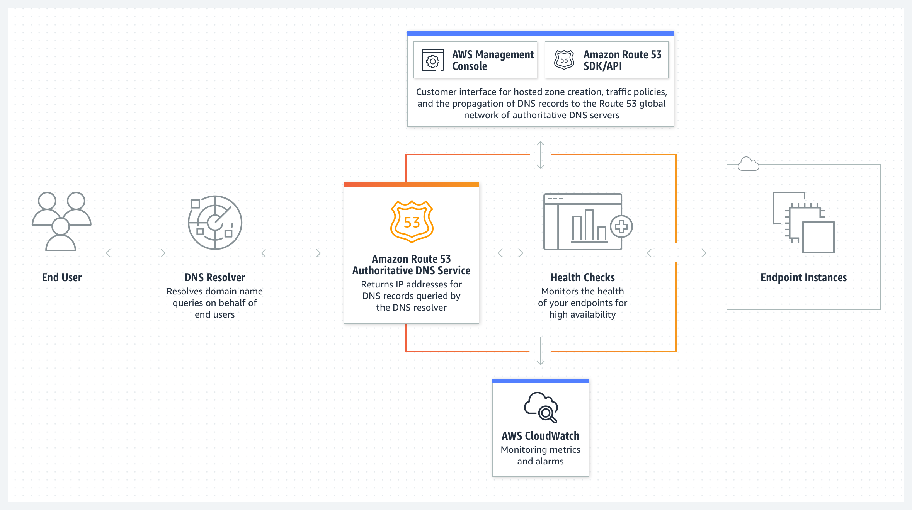

# Domain Name System - Route 53

- [What?](#what)
- [Tính năng của Route 53](#tính-năng-của-route-53)
- [Route 53 hosted zone](#route-53-hosted-zone)
- [DNS Record](#dns-record)
- [Routing policy](#routing-policy)
- [Route 53 Health check](#route-53-health-check)
- [Route 53 pricing](#route-53-pricing)

## What?

- **DNS – Domain Name System**: là một hệ thống quản lý các tên miền và ánh xạ chúng thành địa chỉ IP của máy chủ, cho phép các ứng dụng truy cập vào các dịch vụ trên internet bằng tên miền thay vì sử dụng địa chỉ IP.
- **AWS Route 53** là một dịch vụ quản lý tên miền và DNS (Domain Name System) được cung cấp bởi Amazon Web Services (AWS). DNS AWS Route 53 cho phép bạn đăng ký và quản lý tên miền, tạo và cấu hình các bản ghi DNS, và điều hướng các yêu cầu từ tên miền đến các nguồn tài nguyên khác nhau trên AWS và bên ngoài. Điều này bao gồm điều hướng yêu cầu đến máy chủ web, máy chủ email, CDN và các tài nguyên khác.
- **Route 53** cung cấp một loạt tính năng như đám mây DNS, chống chịu tải, đám mây phân phối nội dung, bảo mật và theo dõi tình trạng tài nguyên. Nó cũng tích hợp tốt với các dịch vụ khác của AWS, cho phép bạn tự động cập nhật bản ghi DNS khi tạo hoặc xoá các nguồn tài nguyên trên AWS

## Tính năng của Route 53

- **Register Domain name**: cho phép bạn mua và quản lý tên miền, tự đông gia hạn (optional). Bạn cũng có thể đem một domain đã mua của bên thứ 3 và quản lý trên Route 53.
- **DNS Routing**: điều hướng internet traffic tới một resource nhất định vd: EC2 IP, Application Load Balancer, Cloud Front, API Gateway, RDS,...
- **Health checking**: tự động gửi request đến các resource để check tình trạng hoạt động. Có thể kết hợp với Cloud Watch alarm để notify khi có resource unhealthy.

## Route 53 hosted zone

- Route 53 hosted zone là một khái niệm trong AWS Route 53. Một hosted zone đại diện cho một tên miền hoặc một tên miền con trong hệ thống DNS. Nó là nơi bạn quản lý các bản ghi DNS (DNS Record) và cấu hình liên quan cho tên miền cụ thể.
- Hosted zone public sẽ map với một tên miền cụ thể (có thể mua bởi Route 53 hoặc bên thứ 3). Private hosted zone cũng map với tên miền tuy nhiên chỉ có tác dụng trong scope một VPC.
- Sau khi tạo hosted zone, bạn có thể thêm các bản ghi DNS vào nó như A Record, CNAME Record, MX Record và nhiều loại bản ghi khác. Bạn có thể cấu hình các bản ghi này để điều hướng yêu cầu tới các tài nguyên khác nhau, chẳng hạn như máy chủ web, máy chủ email hoặc dịch vụ khác trên internet.
- Có thể tương tác với Hostedzone thông qua Console hoặc AWS API từ đó cho phép update tự động các DNS Record.

## DNS Record

- **A Record (Address Record)**: Xác định một địa chỉ IPv4 cho tên miền. Nó ánh xạ một tên miền vào một địa chỉ IP v4
- **AAAA Record (IPv6 Address Record)**: Tương tự như A Record, nhưng sử dụng để xác định một địa chỉ IPv6 cho tên miền.
- **CNAME Record (Canonical Name Record)**: Nó được sử dụng để tạo đường dẫn từ một tên miền thứ cấp (subdomain) đến một tên miền ở bất cứ đâu trên internet.
- **MX Record (Mail Exchanger Record)**: Xác định các máy chủ chịu trách nhiệm nhận và xử lý thư điện tử cho một tên miền. Nó được sử dụng để định vị máy chủ email.
- **TXT Record (Text Record)**: Cho phép bạn lưu trữ các dữ liệu văn bản tùy ý cho tên miền. Nó thường được sử dụng để xác thực tên miền và cung cấp thông tin khác nhau cho các dịch vụ khác.
- **SRV Record (Service Record)**: Xác định vị trí và cấu hình dịch vụ cụ thể trên mạng. Nó được sử dụng chủ yếu trong việc xác định các máy chủ chịu trách nhiệm cho các dịch vụ như VoIP (Voice over IP) và IM (Instant Messaging).
- **NS Record (Name Server Record)**: Xác định máy chủ tên miền (name server) chịu trách nhiệm quản lý các bản ghi DNS cho tên miền cụ thể. Nó cho phép bạn chỉ định máy chủ DNS mà bạn muốn sử dụng cho tên miền của mình.
- **PTR Record (Pointer Record)**: Sử dụng để thực hiện ánh xạ địa chỉ IP thành tên miền. Nó được sử dụng chủ yếu trong việc xác định tên miền từ một địa chỉ IP cụ thể.

## Routing policy

- **Simple routing policy**: Sử dụng trong trường hợp bạn trỏ DNS Record tới một resource riêng lẻ Ví dụ: CloudFront, Web Server run on EC2.
- **Failover routing policy**: Sử dụng khi cấu hình một cặp resource hoạt động theo cơ chế active-passive failover. Thường sử dụng trong private hosted zone.
- **Geolocation routing policy**: Điều hướng traffic từ user tới các target dựa trên vị trí địa lý của user.
- **Geoproximity routing policy**: Sử dụng khi bạn muốn điều hướng traffic dựa trên vị trí của resource. Bạn cũng có thể shift traffic từ resource location này sang resource ở location khác.
- **Latency routing policy**: Sử dụng khi bạn có nhiều resource trên multi regions và muốn điều hướng traffic tới region có latency tốt nhất.
- **IP-based routing policy**: Điều hướng traffic dựa trên location của user và dựa trên IP address mà traffic bắt nguồn.
- **Multivalue answer routing policy**: Sử dụng khi bạn muốn query up-to 8 record healthy được lựa chọn ngẫu nhiên.
- **Weighted routing policy**: Phân chia tỉ lệ điều hướng tới target theo một tỷ lệ nhất định mà bạn mong muốn.

## Route 53 Health check

- Route 53 định kỳ thực hiện các call tới endpoint bạn muốn thực hiện healthcheck. Nếu response failed hoặc không trả về response, Route 53 sẽ raise alarm tới CloudWatch Alarm kết hợp với SNS để notify tới người nhận (vd đội operator).
- Các thông số có thể setting cho healthcheck bao gồm:
  - IP/Domain name cần check
  - Protocol (TCP, HTTP, HTTPS)
  - Interval
  - Failure threshold vd 3 lần ko có resposne thì tính là fail.
  - Notification (optional) kết hợp với CloudWatch Alarm và SNS

## Route 53 pricing

- Giá của tên miền (khác nhau tuỳ đuôi vd .com, .net, .click...sẽ có phí thường niên khác nhau).
- Hosted zone: $0.5/month.
- Query: vd $0.4/1M query standard, $0.6/1M query latency.
- Health check: $0.5/health check/month.
- Log: phụ thuộc vào giá của CloudWatch.
