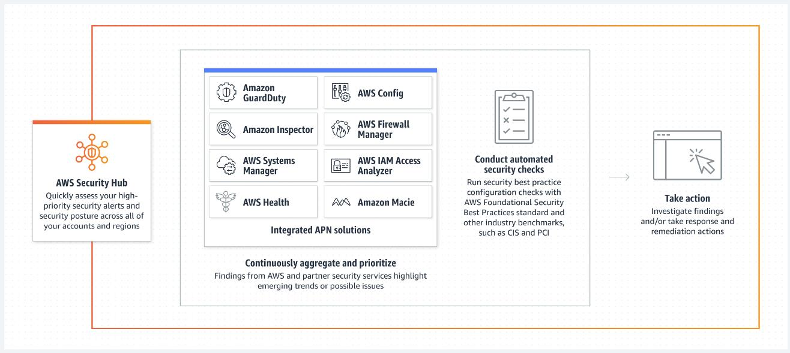
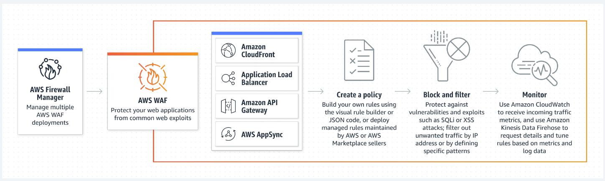

# Security Services

## Các dịch vụ liên quan Security

- Một số nhóm dịch vụ Security chính:
  - Identity and Access management
  - Data encryption and protection
  - Threat detection
  - Application and infrastructure protection
  - Management
- Một số service liên quan security (trên console):
  - Certificate manager
  - WAF
  - KMS
  - Secret Manager
  - Trusted Advisor

## Identity and Access management

- ***AWS Identity Center***
  - Công cụ thay thế single-sign-on (SSO) của AWS, có nhiệm vụ quản lý tập trung quyền access tới nhiều account & application trên AWS

- ***AWS Resource Access Manager***
  - Đơn giản hoá việc chia sẻ một cách bảo mật các resource giữa các AWS Account.
  - Quản lý access đến từng resource thông qua sharing detail, cho phép chia sẻ tới IAM Role, user, AWS Account khác trong cùng Organization.

## Data encryption and protection

- ***AWS Key Management Service (AWS KMS)***
  - Dịch vụ quản lý khóa của AWS, giúp tạo và kiểm soát key được sử dụng để mã hóa hoặc ký số dữ liệu của bạn.

- ***AWS Secrets Manager***
  - Giúp quản lý các thông tin mật như username, password của DB. Cung cấp cơ chế để quản lý access tới các secret và hỗ trợ rotation.

- ***AWS Certificate Manager (ACM)***
  - Giúp tạo và quản lý các SSL certificate một cách dễ dàng. Certificate tạo ra bởi ACM dễ dàng tích hợp với các dịch vụ như CloudFront, Application Load Balancer

- ***Amazon Macie***
  - Dịch vụ giúp phát hiện và bảo vệ dữ liệu nhạy cảm nhờ vào việc apply Machine Learning cho các việc như scanning.

## Threat detection

- ***Amazon GuardDuty***
  - Phát hiện mối đe doạ thông minh.
  - GuardDuty liên tục theo dõi khối lượng công việc và tài khoản AWS của bạn để phát hiện hoạt động có hại, đồng thời cung cấp các nội dung phát hiện bảo mật chi tiết nhằm nhận biết và khắc phục.

- ***Amazon Inspector***
  - Quản lý lỗ hổng bảo mật tự động và liên tục trên quy mô lớn. Hỗ trợ các dịch vụ như EC2, Lambda, ECR
  - Scan lỗ hỏng bảo mật EC2, Lambda, ...

- ***Amazon Detective***
  - Phân tích và trực quan hóa dữ liệu về bảo mật để điều tra các sự cố bảo mật tiềm ẩn.
  - Bằng cách phân tích các log như VPC Log, CloudTrail Log, EKS Audit log, Detective có thể phân tích và điều tra những nguy cơ tiềm ẩn.

- ***AWS Config***
  - Xem xét, kiểm tra và đánh giá cấu hình các tài nguyên của bạn.
  - AWS Config liên tục xem xét, kiểm tra và đánh giá các cấu hình và mối quan hệ của các tài nguyên.
  - Có thể đưa ra các rule để apply cho các resource trên AWS. AWS Config có nhiệm vụ phát hiện ra resource nào vi phạm rule và có action kịp thời (notify, alarm, log..)

*Chức năng Proactive Compliance giúp ngăn chặn hoặc thực thi hành động khi có violate rule.*

- ***AWS Security Hub***
  - Nơi có dashboard tổng hợp các vấn đề về security

## Application and infra protection

- ***AWS WAF***
  - AWS WAF giúp bạn bảo vệ chống lại các bot và tình huống khai thác web phổ biến có thể ảnh hưởng đến mức độ sẵn sàng, xâm phạm bảo mật hoặc tiêu tốn quá nhiều tài nguyên.

- ***AWS Shield***
  - Tối đa hóa mức độ sẵn sàng và khả năng đáp ứng của ứng dụng với tính năng bảo vệ được quản lý chống lại DDoS
*Hạ tầng của AWS được bảo vệ bởi Shield basic (by default)*

***Nếu Enable Advanced Shield sẽ tốn phí ($3000/month và charge ngay lập tức) -> Lưu ý không bật shield advanced.***

## Management

- ***AWS Trusted Advisor***

- AWS Trusted Advisor cung cấp các đề xuất giúp bạn tuân theo những biện pháp thực hành tốt nhất về AWS.
- Trusted Advisor đánh giá tài khoản của bạn bằng các nội dung kiểm tra.
- Những nội dung kiểm tra này xác định các cách để tối ưu hóa cơ sở hạ tầng AWS của bạn, tăng cường bảo mật và hiệu năng, giảm chi phí cũng như giám sát service limit. Sau đó, bạn có thể làm theo các đề xuất để tối ưu hóa dịch vụ và tài nguyên của mình.

*Để tận dụng tối đa các tính năng của Trusted Advisor, bạn cần mua gói Business support plan trở lên*

- ***AWS Organizations***
  - AWS Organization cho phép bạn tạo tài khoản AWS mới mà không phải trả thêm phí. Với các tài khoản trong tổ chức, bạn có thể dễ dàng phân bổ tài nguyên, nhóm các tài khoản và áp dụng các chính sách quản trị cho tài khoản hoặc nhóm.
    - Lợi ích khi sử dụng AWS Organization
      - Tập trung việc quản lý chi phí cũng như theo dõi chi phí của từng account.
      - Phân chia đơn vị trong tổ chức dễ dàng
      - Apply policy đặc thù cho từng đơn vị tổ chức.
      - Tập trung data cho bài toán monitor and audit.
      - Cơ sở để triển khai Landing zone.
