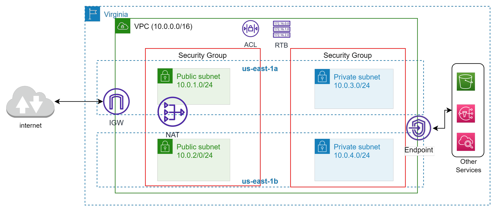
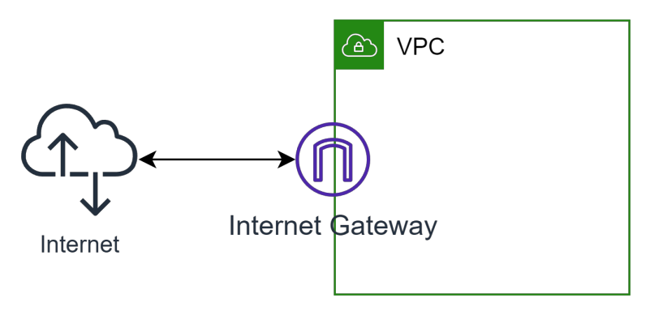
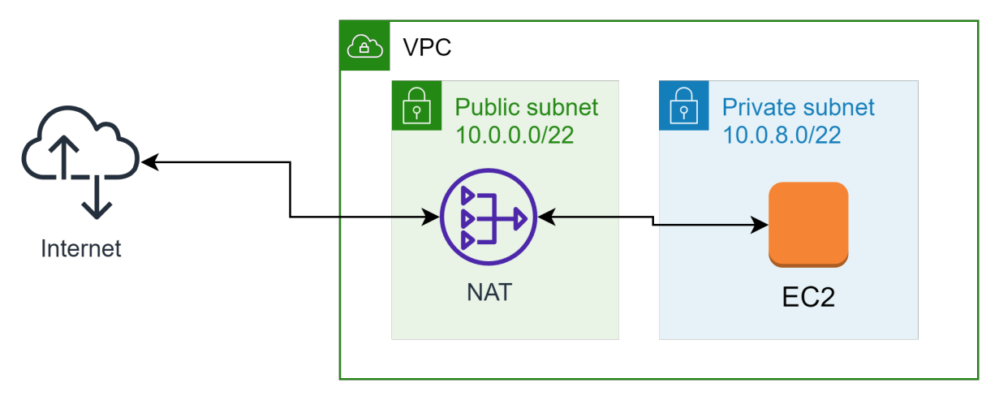
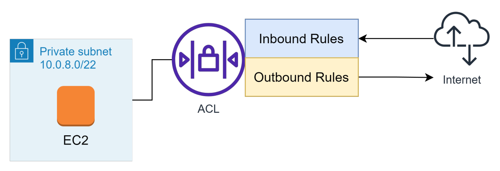
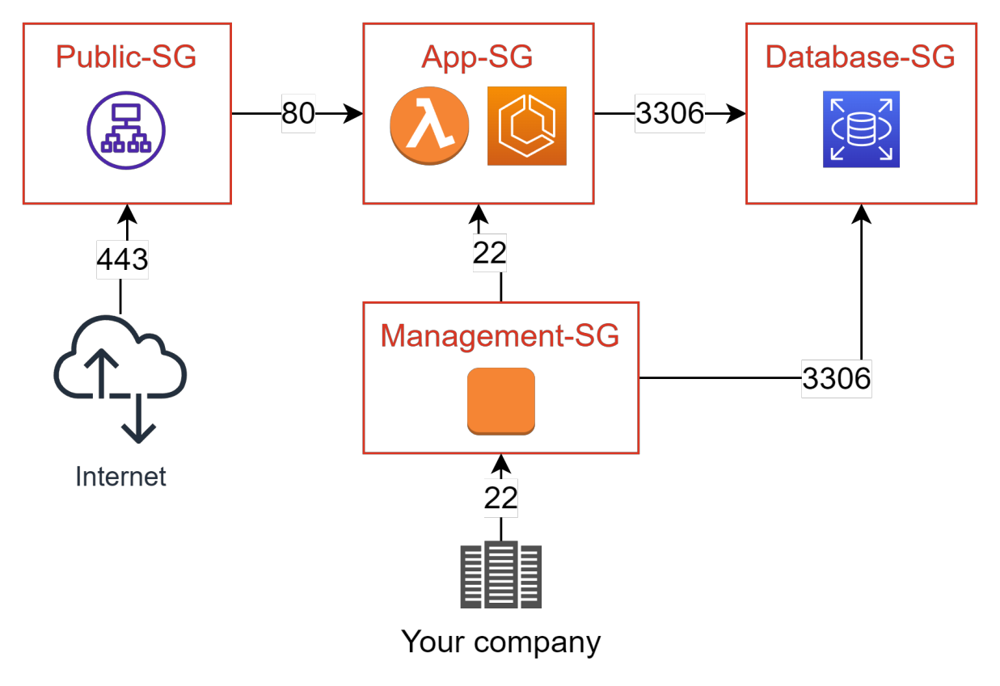
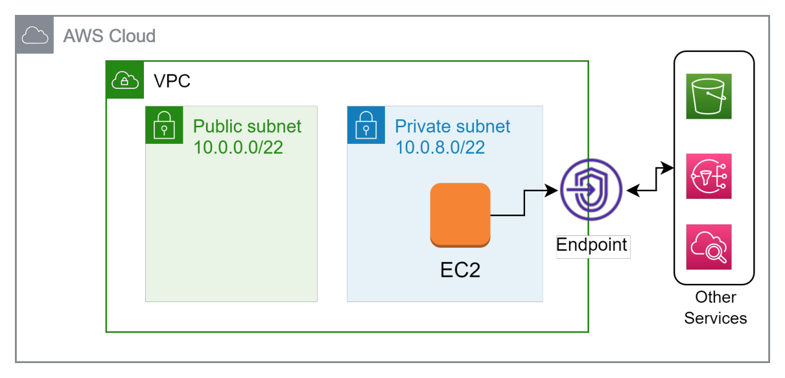
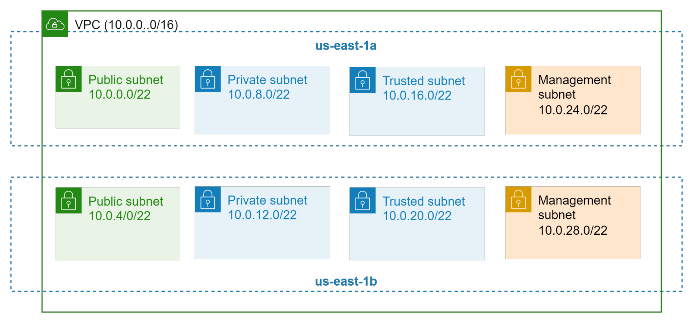
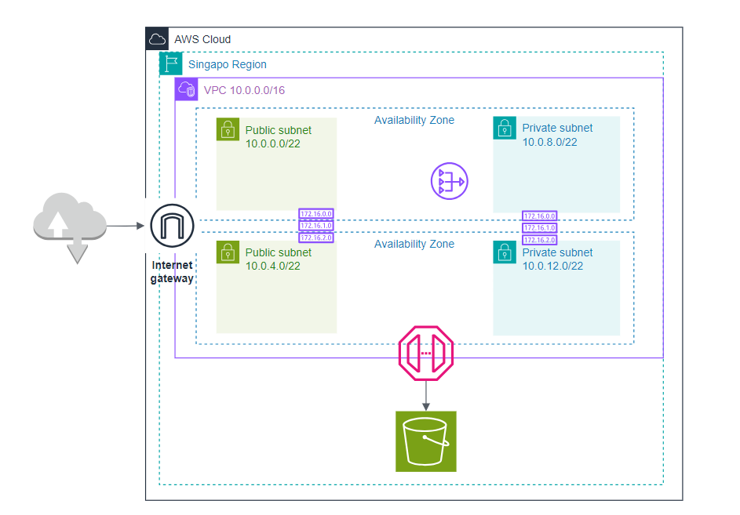
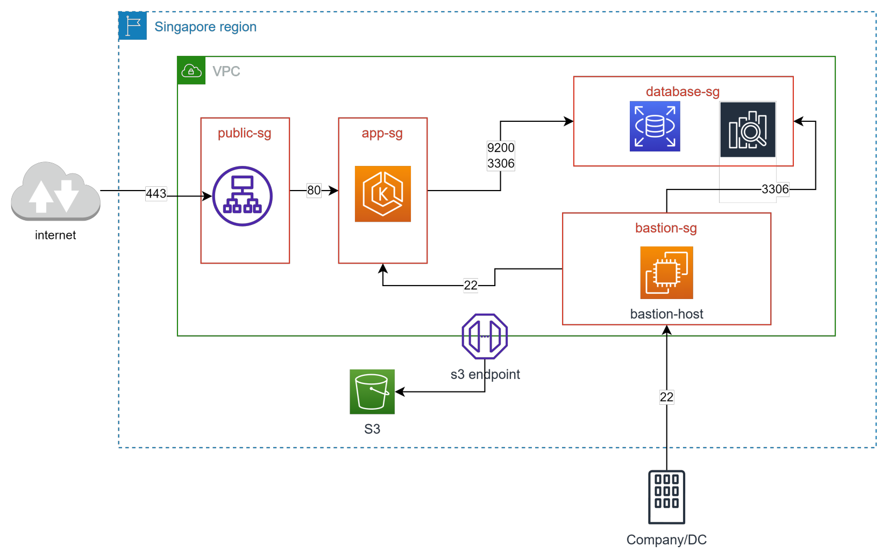

# Networking service - VPC, Peering, Endpoint

- [What?](#what)
- [Các thành phần cơ bản của VPC](#các-thành-phần-cơ-bản-của-vpc)
- [Internet Gateway](#internet-gateway)
- [NAT Gateway](#nat-gateway)
- [Network Access Control List (ACL)](#network-access-control-list-acl)
- [Security Group](#security-group)
- [Route Table](#route-table)
- [VPC Endpoint](#vpc-endpoint)
- [Định nghĩa VPC](#định-nghĩa-vpc)
- [Phân chia subnet?](#phân-chia-subnet)
- [Pricing of VPC](#pricing-of-vpc)
- [Thiết kế VPC Đơn giản](#thiết-kế-vpc-đơn-giản)

## What?

- Viêt tắt của Virtual Private Cloud
- Là một service cho phép người dùng tạo một mạng ảo (virtual network) và control toàn bộ network in/out của mạng đó.
- VPC tương đối giống với network ở datacenter truyền thống tuy nhiên các khái niệm đã được AWS đơn giản hoá giúp người dùng dễ tiếp cận.

## Các thành phần cơ bản của VPC

- **VPC**: Một mạng ảo được tạo ra ở cấp độ region.
- **Subnet**: Một dải IP được định nghĩa nằm trong VPC. Mỗi subnet phải được quyết định Availability Zone tại thời điểm tạo ra.
- **IP Address**: IP V4 hoặc V6 được cấp phát. Có 2 loại là Public IP và Private IP.
- **Routing**: xác định traffic sẽ được điều hướng đi đâu trong mạng.
- **Elastic IP**: IP được cấp phát riêng, có thể access từ internet (public), không bị thu hồi khi instance start -> stop. Nếu không dùng, hoặc được gán cho ec2 đang stop => tính phí. Vì IP này là giới hạn trên global
- **Security Group**: Đóng vai trò như một firewall ở cấp độ instance, định nghĩa traffic được đi vào /đi ra.
- **Network Access Controll List (ACL)**: được apply ở cấp độ subnet, tương tự như security group nhưng có rule Deny và các rule được đánh độ ưu tiên. Mặc định khi tạo VPC sẽ có 1 ACL được apply cho toàn bộ subnet trong VPC (mở all traffic không chặn gì cả).
- **VPC Flow Log**: capture các thông tin di chuyển của traffic trong network.
- **VPN Connection**: kết nối VPC trên AWS với hệ thống dưới On-premise.
- **Elastic Network Interface**: đóng vai trò như 1 card mạng ảo.
- **Internet Gateway**: Kết nối VPC với Internet, là cổng vào từ internet tới các thành phần trong VPC.
- **NAT Gateway**: dịch vụ NAT của AWS cho phép các thành phần bên trong kết nối tới internet nhưng không cho bên ngoài kết nối tới.
- **VPC Endpoint**: kênh kết nối private giúp kết nối tới các services khác của AWS mà không thông qua internet.
- **Peering connection**: kênh kết nối giữa 2 VPC.
- **Transit gateways**: đóng vai trò như 1 hub đứng giữa các VPCs, VPN Connection, Direct Connect.

## Internet Gateway

- Là cửa ngõ để truy cập các thành phần trong VPC.
- Nếu VPC không được gắn Internet Gateway thì không thể kết nối SSH tới instance kể cả instance đó có được gắn public IP. Mặc định default-vpc do AWS tạo sẵn đã có gắn Internet Gateway.

## NAT Gateway

- Giúp cho các instance trong Private Subnet có thể đi ra internet mà không cần tới public IP.
- Giúp tăng cường bảo mật cho các resource cần private (App, DB).

## Network Access Control List (ACL)

- Control network in/out đối với subnet được associate
- Mỗi rule sẽ có các thông số:
  - Priority
  - Allow/Deny
  - Protocol
  - Port range
  - Source IP / Destination IP
- Default ACL sẽ allow all.
- Sử dụng quá nhiều rule của ACL sẽ làm giảm performance.
- Rule của ACL là stateless.

## Security Group

- Thường được dùng để gom nhóm các resource có chung network setting (in/out, protocol, port). Khi thiết kế cần quan tâm tới tính tái sử dụng, dễ quản lý.
- Source của một Security Group có thể là CIDR(Classless Inter-Domain Routing - Ex: 192.168.1.0/24) hoặc id của một Security Group khác.
- Rule của Security Group là stateful và không có deny rule.
*Statefull có nghĩa là nếu Inbound cho phép traffic đi vào thì khi request tới sẽ nhận được response mà không cần explicit allow Outbound. Khác với Network ACL*

## Route Table

- Định tuyến traffic trong subnet hoặc gateway sẽ được điều hướng đi đâu
- Route Table sẽ quyết định một subnet sẽ là Private hay Public.
- Subnet được gọi là Public khi có route đi tới Internet Gateway và ngược lại.
- Một Subnet chỉ có thể associate 1 route table.
- Default VPC do AWS tạo sẵn sẽ có 1 main route table associate với toàn bộ subnet.

## VPC Endpoint

- Giúp các resource trong VPC có thể kết nối tới các dịch vụ khác của AWS thông qua private connection.
- Công dụng: secure, tăng tốc độ.
- Có 2 loại endpoint là Gateway Endpoint (S3, Dynamodb) và Interface Endpoint (SQS, CloudWatch,...)
- Endpoint có thể được cấu hình Security Group để hạn chế truy cập.

## Định nghĩa VPC

- VPC được định nghĩa bằng 1 dải CIDR.
- AWS cho recommend chọn 1 trong 3 dải CIDR sau (theo chuẩn RFC-1918)
  - 192.168.0.0 – 192.168.255.255. Ex: 192.168.0.0/20
  - 10.0.0.0 – 10.255.255.255. Ex: 10.0.0.0/16
  - 172.16.0.0 – 172.31.255.255. Ex: 172.31.0.0/16
- Việc định nghĩa CIDR của IP cần tuân thủ một số tiêu chí sau:
  - Cover được số lượng IP private cần cấp phát trong tương lai.
  - Tránh overlap với các hệ thống sẵn có (kể cả on-premise) nếu không sẽ không thể peering.

## Phân chia subnet?

- Subnet được coi như một thành phần con của VPC.
- Một VPC có thể chứa nhiều subnet không overlap nhau.
- Khi tạo subnet phải chọn Availability Zone.
- Chọn CIDR cho subnet cần lưu ý:
  - Số lượng IP cho các resource cần cấp phát (EC2, Container, Lambda,...)
**VD**: subnet 10.0.1.0/24 sẽ có 256 IP trừ đi 5 reserve ip của AWS
-> 251 IP khả dụng.
  - Số lượng subnet dự tính sẽ tạo trong tương lai.
  - Đặt số sao cho dễ quản lý.

## Pricing of VPC

[Tool CIDR](https://www.ipaddressguide.com/cidr) hoặc tính tay cũng không phải là vấn đề

Giả sử VPC sử dụng CIDR /16 và Subnet sử dụng CIDR /22 ta sẽ có sơ đồ sau:

- *Việc phân chia bao nhiêu loại subnet phụ thuộc vào yêu cầu về độc lập network cho các component*
- *Các subnet không sử dụng hết IP của VPC nên trong tương lai vẫn có thể mở rộng tạo thêm subnet nếu cần*

VPC là một dịch vụ miễn phí tuy nhiên user phải trả phí cho các resource liên quan:

- NAT Gateway: tính tiền theo giờ, ~$45/month/Gateway.
- VPC Endpoint: Tính tiền theo giờ và lưu lượng traffic.
- VPN Connection: tính tiền theo giờ.
- Elastic IP: Tính tiền theo giờ x số IP.
- Traffic: data đi ra ngoài internet.
- ...and more

## Thiết kế VPC Đơn giản

- **Thiết kế một VPC như sau (sử dụng drawio hoặc Powerpoint)**
- VPC CIDR: 10.0.0.0/16
- Có 2 loại subnet Public, Private. Mỗi subnet chứa ít nhất 1000 IPs.
- Mỗi loại subnets nằm ở ít nhất 2 AZ.
- Có 1 Internet Gateway, cấu hình route table tới Internet Gateway.
- Có 1 NAT Gateway, cấu hình route table tới NAT Gateway

- **Thiết kế security group cho 4 nhóm đối tượng:**
  - Application Load Balancer (ALB): expose port HTTPS 443.
  - App Server cho phép port 80 từ ALB, 22 từ Bastion server.
  - Database Server sử dụng MySQL sd port: 3306. Elastic Search sd port: 9200.
  - Bastion Server: SSH port 22 từ IP công ty.
  - Thiết kế VPC Endpoint cho S3 service.

