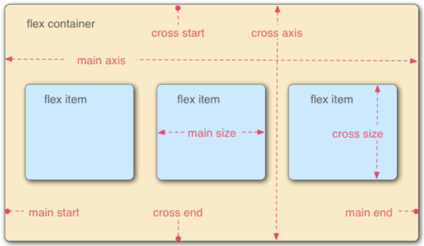

# Flexbox CSS

[Practice](https://codepen.io/enxaneta/full/adLPwv/)

## [Đọc bài này dễ hiểu hơn](https://itviec.com/blog/flex-css/)

## CSS properties used in Flexbox

- **display**: flex | inline-flex

Sẽ quyết định có dùng layout flexbox hay không

- **flex-direction**: row | column

Giúp thay đổi phương hướng của main axis, tức là flex-item sẽ nằm ngang hay dọc

- **flex-wrap**: nowrap | wrap | wrap-reverse

Giúp flex-item xuống dòng hoặc lên dòng

- **flex-flow**: shorthand của flex-wrap,direction

- **flex-basis**: \<length\>

Thay đổi kích thước của main-size, tức là size của flex-item

- **justify-content**: flex-start | flex-end | center | space-between | space-around

Giúp căn flex-item theo hướng main-axis. Khi dùng thuộc tính này cho thằng cha, tương tự với việc dùng thuộc tính justify-self cho các thằng con

- **justify-self**: flex-start | flex-end | center

- **align-content**: flex-start | flex-end | center

tương tự như justify cơ mà theo hướng cross-axis

- **align-self**: flex-start | flex-end | center
- **flex-grow**: \<number\>

Tăng kích thước của main-size flex-item, theo hướng main-axis

- **flex-shrink**: \<number\>

ngược lại với flex-grow

- **flex**: \<number\>

shorthand của flex-basis,shrink,grow

- **order**: \<number\>

Quyết định thứ tự hiện thị các flex-item

[HTML mix Flexbox CSS - My Github](https://github.com/Hjn4Pwn/HTML-CSS-JS-Basic-Learning/tree/master/CSS/Flexbox)
