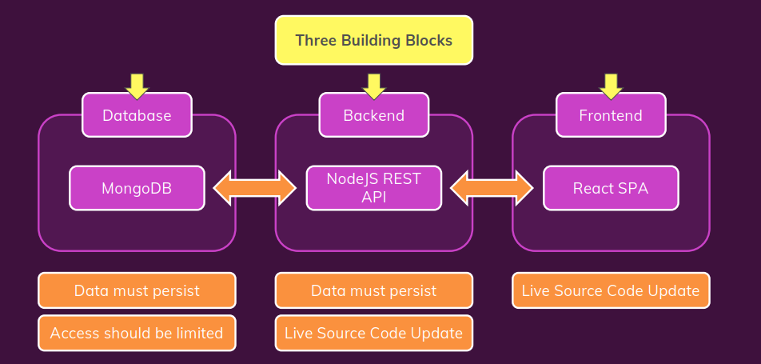

# Docker Compose



## Docker command for build multi container

```sh
---------------------
Create Network
---------------------

docker network create goals-net

---------------------
Run MongoDB Container
---------------------

docker run --name mongodb \
  -e MONGO_INITDB_ROOT_USERNAME=max \
  -e MONGO_INITDB_ROOT_PASSWORD=secret \
  -v data:/data/db \
  --rm \
  -d \
  --network goals-net \
  mongo

---------------------
Build Node API Image - Backend
---------------------

docker build -t goals-node .

---------------------
Run Node API Container
---------------------

docker run --name goals-backend \
  -e MONGODB_USERNAME=max \
  -e MONGODB_PASSWORD=secret \
  -v logs:/app/logs \
  -v /Users/maximilianschwarzmuller/development/teaching/udemy/docker-complete/backend:/app \
  -v /app/node_modules \
  --rm \
  -d \
  --network goals-net \
  -p 80:80 \
  goals-node

---------------------
Build React SPA Image - Frontend
---------------------

docker build -t goals-react .

---------------------
Run React SPA Container
---------------------

docker run --name goals-frontend \
  -v /Users/maximilianschwarzmuller/development/teaching/udemy/docker-complete/frontend/src:/app/src \
  --rm \
  -d \
  -p 3000:3000 \
  -it \
  goals-react

---------------------
Stop all Containers
---------------------

docker stop mongodb goals-backend goals-frontend


```

## docker-compose file .yaml

```sh
version: "3.8"
services:
  mongodb:
    image: 'mongo'
    volumes: 
      - data:/data/db
    # environment: 
    #   MONGO_INITDB_ROOT_USERNAME: max
    #   MONGO_INITDB_ROOT_PASSWORD: secret
      # - MONGO_INITDB_ROOT_USERNAME=max
    env_file: 
      - ./env/mongo.env
  backend:
    build: ./backend
    # build:
    #   context: ./backend
    #   dockerfile: Dockerfile
    #   args:
    #     some-arg: 1
    ports:
      - '80:80'
    volumes: 
      - logs:/app/logs
      - ./backend:/app
      - /app/node_modules
    env_file: 
      - ./env/backend.env
    depends_on:
      - mongodb
  frontend:
    build: ./frontend
    ports: 
      - '3000:3000'
    volumes: 
      - ./frontend/src:/app/src
    stdin_open: true
    tty: true
    depends_on: 
      - backend

volumes: 
  data:
  logs:


```

## Detail

- **version**: của docker compose, ảnh hưởng đến syntax, features dùng trong docker compose. [Find here](https://docs.docker.com/compose/compose-file/compose-versioning/)

- **syntax**: yaml, cách 2 space
- **Service**: gồm các container, ở đây là 3 container sẽ được tạo ra
- **image**: "abc" => có thể là image trên registry hoặc đc tạo ra ở local
- **volumes**:
  - **logs:/app/logs**: named volume
  - **./backend:/app**: bind mount
  - **/app/node_modules**: unnamed volume
- **environment**: lưu các biến môi trường
  - MONGO_INITDB_ROOT_USERNAME: max
  - MONGO_INITDB_ROOT_PASSWORD: secret
  - '- MONGO_INITDB_ROOT_USERNAME=max
- **env_file**: file content sẽ có syntax như sau: *MONGODB_USERNAME=max*
  - '- ./env/backend.env
- **network**: có thể thêm network như này, cơ mà docker-compose đã tự tạo network riêng cho các service mà nó tạo ra
  - '- abc-net
- **depends_on**: nó sẽ đợi container khác được khởi động trước
- volumes: này đứng cùng hàng với service, là để các named volume có thể chia sẽ với nhau giữa các services
  - data:
  - logs:
- Với **-it** bên docker run thì sẽ chuyển thành:
  - **stdin_open: true**
  - **tty: true**
- **build**: ./frontend : trỏ đến path chứa Dockerfile, có thể config sâu hơn
- **ports**:
  - '- '3000:3000'

## command

- **docker-compose up**:
  - khởi tạo image, run container
  - option -d, như docker command run
  - option build => build image mà k run container
- **docker-compose down**: stop & delete everything which are created by docker-compose
