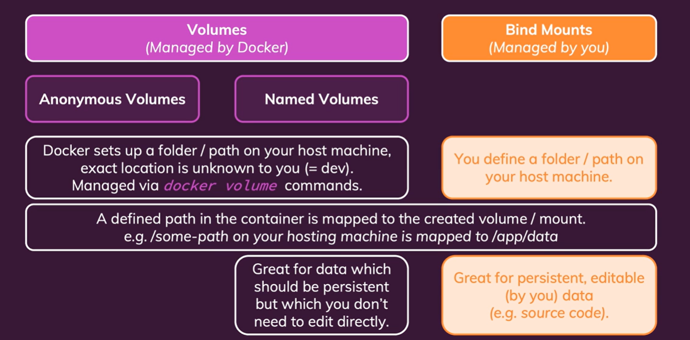
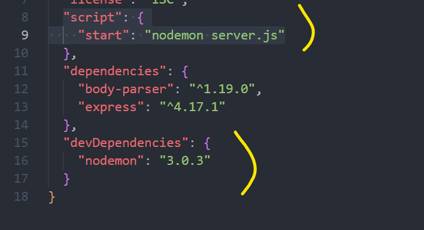
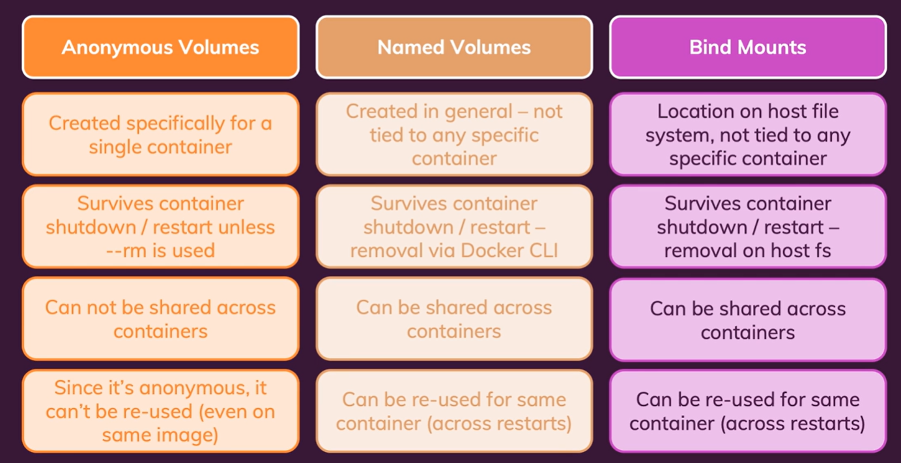

# Volume

- [Compare Persist Volume vs Bind Mount](#compare-persist-volume-vs-bind-mount)
- [Docker Volume - Persist Volume](#docker-volume---persist-volume)
- [Bind Mount](#bind-mount)
- [.dockerignore](#dockerignore)
- [Volume Comparison](#volume-comparison)
- [Environment Variable](#environment-variable)
- [Argument in Dockerfile and Docker run command](#argument-in-dockerfile-and-docker-run-command)

## Compare Persist Volume vs Bind Mount



## Docker Volume - Persist Volume

Dockerfile:

```py
FROM node:14
WORKDIR /app
COPY package.json .
RUN npm install
COPY . .
EXPOSE 80
VOLUME [ "/app/feedback" ]
CMD [ "node", "server.js" ]

```

```sh
➜ data-volumes-03-adj-node-code ⚡                                  20.8.0  15:46:24
▶ docker volume ls
DRIVER    VOLUME NAME
local     d35090ded9fa54da57395d8ff63e53182d1890a1e1a1bf337b574b33a45d30dc
local     f3f64fa3d0a03888d6ae7966d97c172aff760650af8a9b1a71477f2eb2878c70
local     getting-started-app_todo-mysql-data
local     jenkins_home
local     todo-mysql-data

```

Nếu thêm cái VOLUME như trên mà không thêm vào lệnh docker run => vẫn tạo đưọcw volume và link tới host machine cơ mà nó sẽ không được tái sử dụng, bởi nó random name, và không được gắn vào lúc dùng docker run. **And How fix it?**

- Không cần chỉnh sửa gì với Dockerfile (tức là không cần thêm ***VOLUME [ "/app/feedback" ]*** ) và thêm option -v vào docker run:

> docker run -p 3000:80 -d --rm -v f3f64fa3d0a03888d6ae7966d97c172aff760650af8a9b1a71477f2eb2878c70:/app/feedback test:latest

OR

> docker run -p 3000:80 -d --rm -v huyna:/app/feedback test:latest

Đặt hẳn tên cho voulme rồi cứ đính vào như này, cơ mà volume được lưu ở đâu trên host machine thì không biết được, do docker quản lý

### Remove Docker Volume

> Docker volume rm VOLUME-NAME

## Bind Mount

Cách mà ta có thể tạo ra 1 cái bind mount đính vào container:

> docker run -p 3000:80 -d --name node-app -v "$(pwd):/app" node-app:v1

Cơ mà cái này có vấn đề như sau, nếu làm vậy thì cái thư mục app đó sẽ được link, copy vào /app trong Docker, nên nó gây ra cái lỗi sau:

```sh
➜ data-volumes-03-adj-node-code ⚡                                  20.8.0  17:25:24
▶ docker logs db8ac
internal/modules/cjs/loader.js:934
  throw err;
  ^

Error: Cannot find module 'express'
Require stack:
- /app/server.js
    at Function.Module._resolveFilename (internal/modules/cjs/loader.js:931:15)
    at Function.Module._load (internal/modules/cjs/loader.js:774:27)
    at Module.require (internal/modules/cjs/loader.js:1003:19)
    at require (internal/modules/cjs/helpers.js:107:18)
    at Object.<anonymous> (/app/server.js:5:17)
    at Module._compile (internal/modules/cjs/loader.js:1114:14)
    at Object.Module._extensions..js (internal/modules/cjs/loader.js:1143:10)
    at Module.load (internal/modules/cjs/loader.js:979:32)
    at Function.Module._load (internal/modules/cjs/loader.js:819:12)
    at Function.executeUserEntryPoint [as runMain] (internal/modules/run_main.js:75:12) {
  code: 'MODULE_NOT_FOUND',
  requireStack: [ '/app/server.js' ]
}
```

Tức là ta bị mất cái thư mục **node_modules** mà được tạo ra bằng cách **npm install**. Do đó ta cần phải giữ cho cái **node_modules** không bị mất như sau:

> docker run -p 3000:80 -d --name node-app **-v "$(pwd):/app"** -v /app/node_modules node-app:latest

Cái này sẽ không hoạt động trên Window, WSL2, nếu muốn pải config gì đó, cơ mà có thể dùng lệnh sau:

> docker run -p 3000:80 -d --name node-app **--mount type=bind,src="$(pwd)",target=/app** -v /app/node_modules node-app:latest

### Nodemon for update js code realtime



Docker file sửa **CMD [ "node", "server.js" ]** => **CMD [ "npm", "start" ]**

Nodemon được dùng trong Nodejs nhầm monitor file system để reload node server mỗi khi có thay đổi. Tuy nhiên thì vẫn chưa thực hành thành công trên wsl2.

Đã follow [this page](https://devblogs.microsoft.com/commandline/access-linux-filesystems-in-windows-and-wsl-2/) but fail :((((

## .dockerignore

Tương tự như ***.gitinorge***. Các file ở đây sẽ không được copy vào container

## Volume Comparison



## Environment Variable

Với những case cần có tính linh động, thay vì hard code ta có thể setup: **app.listen(process.env.PORT);**

và như này nếu muốn ở Dockerfile:

```py
....
ENV PORT 80

EXPOSE $PORT
....

```

Tuy nhiên cần pải có option **--env PORT=XXXX** ở câu lệnh docker run có thể gán và ghi đè env ở dockerfile:

> docker run -p 3000:8000 -d --env PORT=8000 node-app

*Note: Vì để tăng tính bảo mật => các env variable không nên đưa vào Dockerfile mà nên setup lúc dùng docker run*

## Argument in Dockerfile and Docker run command

```py
ARG TEST=80
ENV PORT=TEST

```

Có thể bị ghi đè ở docker run: **--build-arg TEST=XXXX**
