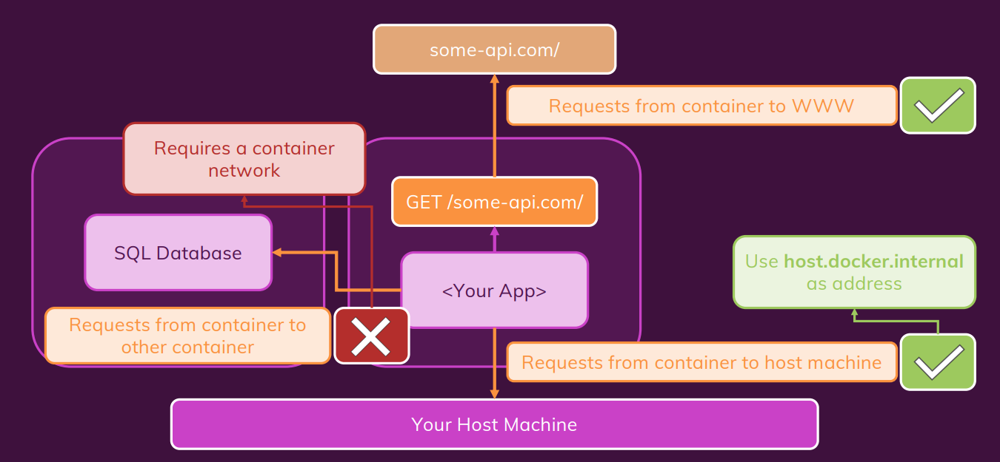

# Docker Network

[For more](https://github.com/Hjn4Pwn/docker-docs/blob/master/docs/docker-coban/docker-network.md)

## Container to WWW

Có thể kết nối đến **WWW** từ bên trong các ứng dụng trong container. Mà không cần phải config

## Container to localhost

Thay domain **localhost** => **host.docker.internal**

## Container to Container

- Tạo network riêng, để đưa các container vào cùng 1 network, và chúng sẽ nói chuyện với nhau bằng name của container
- docker network create NETWORK-NAME
- Thêm option **--network NETWORK-NAME** vào câu lệnh docker run
- Connect giữa các container trong 1 network có thể dùng name của container, thay vì IP
