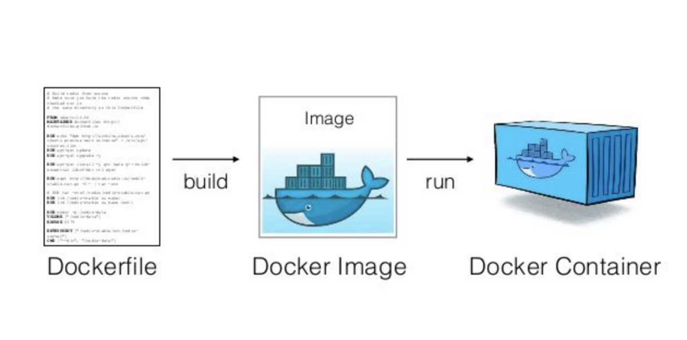

# Get started

- [Image](#image)
- [Build Docker image](#build-docker-image)
- [Run Container](#run-container)
- [Update The Application](#update-the-application)
- [Share Image](#share-docker-application)
- [Persist the DB](#persist-the-db)
- [Bind Mount](#bind-mount)
- [Base Container](#base-container)



## Image

Image: là 1 thực thể giúp cho docker biết được phải chạy cái ứng dụng như thế nào, cần download những packages, những services, version nào để có thể chạy được cái ứng dụng của mình

## Build docker image

Như là mình đọc Doc của docker và làm theo thoi.

- Đầu tiên là cần clone cái source app về để thực hành
- Sau khi clone về thì tiến hành cài đặt các package với **npm i**
- Run app với **node src/index.js**
- Từ giờ sẽ tiến hành build image:
  - Tạo 1 file Dockerfile với nội dung:

```python
# syntax=docker/dockerfile:1

FROM node:18-alpine
WORKDIR /app
COPY . .
RUN yarn install --production
CMD ["node", "src/index.js"]
EXPOSE 3000

```

- Sau đó sẽ tiến hành build với lệnh: **docker build -t getting-started .** hoặc chúng ta có thể gán thêm version cho image bằng cách **docker build -t getting-started:v1 .**
- Sau khi build image xong ta cos thể dùng lệnh **docker image ls** để list các image hiện có

```python
➜ getting-started-app ⚡( main)                                                                                                        20.8.0  2 weeks ago 
▶ docker image ls
REPOSITORY               TAG       IMAGE ID       CREATED         SIZE
getting-started          latest    797b932466d3   6 minutes ago   323MB
docker/getting-started   latest    3e4394f6b72f   10 months ago   47MB

```

Trong quá trình học mình có cài Docker destop, tuy nhiên mình để đó ngắm nghía cho nó trực quan hóa thoi, chứ vẫn chỉ nên dùng CLI thay vì thao tái với GUI

### Fix bug

```sh
➜ API ⚡                                                                        20:55:07
▶ docker build -t ml-detect-malware-JPEG .
failed to fetch metadata: fork/exec /usr/local/lib/docker/cli-plugins/docker-buildx: no such file or directory

DEPRECATED: The legacy builder is deprecated and will be removed in a future release.
            Install the buildx component to build images with BuildKit:
            https://docs.docker.com/go/buildx/

invalid argument "ml-detect-malware-JPEG" for "-t, --tag" flag: invalid reference format: repository name (library/ml-detect-malware-JPEG) must be lowercase
See 'docker build --help'.

```

- **Ta tiến hành cài**:

```sh
docker buildx install
docker buildx version

# nhưng vẫn gặp lỗi
sudo apt-get install docker-buildx-plugin
```

```sh
docker build -t ml-detect-malware-jpeg .
failed to fetch metadata: fork/exec /usr/local/lib/docker/cli-plugins/docker-buildx: no such file or directory

ERROR: BuildKit is enabled but the buildx component is missing or broken.
       Install the buildx component to build images with BuildKit:
       https://docs.docker.com/go/buildx/

```

- **Fix**:

```sh
sudo rm /usr/local/lib/docker/cli-plugins/docker-buildx

```

## run container

- **docker ps -a**
- **docker run -dp 127.0.0.1:3000:3000 getting-started** sẽ nhận được tag name là mặc định
- **docker run -dp 3000:3000 getting-started:v1**
- **docker run -dp 127.0.0.1:3000:3000 --name hjn4-test getting-started** có thể tùy chỉnh name
- **docker stop/start <name/id container>**

```python
➜ getting-started-app ⚡( main)                                                                                                        20.8.0  2 weeks ago 
▶ docker image ls
REPOSITORY               TAG       IMAGE ID       CREATED          SIZE
getting-started          latest    797b932466d3   47 minutes ago   323MB
docker/getting-started   latest    3e4394f6b72f   10 months ago    47MB
➜ getting-started-app ⚡( main)                                                                                                        20.8.0  2 weeks ago 
▶ docker run -dp 127.0.0.1:3000:3000 getting-started
25c0441e08acf8dec3be5f83bec74d0900814e60d5b95961a940687f98d4d882
➜ getting-started-app ⚡( main)                                                                                                        20.8.0  2 weeks ago 
▶ docker ps
CONTAINER ID   IMAGE             COMMAND                  CREATED         STATUS         PORTS                      NAMES
25c0441e08ac   getting-started   "docker-entrypoint.s…"   5 seconds ago   Up 4 seconds   127.0.0.1:3000->3000/tcp   blissful_fermat
➜ getting-started-app ⚡( main)                                                                                                        20.8.0  2 weeks ago 
▶ docker stop blissful_fermat
blissful_fermat
➜ getting-started-app ⚡( main)                                                                                                        20.8.0  2 weeks ago 
▶ docker ps -a
CONTAINER ID   IMAGE             COMMAND                  CREATED         STATUS                     PORTS     NAMES
25c0441e08ac   getting-started   "docker-entrypoint.s…"   2 minutes ago   Exited (0) 5 seconds ago             blissful_fermat
➜ getting-started-app ⚡( main)                                                                                                        20.8.0  2 weeks ago 
▶ docker run -dp 127.0.0.1:3000:3000 --name hjn4-test getting-started
393b2bbac29d134b92593257138700871bc9568439eb919bbbe93a54d1509abc
➜ getting-started-app ⚡( main)                                                                                                        20.8.0  2 weeks ago 
▶ docker ps -a
CONTAINER ID   IMAGE             COMMAND                  CREATED         STATUS                      PORTS                      NAMES
393b2bbac29d   getting-started   "docker-entrypoint.s…"   6 seconds ago   Up 6 seconds                127.0.0.1:3000->3000/tcp   hjn4-test
25c0441e08ac   getting-started   "docker-entrypoint.s…"   2 minutes ago   Exited (0) 49 seconds ago                              blissful_fermat
➜ getting-started-app ⚡( main)                                                                                                        20.8.0  2 weeks ago 
▶ docker stop hjn4-test
hjn4-test
➜ getting-started-app ⚡( main)                                                                                                        20.8.0  2 weeks ago 
▶ docker start hjn4-test
hjn4-test
➜ getting-started-app ⚡( main)                                                                                                        20.8.0  2 weeks ago 
▶ docker stop hjn4-test
hjn4-test

```

- **docker rm <name/id container>**

```shell
➜ getting-started-app ⚡( main)                                                                                                        20.8.0  2 weeks ago 
▶ docker ps -a
CONTAINER ID   IMAGE             COMMAND                  CREATED         STATUS                     PORTS     NAMES
393b2bbac29d   getting-started   "docker-entrypoint.s…"   6 minutes ago   Exited (0) 5 minutes ago             hjn4-test
25c0441e08ac   getting-started   "docker-entrypoint.s…"   9 minutes ago   Exited (0) 7 minutes ago             blissful_fermat
➜ getting-started-app ⚡( main)                                                                                                        20.8.0  2 weeks ago 
▶ docker rm blissful_fermat
blissful_fermat
➜ getting-started-app ⚡( main)                                                                                                        20.8.0  2 weeks ago 
▶ docker ps -a
CONTAINER ID   IMAGE             COMMAND                  CREATED         STATUS                     PORTS     NAMES
393b2bbac29d   getting-started   "docker-entrypoint.s…"   6 minutes ago   Exited (0) 5 minutes ago             hjn4-test

```

## update the application

- Update bằng cách: xóa, stop, cái container hiện tại và phải build image mới, run container mới.
- Mình vẫn chưa tìm hiểu có cách nào khác không, sẽ tìm hiểu sau khi clear hết các task này

## share docker application

- **docker login**

Nói đơn giản thì là push lên docker hub thoi

```shell
➜ getting-started-app ⚡( main)                                                                                                       20.8.0  2 weeks ago 
▶ docker tag getting-started hjn4/learn-get-started-from-docker-doc

➜ getting-started-app ⚡( main)                                                                                                        20.8.0  2 weeks ago 
▶ docker image ls
REPOSITORY                               TAG       IMAGE ID       CREATED             SIZE
hjn4/learn-get-started-from-docker-doc   latest    797b932466d3   About an hour ago   323MB
getting-started                          latest    797b932466d3   About an hour ago   323MB
docker/getting-started                   latest    3e4394f6b72f   10 months ago       47MB

➜ getting-started-app ⚡( main)                                                                                                        20.8.0  2 weeks ago 
▶ docker push hjn4/learn-get-started-from-docker-doc
Using default tag: latest
The push refers to repository [docker.io/hjn4/learn-get-started-from-docker-doc]
75de2c3fea36: Pushed 
5f73fb1faa67: Pushed 
fb74669cf256: Pushed 
b76efd4eddd5: Mounted from library/node 
fa5569ec60d1: Mounted from library/node 
b105890ed2f2: Mounted from library/node 
cc2447e1835a: Mounted from library/node 
latest: digest: sha256:eba4e266c4935c7889ad252aab3eb871775fa353160568dc1c19666035cf9cce size: 1788

➜ getting-started-app ⚡( main)                                                                                                        20.8.0  2 weeks ago 
▶ 

```

- Đầu tiên cần gán tag cho image cần push:

> docker tag *image-name* *username-dockerhub* **/** *repo-name-on-docker-hub* **:** *version*

- Chúng ta có thể dùng list các image ra và thấy 1 image mới được tạo ra như trên

- Kế tiếp là push:

> docker push *username-dockerhub* **/** *repo-name-on-docker-hub*

*chúng ta có thể tạo thêm version cho image như sau*

```shell
➜ getting-started-app ⚡( main)                                                                                                        20.8.0  2 weeks ago 
▶ docker tag getting-started hjn4/learn-get-started-from-docker-doc:v1
➜ getting-started-app ⚡( main)                                                                                                        20.8.0  2 weeks ago 
▶ docker image ls
REPOSITORY                               TAG       IMAGE ID       CREATED         SIZE
getting-started                          latest    797b932466d3   2 hours ago     323MB
hjn4/getting-started                     latest    797b932466d3   2 hours ago     323MB
hjn4/learn-get-started-from-docker-doc   latest    797b932466d3   2 hours ago     323MB
hjn4/learn-get-started-from-docker-doc   v1        797b932466d3   2 hours ago     323MB
docker/getting-started                   latest    3e4394f6b72f   10 months ago   47MB

```

### clone container về run sau khi push lên docker hub

> docker run -dp 127.0.0.1:3000:3000 --name test-clone hjn4/learn-get-started-from-docker-doc:latest

Note: *thường thì ta nên đặt version cụ thể như ngày tháng thay vì để mặc định là latest*

## Persist the DB

Cái persist volume này sẽ ưu tiên sử dụng hơn bởi vì nó là do docker quản lý, có tính bảo mật hơn là mình tự quản lí

- **docker volume create todo-db**
Tức là mình tạo ra 1 cái volume để mà lưu trữ data, sao cho các container sau này tạo lên nó sẽ link đến cái volume này nhầm đảm bảo dữ liệu trong lúc tương tác vẫn được lưu trữ.

- **docker run -dp 127.0.0.1:3000:3000 --mount type=volume,src=todo-db,target=/etc/todos getting-started**

Các cái như **version** hay **--name** đồ thì mình tự tinh chỉnh

```shell
➜ getting-started-app ⚡( main)                                                                                                               20.8.0  2 weeks ago 
▶ docker volume inspect todo-db
[
    {
        "CreatedAt": "2023-10-27T13:50:42Z",
        "Driver": "local",
        "Labels": null,
        "Mountpoint": "/var/lib/docker/volumes/todo-db/_data",
        "Name": "todo-db",
        "Options": null,
        "Scope": "local"
    }
]

```

## Bind Mount

Toẹt vời trên môi trường dev

> docker run -it --mount type=bind,src="$(pwd)",target=/src ubuntu bash

Note: *The --mount option tells Docker to create a bind mount, where **src** is the current working directory on your host machine (getting-started-app), and target is where that directory should appear inside the container (/src).*

Điều này giúp mình có thể tương tác tức thì giữa môi trường trong container và host.

```shell
docker run -dp 127.0.0.1:3000:3000 \
    -w /app --mount type=bind,src="$(pwd)",target=/app \
    node:18-alpine \
    sh -c "yarn install && yarn run dev"


 docker logs -f <container-id>
```

[For more](https://docs.docker.com/get-started/06_bind_mounts/)

## Multi container apps

Target là mỗi ứng dụng sẽ chạy 1 container riêng lẽ, dễ dàng cho quản lý và update.

[For more](https://docs.docker.com/get-started/07_multi_container/)

- Tạo 1 network để các container có thể tương tác với nhau

```shell
docker network create todo-app
```

- Tạo 1 container MYSQL và attach nó vào network vừa tạo

```shell
docker run -d \
    --network todo-app --network-alias mysql \
    -v todo-mysql-data:/var/lib/mysql \
    -e MYSQL_ROOT_PASSWORD=secret \
    -e MYSQL_DATABASE=todos \
    mysql:8.0

```

- Confirm

```shell
docker exec -it <mysql-container-id> mysql -u root -p

mysql> SHOW DATABASES;
+--------------------+
| Database           |
+--------------------+
| information_schema |
| mysql              |
| performance_schema |
| sys                |
| todos              |
+--------------------+
5 rows in set (0.00 sec)

mysql> exit

```

### Xác định địa chỉ IP các container

```shell
docker run -it --network todo-app nicolaka/netshoot

dig mysql

; <> DiG 9.18.8 <> mysql
;; global options: +cmd
;; Got answer:
;; ->>HEADER<<- opcode: QUERY, status: NOERROR, id: 32162
;; flags: qr rd ra; QUERY: 1, ANSWER: 1, AUTHORITY: 0, ADDITIONAL: 0

;; QUESTION SECTION:
;mysql.    IN A

;; ANSWER SECTION:
mysql.   600 IN A 172.23.0.2

;; Query time: 0 msec
;; SERVER: 127.0.0.11#53(127.0.0.11)
;; WHEN: Tue Oct 01 23:47:24 UTC 2019
;; MSG SIZE  rcvd: 44
```

### run app with mysql

```shell
docker run -dp 127.0.0.1:3000:3000 \
  -w /app -v "$(pwd):/app" \
  --network todo-app \
  -e MYSQL_HOST=mysql \
  -e MYSQL_USER=root \
  -e MYSQL_PASSWORD=secret \
  -e MYSQL_DB=todos \
  node:18-alpine \
  sh -c "yarn install && yarn run dev"


```

có thể dùng **docker logs -f \<container-id>**  xem log

- check:

```shell
docker exec -it <mysql-container-id> mysql -p todos


mysql> select * from todo_items;
+--------------------------------------+--------------------+-----------+
| id                                   | name               | completed |
+--------------------------------------+--------------------+-----------+
| c906ff08-60e6-44e6-8f49-ed56a0853e85 | Do amazing things! |         0 |
| 2912a79e-8486-4bc3-a4c5-460793a575ab | Be awesome!        |         0 |
+--------------------------------------+--------------------+-----------+


```

## Base container

Như là môi trường để chạy các lệnh như python, php, node, ...

- Dockerfile:

```sh
FROM node
WORKDIR /app

```

> docker run -it -d -v $(pwd):/app mynode npm init

lệnh trên giúp không cần cài node trên local mà vẫn có thể khởi tạo node project thông qua container với bind mount

Có thể thêm **ENTRYPOINT ["npm"]** để không các lệnh ta dùng đều bắt đầu với npm mà k ghi lại:

> docker run -it -d -v $(pwd):/app mynode init

- Docker-compose:

```sh
version: "3.8"
services:
  npm-name:
    build: ./
    stdin_open: true
    tty: true
    volumes:
      - ./:/app

```

- Nếu có ENTRYPOINT npm:

> docker-compose run --rm npm-name init

- Nếu không có ENTRYPOINT

> docker-compose run --rm npm-name npm init
