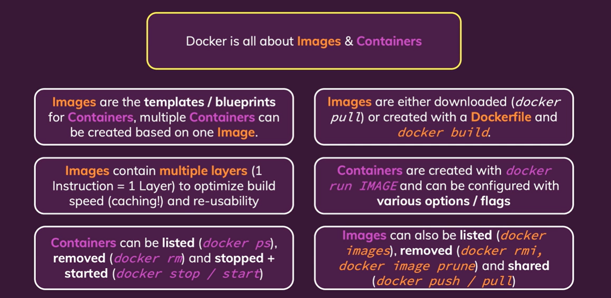

# Images & Containers: The Core Building Blocks

- [Build & Run basic image with Dockerfile](#build--run-basic-image-with-dockerfile)
- [Images are Read-Only](#images-are-read-only)
- [Images Layers](#images-layers)
- [Attach & Detach Container](#attach--detach-container)
  - [Attach](#attach)
  - [Detach](#detach)
- [Internative mode](#internative-mode)
- [Remove](#remove)
- [More information about an image](#more-information-about-an-image)
- [Copy file into & from container](#copy-file-into--from-container)
- [Name & Tag of Containers & Images](#name--tag-of-containers--images)
- [Push image to DockerHub](#push-image-to-dockerhub)
- [Summary](#summary)
- [Cheat sheet](#cheat-sheet)

## Build & Run basic image with Dockerfile

```py
FROM node:14
WORKDIR /app
COPY . .
RUN npm install
EXPOSE 3000
CMD [ "node", "app.mjs" ]

```

> docker build -t getting-started:v1 .

> docker run -dp 3000:80 getting-started:v1

## Images are Read-Only

Nên là mỗi khi update code, application => create new image => run => container with new version of code

## Images Layers

```py
FROM node:14
WORKDIR /app
COPY . .
RUN npm install
EXPOSE 3000
CMD [ "node", "app.mjs" ]

```

- Với cái Dockerfile như trên nếu chúng ta build lại image mà không thay đổi code => nó có cache để không phải chạy lại. Tuy nhiên khi mà ta đã thay đổi code thì nó sẽ chạy lại các instructions kể từ chỗ đã thay đổi đến hết.

- Do đó để save time, ta sẽ làm như sau với case này:

```py
FROM node:14
WORKDIR /app
COPY package.json .
RUN npm install
COPY . .
EXPOSE 3000
CMD [ "node", "app.mjs" ]

```

## Attach & Detach Container

### Attach

> docker attach \<id-name\>

trường hợp cần thêm thông tin từ việc chạy docker => attach hoặc dùng docker

### Detach

> docker run -p 8000:80 -d \<id-name\>

*If you started a container in detached mode (i.e. with -d), you can still attach to it afterwards without restarting the Container with the following command:* **docker attach CONTAINER**

## Internative mode

Example:

```py
from random import randint

min_number = int(input('Please enter the min number: '))
max_number = int(input('Please enter the max number: '))

if (max_number < min_number): 
  print('Invalid input - shutting down...')
else:
  rnd_number = randint(min_number, max_number)
  print(rnd_number)

```

Dockerfile:

```py
FROM python
WORKDIR /app
COPY . .
CMD ["python", "rng.py"]

```

Nếu run bình thường ta sẽ không thể tương tác, input vào được do đó ta cần 2 options:

```py
 -i, --interactive                    Keep STDIN open even if not attached
 -t, --tty                            Allocate a pseudo-TTY
```

option -i => cho phép stdin, -t giả lập => terminal để tương

## Remove

- Chỉ được xóa container mà đã stop

> docker rm CONTAINER

- Chỉ được xóa image mà không được dùng ở bấn kì container nào

> docker rmi

> docker image prune

- Sẽ xóa toạn bộ các image không sử dụng

- Thêm option -rm => vào docker run thì container sẽ được xóa khi bị stop 1 cách auto  

## More information about an image

> docker image inspect IMAGE-

## Copy file into & from container

> docker cp source CONTAINER-NAME:dest

## Name & Tag of Containers & Images

- Thêm option **--name** trong câu lệnh docker run:

> docker run -p 8000:80 -d --name NAME IMAGE-NAME:TAG

- Thêm option -t để gắn tag cho image, chính là version:

> docker build -t abc:v2 .
> docker run -p 8000:80 -d --name NAME IMAGE-NAME:TAG

## Push image to DockerHub

- Đầu tiên cần tạo repo ta có repo-name
- Để push được image lên DockerHub ta cần image đó phải có tên là username-of-DockerHub/Repo-name

> docker tag image-name username-dockerhub / repo-name-on-docker-hub : version

```sh
➜ python-app-starting-setup ⚡                                                   17:17:13
▶ docker images
REPOSITORY   TAG       IMAGE ID       CREATED              SIZE
abc          v1        17b72ac3e71d   About a minute ago   1.02GB

➜ python-app-starting-setup ⚡                                                   17:17:58
▶ docker tag 17b72ac3e71d hjn4/udemy-docker-learn:v1

➜ python-app-starting-setup ⚡                                                   17:18:03
▶ docker images
REPOSITORY                TAG       IMAGE ID       CREATED              SIZE
hjn4/udemy-docker-learn   v1        17b72ac3e71d   About a minute ago   1.02GB
abc                       v1        17b72ac3e71d   About a minute ago   1.02GB

➜ python-app-starting-setup ⚡                                                   17:18:05
▶ docker push hjn4/udemy-docker-learn:v1
The push refers to repository [docker.io/hjn4/udemy-docker-learn]
eae17a074db1: Pushed
2b9b1a0059f9: Pushed
d08e8c3991bb: Mounted from library/python
00fdc842d356: Mounted from library/python
a2ad80a8ed2e: Mounted from library/python
74ec933aa24e: Mounted from library/python
d43f876e6f21: Mounted from library/python
9f843c569746: Mounted from library/python
bcd354c940e1: Mounted from library/python
1dae5147cd29: Mounted from library/python
v1: digest: sha256:167a2de6abd3d4b0b231e33431fb4f40f8f744e6132b228e730c2fe3d53bf46e size: 2420

```

- Pull image from DockerHun

> docker pull IMAGE:tag

## Summary



## Cheat sheet

- **docker build .** : Build a Dockerfile and create your own Image based on the file
  - ***-t NAME:TAG*** : Assign a NAME and a TAG to an image
- **docker run IMAGE_NAME** : Create and start a new container based on image IMAGENAME (or use the image id)
  - ***--name NAME*** : Assign a NAME to the container. The name can be used for stopping and removing etc.
  - ***-d*** : Run the container in detached mode - i.e. output printed by the container is not visible, the command prompt / terminal does NOT wait for the container to stop
  - ***-it*** : Run the container in "interactive" mode - the container / application is then prepared to receive input via the command prompt / terminal. You can stop the container with CTRL + C when using the -it flag
  - ***--rm*** : Automatically remove the container when it's stopped
- **docker ps** : List all running containers
  - ***-a*** : List all containers - including stopped ones
- **docker images** : List all locally stored images
- **docker rm CONTAINER** : Remove a container with name CONTAINER (you can also use the container id)
  - ***-f***: Can remove when container is running
- **docker rmi IMAGE** : Remove an image by name / id
- **docker container prune** : Remove all stopped containers
- **docker image prune** : Remove all dangling images (untagged images)
  - ***-a*** : Remove all locally stored images
- **docker push IMAGE** : Push an image to DockerHub (or another registry) - the image name/ tag must include the repository name/ url
- **docker pull IMAGE** : Pull (download) an image from DockerHub (or another registry) - this is done automatically if you just docker run IMAGE and the image wasn't pulled before
