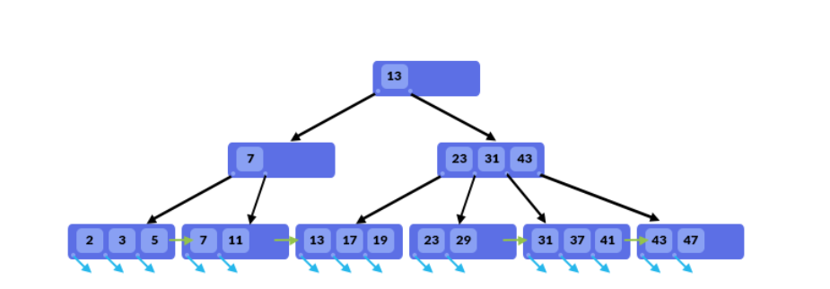
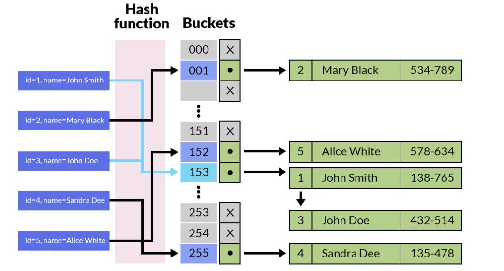

# SQL

[For More](https://github.com/Hjn4Pwn/SQL.git)

## Một số constraint

- **NOT NULL**: Không cho phép giá trị Null
- **UNIQUE**: Mỗi giá trị là duy nhất
- **PRIMARY KEY**: Khóa chính (NOT NULL & UNIQUE)
- **FOREIGN KEY**: Khóa ngoại (tham chiếu sang table khác)
- **CHECK**: Kiểm tra dựa vào điều kiện
- **DEFAULT**: Quy định giá trị mặc định có trường (nếu không input)

```sql
CREATE TABLE persons (
    id INT AUTO_INCREMENT PRIMARY KEY,
    name VARCHAR(255) NOT NULL,
    email VARCHAR(100) UNIQUE,
    age INT DEFAULT 0 CHECK (age >= 18),
    city VARCHAR(255) DEFAULT 'huyna'
);
```

*Việc add constraint + name giúp có thể đặt tên cho ràng buộc, tường minh hơn*

VD:

```sql
alter table NHANVIEN add constraint PK_NV
primary key (MANV)

alter table CTHD add constraint FK_CT_SP
foreign key (MASP) references
SANPHAM(MASP)

alter table SANPHAM add constraint
CK_GIA check (GIA >=500)

alter table KHACHHANG add constraint
UQ_KH unique (CMND)

-- delete constraint
alter table SANPHAM drop constraint CK_GIA;
```

## Các kiểu dữ liệu thông dụng

- char
- varchar
- text
- longtext
- int
- bigint
- float
- double
- date
- datetime
- timestamp
- time

## Tạo và xóa DB

```sql
create database learn_mysql;
drop database learn_mysql;

use learn_mysql; -- use database 
```

## Khóa chính & Khóa ngoại

### Khóa chính

```sql
create table users(
    id int auto_increment primary key,
    username varchar(50),
    password varchar(255),
    -- primary key(id)
    -- primary key(id_A, id_B)
    -- constraint PK_Combine primary key(id, username)
);

alter table users
add primary key(id);

```

### Khóa ngoại

- Khóa ngoại là cột của bảng A tham chiếu đến khóa chính của bảng B

```sql
create table customer(
    id int auto_increment primary key,
    name varchar(40),
    address varchar(255),
);

create table orders(
    id int auto_increment primary key,
    staff varchar(50),
    customer_id int,
    foreign key (customer_id) references customers(id)
);

-- dùng khi đã tạo bảng rồi và muốn add fk
alter table orders
add constraint fk_orders_customers -- đặt tên cho fk
add foreign key (customer_id) references customers(id);

```

## Table

```sql
-- create table

-- Thêm cột mới vào bảng
alter table table_name
add new_col col_definition [first | after column name];

alter table products
add description varchar(255);

-- Chỉnh sửa cột
alter table table_name
modify col_name col_definition;

alter table products
modify id varchar(10);

-- Đổi tên cột
alter table table_name change column old_name new_name col_definition;

alter table products
change column description price float;

-- Xóa cột
alter table table_name drop column col_name;

alter table products drop price;

-- delete table
drop table table_name1, table_name2;

```

## Thao tác với dữ liệu

### Inset

```sql
INSERT INTO NHANVIEN(MANV,HOTEN,SODT,NGVL) 
VALUES 
('NV01','NGUYEN NHU NHUT','0927345678','13/04/2006'),
('NV02','LE THI PHI YEN','0987567390','21/04/2006'),
('NV03','NGUYEN VAN B','0997047382','27/04/2006'),
('NV04','NGO THANH TUAN','0913758498','24/06/2006'),
('NV05','NGUYEN THI TRUC THANH','0918590387','20/07/2006')

```

### Update

```sql
UPDATE KHACHHANG1 SET LOAIKH='VIP' WHERE (NGDK<'01/01/2007'AND DOANHSO >10000000  )
OR  (NGDK>='01/01/2007'AND DOANHSO >2000000  )

```

### Delete

...

## Index

Index là một cấu trúc dữ liệu giúp xác định nhanh chóng các records trong table.

Hiểu một cách đơn giản thì nếu không có index thì SQL phải scan toàn bộ table để tìm được các records có liên quan. Dữ liệu càng lớn, tốc độ query sẽ càng chậm.

- **Ưu điểm**
  - Ưu điểm của index là tăng tốc độ tìm kiếm records theo câu lệnh WHERE.
  - Không chỉ giới hạn trong câu lệnh SELECT mà với cả xử lý UPDATE hay DELETE có điều kiện WHERE.

- **Nhược điểm**
  - Khi sử dụng index thì tốc độ của những xử lý ghi dữ liệu (Insert, Update, Delete) sẽ bị chậm đi.
  - Vì ngoài việc thêm hay update thông tin data thì MYSQL cũng cần update lại thông tin index của bảng tương ứng.
  - Do vậy với những table hay có xử lý insert, update hoặc delete và cần tốc độ xử lý nhanh thì không nên được đánh index.
  - Ngoài ra việc đánh index cũng sẽ tốn resource của server như thêm dung lượng cho CSDL.

### Các kiểu index

- MySQL cung cấp 3 kiểu index khác nhau cho data đó là B-Tree, Hash và R-Tree index.
- Do R-Tree được sử dụng cho các loại dữ liệu hình học không gian Spatial data và thường ít khi gặp phải nên bài viết này chúng ta sẽ tập chung vào 2 loại index là B-Tree và Hash.

### B-Tree index



B-Tree (Balanced Tree) là một cấu trúc dữ liệu dạng cây được tổ chức sao cho dữ liệu được lưu trữ trong một cấu trúc phân cấp. Đặc điểm nổi bật của B-Tree là mọi đường dẫn từ gốc đến lá đều có cùng độ sâu, đảm bảo cây luôn cân bằng. Điều này giúp duy trì hiệu suất tìm kiếm, chèn, xóa ổn định, thường là O(log n).

Thông thường khi nói đến index mà không chỉ rõ loại index thì default là sẽ sử dụng B-Tree index.

```sql
-- Create index
CREATE INDEX id_index ON table_name (column_name[, column_name…]) USING BTREE;

-- Or
ALTER TABLE table_name ADD INDEX id_index (column_name[, column_name…])

-- Drop index
DROP INDEX index_name ON table_name

```

**Cấu trúc của B-Tree:**

- Nút gốc (Root Node): Là nút đầu tiên và cao nhất trong cây.
- Nút lá (Leaf Node): Là các nút cuối cùng ở đáy cây, nơi lưu trữ các giá trị dữ liệu thực tế hoặc con trỏ đến dữ liệu.
- Nút trung gian (Internal Node): Nằm giữa nút gốc và nút lá, chứa các khóa (keys) để định hướng việc tìm kiếm, đồng thời chứa con trỏ trỏ đến các nút con.

**Cách hoạt động:**

- Khi thực hiện tìm kiếm một giá trị trong cột có sử dụng B-Tree index, MySQL bắt đầu từ nút gốc. Dựa trên giá trị của các khóa, nó xác định hướng đi xuống để tìm nút con tương ứng.
- Quá trình này tiếp diễn cho đến khi tìm được nút lá chứa giá trị cần tìm hoặc kết luận giá trị đó không tồn tại.
- B-Tree có khả năng cân bằng tự động, vì vậy khi dữ liệu được chèn hoặc xóa, cây sẽ tự tái cấu trúc để duy trì hiệu suất tìm kiếm.

**Ưu và nhược điểm:**

- **Ưu điểm**:
  - Hiệu quả với các truy vấn có điều kiện như =, >, <, >=, <=, và các truy vấn có phạm vi (BETWEEN, LIKE với điều kiện bắt đầu bằng ký tự).
  - Đảm bảo truy vấn ổn định với hiệu suất O(log n).
  - Hỗ trợ sắp xếp dữ liệu tự nhiên, do đó có thể tối ưu hóa truy vấn ORDER BY.

- **Nhược điểm**:
  - Khi bảng có quá nhiều chèn/xóa, cấu trúc B-Tree có thể phải tái cấu trúc nhiều lần, gây giảm hiệu suất tạm thời.
  - Với các truy vấn chính xác hoặc không thể sắp xếp (ví dụ, LIKE với ký tự wildcard đầu tiên), B-Tree không tối ưu bằng Hash Index.

### Hash Index



Hash Index là một cấu trúc dữ liệu dựa trên bảng băm (hash table). Một hàm băm (hash function) được áp dụng trên giá trị của cột được index để tạo ra một khóa băm, sau đó khóa này được sử dụng để định vị vị trí lưu trữ dữ liệu trong bảng băm.

```sql
-- Create index
CREATE INDEX id_index ON table_name (column_name[, column_name…]) USING HASH;

-- Or
ALTER TABLE table_name ADD INDEX id_index (column_name[, column_name…]) USING HASH;

```

**Cấu trúc của Hash Index:**
    - **Hash Function:** Chuyển đổi giá trị của cột được index thành một mã băm (hash code).
    - **Bucket:** Mỗi khóa băm tương ứng với một bucket, chứa các con trỏ trỏ đến các dòng dữ liệu thực tế.

**Cách hoạt động:**
    - Khi thực hiện tìm kiếm, MySQL áp dụng hàm băm lên giá trị tìm kiếm để tạo ra một mã băm.
    - Sau đó, MySQL sử dụng mã băm này để xác định bucket chứa dữ liệu thực tế.
    - Nếu có nhiều mục dữ liệu với cùng một mã băm (xung đột băm), MySQL sẽ kiểm tra từng mục để tìm ra giá trị chính xác.

**Ưu và nhược điểm:**

- **Ưu điểm:**
  - Tốc độ truy vấn cực nhanh cho các truy vấn chính xác (=).
  - Hiệu suất tìm kiếm là O(1) trong trường hợp không có xung đột băm.

- **Nhược điểm:**
  - Không hỗ trợ các truy vấn phạm vi (ví dụ >, <, BETWEEN), vì hàm băm không duy trì trật tự.
  - Dễ xảy ra xung đột băm, điều này có thể làm giảm hiệu suất nếu không được xử lý tốt.
  - Không thể sử dụng cho các truy vấn với ORDER BY, vì dữ liệu không được lưu trữ theo bất kỳ thứ tự nào.

### Cách đánh index

#### Single-Column Index

**Cách tạo:** Giả sử bạn có một bảng users với các cột id, name, email, created_at. Bạn muốn tạo index trên cột email: **CREATE INDEX idx_email ON users(email);**

Khi bạn thực hiện các truy vấn mà cột email nằm trong điều kiện WHERE, JOIN, hoặc ORDER BY, MySQL sẽ sử dụng index này để tìm kiếm nhanh hơn.

#### Multi-Column Index

```sql
CREATE INDEX idx_name ON users(last_name, first_name, dob);

```

Composite Index tuân theo quy tắc Leftmost Prefix, nghĩa là index sẽ hoạt động hiệu quả với các truy vấn sử dụng cột đầu tiên trong danh sách cột của index, sau đó là các cột tiếp theo theo thứ tự.

**Ví dụ: đánh index trên 3 cột a,b,c thì: truy vấn a, b, c hoặc a, b hoặc a là đúng và hiệu quả khi sử dụng Composite Index**
