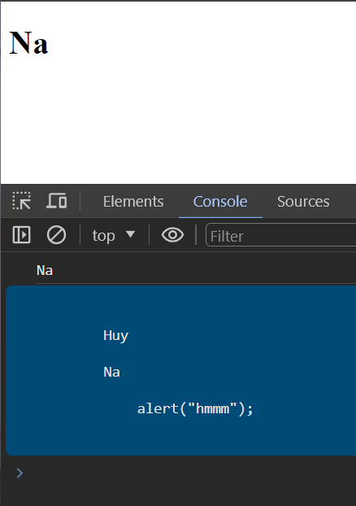

# HTML DOM

***HTML DOM không phải của JS mà nó là 1 quy chuẩn đc W3C định ra, JS có các method, cách thức để có thể tương tác, truy cập vào cáu trúc của HTML DOM***


## Basic Concept

**DOM -  Document Object Model**

*DOM được browser tạo ra khi website được load. Browser có html source code sẽ dựa trên quy chuẩn W3C được cài đặt sẵn => tạo ra DOM*

Gồm 3 thành phần

- **Element**
- **Attribute**
- **Text**

## Get element methods

### Element

```js

/*--------------------------------------*/
// ID return thẳng luôn đối tượng đó
let HeadingNode = document.getElementById('heading');

console.log(HeadingNode)

/*--------------------------------------*/
// class return mảng chứa nhiều elements bên trong
let HeadingNodes = document.getElementsByClassName('heading');

console.log(HeadingNodes)
/*--------------------------------------*/
// tag name return mảng chứa nhiều elements bên trong
let HeadingNodes = document.getElementsByTagName('p');

console.log(HeadingNodes)

/*--------------------------------------*/
// CSS selector return thẳng 1 thằng
let HeadingNode = document.querySelector('.head .heading-2');

console.log(HeadingNode)

// CCS như nào thì ở đây tương tự -- ở đây chỉ select thằng đầu tiên

// Nếu dùng querySelectorAll thì nó return về 1 list các elements thỏa mãn

/*--------------------------------------*/
// HTML collection 
// a(anchors) / form / img(images)
console.log(document.forms)
console.log(document.forms['form-1'])
console.log(document.forms.form_1)

```

### Attribute

```js
let HeadingELemnt = document.querySelector('h2');

HeadingELemnt.title = "haizzz"; //title
HeadingELemnt.id = "haizzz"; //id
HeadingELemnt.className = "haizzz"; //class

// set attribute và value mới cho 1 element
HeadingELemnt.setAttribute('huyna', 'haha');

console.log(HeadingELemnt.getAttribute('id')); //haizz
console.log(HeadingELemnt.getAttribute('huyna')); //haha

// chỉ hợp lệ với các attribute hợp lệ, chứ huyna là cái mình tự set, k dùng kiểu syntax này được
console.log(HeadingELemnt.id); //haizz

```

### Text

```js
let HeadingELemnt = document.querySelector('.heading');

// HeadingELemnt.innerText = "abc";
// HeadingELemnt.textContent = "xyz"; //same

console.log(HeadingELemnt.innerText); // in ra những gì nhìn thấy
console.log(HeadingELemnt.textContent);  // in ra những text thật sự chứa (bỏ qua các tag, chỉ lấy text bên trong tag)

```



## InnerHTML Property

```js
let boxElement = document.querySelector('.box');

// boxElement.innerHTML = "<h1>haha h2</h1>"; // thêm vòa bên trong element

boxElement.outerHTML = "<h1>haha h2</h1>"; // ghi đè luôn thằng cha đã thêm nó

```

## DOM event

Ví dụ cơ bản: [for more](https://www.w3schools.com/jsref/dom_obj_event.asp)

```js
let boxElement = document.querySelector('.box');

boxElement.onclick = function () {
    console.log("123")
}

```

```html
<body>
    <input type="text" class="">
    <input type="checkbox" name="" id="">

    <select name="" id="">
        <option value="1">JS</option>
        <option value="2">PHP</option>
        <option value="3">Python</option>
    </select>

</body>

```

```js
let inputElement = document.querySelector('input[type="text"]');

// cần có sự thay đổi tức là focus vào nhập rồi focus ra ngoài
inputElement.onchange = function (e) { // có thể dùng oninput ...
    console.log(e.target.value)
}

/*---------------------------------------*/

let inputElement = document.querySelector('input[type="checkbox"]');

inputElement.onchange = function (e) {
    console.log(e.target.checked) // return true/false
}

/*---------------------------------------*/
let inputElement = document.querySelector('select');

inputElement.onchange = function (e) {
    console.log(e.target.value) // return 1/2/3 (value set in option)
}


/*---------------------------------------*/
// preventDefault: giúp loại bỏ hành vi mặc định của browser trên thẻ html
// 
//  <a href="https://facebook.com" class="">facebook</a>
//  <br>
//  <a href="https://google.com" class="">goole</a>
//  


let aElement = document.links;

for (let i = 0; i < aElement.length; i++) {
    aElement[i].onclick = function (e) {
        if (!e.target.href.startsWith('https://face')) {
            e.preventDefault();
        }
    }
}

/*---------------------------------------*/
// stopPropagation: giúp loại bỏ sự kiện nổi bọt, event bị trigger từ con => cha => ông ....

    // <div>
    //     DIV
    //     <button>Click me</button>
    // </div>

document.querySelector('div').onclick =
    function () {
        console.log('DIV');
    }

document.querySelector('button').onclick =
    function (e) {
        e.stopPropagation();
        console.log('button');
    }

```

## Event listener

```js
let btn = document.getElementById('btn');


/**
 * dùng dom event chỉ muốn catch event và thực hiện trong 3s
 * sẽ bị ghi đè 
 */

// btn.onclick = function () {
//     console.log('viec 1');
//     console.log('viec 2');
//     console.log('viec 3');
// }

// setTimeout(function () {
//     btn.onclick = function () { }
// }, 3000);

/**
 * Không bị ghi đè
 * tuy nhiên cần để function ở bên ngoài để 
 * tạo và xóa dễ dàng hơn
 * cung cấp phương thức remove dễ dàng
 */

function viec1() {
    console.log('viec 11');
}

btn.addEventListener('click', viec1);

btn.addEventListener('click', function () {
    console.log('viec 22');
});

btn.addEventListener('click', function () {
    console.log('viec 33');
});

setTimeout(function () {
    btn.removeEventListener('click', viec1)
}, 3000);

```
