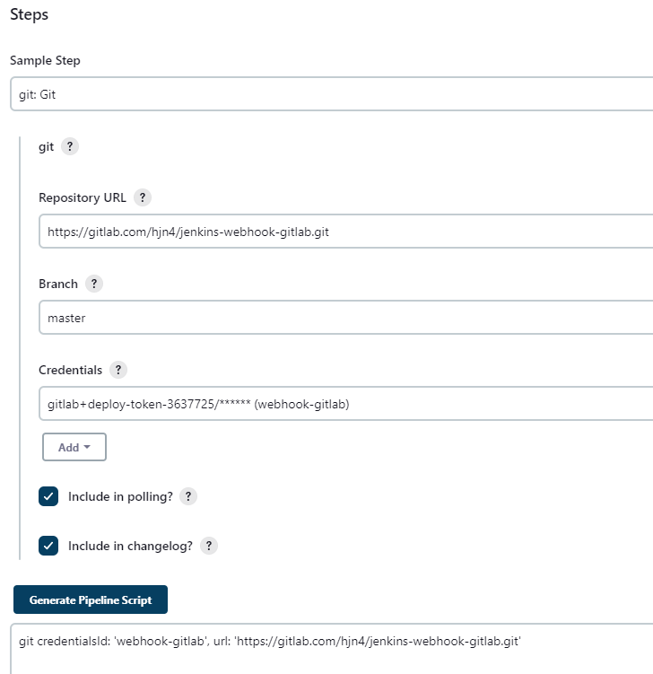
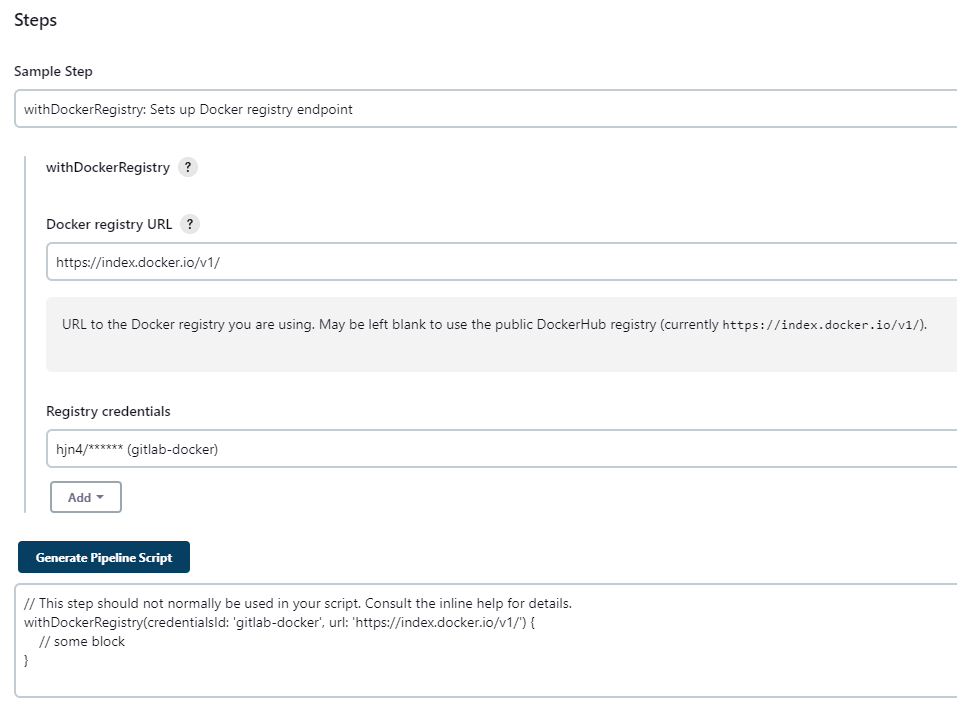
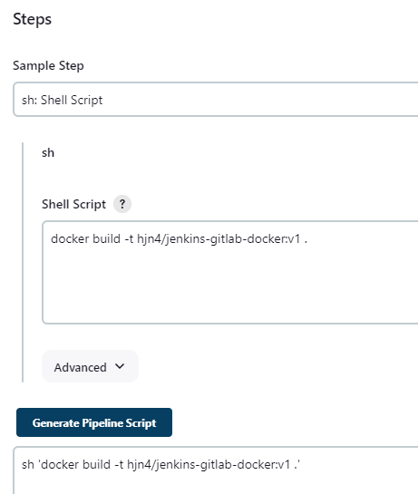
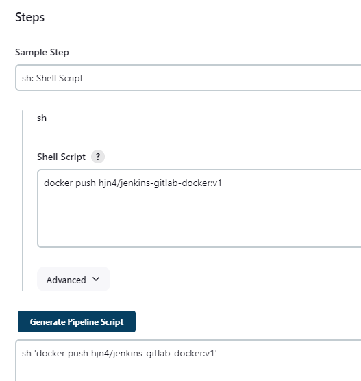

# Gitlab-dockerhub-pipeline

*ở đây mình sẽ thực hành đẩy code lên gitlab, trigger push event, dùng jenkins clone code về, build image và push lên dockerhub*

[Full code here](https://gitlab.com/hjn4/jenkins-webhook-gitlab.git)
[Troubleshoot docker not found](https://forums.docker.com/t/docker-not-found-in-jenkins-pipeline/31683)

- Thì đầu tiên cũng làm tương tự như [thế này](./gitlab_jenkins.md)

- Ta sẽ dùng pipeline syntax để generate ra cái code cho **jenkinsfile**:

  - **git credentialsId: 'webhook-gitlab', url: '<https://gitlab.com/hjn4/jenkins-webhook-gitlab.git>'**: Sử dụng plugin Git trong Jenkins để sao chép mã nguồn từ kho GitLab. Cung cấp thông tin đăng nhập (credentialsId) và URL của kho Git.
stage('docker build and push') { ... }: Định nghĩa một giai đoạn khác có tên là "docker build and push" để xây dựng và đẩy hình ảnh Docker lên Docker Registry.


  - **withDockerRegistry(credentialsId: 'gitlab-docker', url: '<https://index.docker.io/v1/>') { ... }**: Sử dụng plugin Docker trong Jenkins để thực hiện các bước trong một Docker registry(cụ thể là dockerhub). Cung cấp thông tin đăng nhập (credentialsId) và URL của Docker registry.


  - **sh 'docker build -t hjn4/jenkins-gitlab-docker:v1 .'**: Sử dụng lệnh shell để xây dựng image Docker từ Dockerfile hiện tại và đặt tên là hjn4/jenkins-gitlab-docker:v1.


  - **sh 'docker push hjn4/jenkins-gitlab-docker:v1'**: Sử dụng lệnh shell để đẩy image Docker vừa xây dựng lên Docker registry (cụ thể là dockerhub).


```python
pipeline {
    agent any
    stages {
        stage('Clone') {
            steps {
                git credentialsId: 'webhook-gitlab', url: 'https://gitlab.com/hjn4/jenkins-webhook-gitlab.git'
            }
        }
        stage('docker build and push') {
            steps {
                // This step should not normally be used in your script. Consult the inline help for details.
                withDockerRegistry(credentialsId: 'gitlab-docker', url: 'https://index.docker.io/v1/') {
                    sh 'docker build -t hjn4/jenkins-gitlab-docker:v1 .'
                    sh 'docker push hjn4/jenkins-gitlab-docker:v1'
                }
            }
        }
    }
}

```

- Trong đó:
  - credentials **webhook-gitlab**: là token(deploy token => username và passwd cho việc truy cập vào gitlab)

  - credentials **gitlab-docker**: là username và password cho account dockerhub

  - **hjn4/jenkins-gitlab-docker:v1** : *hjn4/jenkins-gitlab-docker* là username/repo-name tạo trước trên dockerhub, *v1* là version

## Result

**Finished: SUCCESS**

```shell
Started by GitLab push by Huy Na
Obtained Jenkinsfile from git https://gitlab.com/hjn4/jenkins-webhook-gitlab.git
[Pipeline] Start of Pipeline
[Pipeline] node
Running on Jenkins in /var/jenkins_home/workspace/webhook-gitlab
[Pipeline] {
[Pipeline] stage
[Pipeline] { (Declarative: Checkout SCM)
[Pipeline] checkout
The recommended git tool is: git
using credential webhook-gitlab
Cloning the remote Git repository
Cloning repository https://gitlab.com/hjn4/jenkins-webhook-gitlab.git
 > git init /var/jenkins_home/workspace/webhook-gitlab # timeout=10
Fetching upstream changes from https://gitlab.com/hjn4/jenkins-webhook-gitlab.git
 > git --version # timeout=10
 > git --version # 'git version 2.39.2'
using GIT_ASKPASS to set credentials webhook-gitlab
 > git fetch --tags --force --progress -- https://gitlab.com/hjn4/jenkins-webhook-gitlab.git +refs/heads/*:refs/remotes/origin/* # timeout=10
 > git config remote.origin.url https://gitlab.com/hjn4/jenkins-webhook-gitlab.git # timeout=10
 > git config --add remote.origin.fetch +refs/heads/*:refs/remotes/origin/* # timeout=10
Avoid second fetch
skipping resolution of commit remotes/origin/master, since it originates from another repository
 > git rev-parse refs/remotes/origin/master^{commit} # timeout=10
Checking out Revision 403666196f3b3729e172c535eafc67ae255c5047 (refs/remotes/origin/master)
 > git config core.sparsecheckout # timeout=10
 > git checkout -f 403666196f3b3729e172c535eafc67ae255c5047 # timeout=10
Commit message: "day2 gitlab docker"
 > git rev-list --no-walk cf46e0874ec6162583b88a10a85c2a933316f8d2 # timeout=10
[Pipeline] }
[Pipeline] // stage
[Pipeline] withEnv
[Pipeline] {
[Pipeline] stage
[Pipeline] { (Clone)
[Pipeline] git
The recommended git tool is: git
using credential webhook-gitlab
 > git rev-parse --resolve-git-dir /var/jenkins_home/workspace/webhook-gitlab/.git # timeout=10
Fetching changes from the remote Git repository
 > git config remote.origin.url https://gitlab.com/hjn4/jenkins-webhook-gitlab.git # timeout=10
Fetching upstream changes from https://gitlab.com/hjn4/jenkins-webhook-gitlab.git
 > git --version # timeout=10
 > git --version # 'git version 2.39.2'
using GIT_ASKPASS to set credentials webhook-gitlab
 > git fetch --tags --force --progress -- https://gitlab.com/hjn4/jenkins-webhook-gitlab.git +refs/heads/*:refs/remotes/origin/* # timeout=10
skipping resolution of commit remotes/origin/master, since it originates from another repository
 > git rev-parse refs/remotes/origin/master^{commit} # timeout=10
Checking out Revision 403666196f3b3729e172c535eafc67ae255c5047 (refs/remotes/origin/master)
 > git config core.sparsecheckout # timeout=10
 > git checkout -f 403666196f3b3729e172c535eafc67ae255c5047 # timeout=10
 > git branch -a -v --no-abbrev # timeout=10
 > git checkout -b master 403666196f3b3729e172c535eafc67ae255c5047 # timeout=10
Commit message: "day2 gitlab docker"
[Pipeline] echo
Hjn4
[Pipeline] }
[Pipeline] // stage
[Pipeline] stage
[Pipeline] { (docker build and push)
[Pipeline] withDockerRegistry
$ docker login -u hjn4 -p ******** https://index.docker.io/v1/
WARNING! Using --password via the CLI is insecure. Use --password-stdin.
WARNING! Your password will be stored unencrypted in /var/jenkins_home/workspace/webhook-gitlab@tmp/4ca3ad41-b448-4a29-841f-61a991ff82dc/config.json.
Configure a credential helper to remove this warning. See
https://docs.docker.com/engine/reference/commandline/login/#credentials-store

Login Succeeded
[Pipeline] {
[Pipeline] sh
+ docker build -t hjn4/jenkins-gitlab-docker:v1 .
DEPRECATED: The legacy builder is deprecated and will be removed in a future release.
            Install the buildx component to build images with BuildKit:
            https://docs.docker.com/go/buildx/

Sending build context to Docker daemon  80.82MB

Step 1/6 : FROM node:18-alpine
18-alpine: Pulling from library/node
96526aa774ef: Pulling fs layer
3130715204cf: Pulling fs layer
b06de8ab1c4f: Pulling fs layer
90ef3ffc5156: Pulling fs layer
90ef3ffc5156: Waiting
96526aa774ef: Verifying Checksum
96526aa774ef: Download complete
96526aa774ef: Pull complete
b06de8ab1c4f: Verifying Checksum
b06de8ab1c4f: Download complete
90ef3ffc5156: Verifying Checksum
90ef3ffc5156: Download complete
3130715204cf: Verifying Checksum
3130715204cf: Download complete
3130715204cf: Pull complete
b06de8ab1c4f: Pull complete
90ef3ffc5156: Pull complete
Digest: sha256:435dcad253bb5b7f347ebc69c8cc52de7c912eb7241098b920f2fc2d7843183d
Status: Downloaded newer image for node:18-alpine
 ---> d1517ab6615b
Step 2/6 : WORKDIR /app
 ---> Running in ddddd5901247
Removing intermediate container ddddd5901247
 ---> 3d9093acfeb6
Step 3/6 : COPY . .
 ---> eb714158d953
Step 4/6 : RUN yarn install --production
 ---> Running in 075c148cfb9d
yarn install v1.22.19
warning package-lock.json found. Your project contains lock files generated by tools other than Yarn. It is advised not to mix package managers in order to avoid resolution inconsistencies caused by unsynchronized lock files. To clear this warning, remove package-lock.json.
[1/4] Resolving packages...
[2/4] Fetching packages...
[3/4] Linking dependencies...
[4/4] Building fresh packages...
Done in 11.67s.
Removing intermediate container 075c148cfb9d
 ---> 7cb52ab34a7c
Step 5/6 : CMD ["node", "src/index.js"]
 ---> Running in 3e94156587c8
Removing intermediate container 3e94156587c8
 ---> cf487bd0af97
Step 6/6 : EXPOSE 3000
 ---> Running in 95f86c8149cf
Removing intermediate container 95f86c8149cf
 ---> 3df7fa1941cc
Successfully built 3df7fa1941cc
Successfully tagged hjn4/jenkins-gitlab-docker:v1
[Pipeline] sh
+ docker push hjn4/jenkins-gitlab-docker:v1
The push refers to repository [docker.io/hjn4/jenkins-gitlab-docker]
8041e6a72956: Preparing
f2ec0ca38f26: Preparing
2a2696d1297f: Preparing
b76efd4eddd5: Preparing
fa5569ec60d1: Preparing
b105890ed2f2: Preparing
cc2447e1835a: Preparing
b105890ed2f2: Waiting
cc2447e1835a: Waiting
fa5569ec60d1: Mounted from library/node
b76efd4eddd5: Mounted from library/node
b105890ed2f2: Mounted from library/node
2a2696d1297f: Pushed
cc2447e1835a: Mounted from library/node
f2ec0ca38f26: Pushed
8041e6a72956: Pushed
v1: digest: sha256:bde28bb0536104339b706b9e633231c17b09c1bc364e592ff803387c3cb93494 size: 1788
[Pipeline] }
[Pipeline] // withDockerRegistry
[Pipeline] }
[Pipeline] // stage
[Pipeline] }
[Pipeline] // withEnv
[Pipeline] }
[Pipeline] // node
[Pipeline] End of Pipeline
Finished: SUCCESS

```
