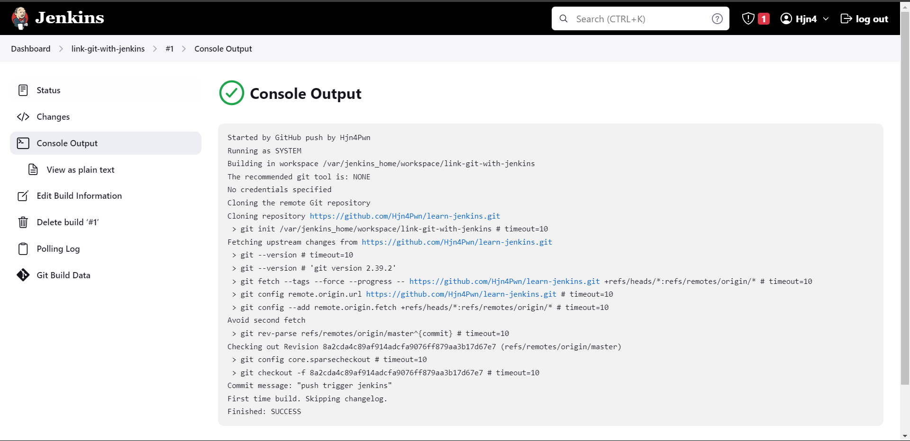

# Link git with jenkins

*ở đây ta thực hiện trigger việc code được push lên repo trên git thì jenkins sẽ lấy về*

- Tạo 1 webhook trong git repo, link đến **URL-của-jenkins/github-webhook/**
- Tạo 1 item trong jenkins, link đến repo trên git (Trong phần build trigger tick chọn github hook trigger...)
- check:


Ta có thể thấy là sau khi push file **index.html** lên git, thì được trigger và jenkins lấy về, lưu vào **/var/jenkins_home/workspace/link-git-with-jenkins**

Ta sẽ check xem: **docker exec -it 1b9 /bin/bash**

```shell
➜ Docker ⚡                                                        22:45:02
▶ docker ps
CONTAINER ID   IMAGE                 COMMAND                  CREATED             STATUS             PORTS                                                                                      NAMES
1b97913bebb6   jenkins/jenkins:lts   "/usr/bin/tini -- /u…"   About an hour ago   Up About an hour   0.0.0.0:8080->8080/tcp, :::8080->8080/tcp, 0.0.0.0:50000->50000/tcp, :::50000->50000/tcp   jenkins

➜ Docker ⚡                                                        22:45:10
▶ docker exec -it 1b9 /bin/bash

jenkins@1b97913bebb6:/$ pwd
/

jenkins@1b97913bebb6:/$ cd /var/jenkins_home/workspacelink-git-with-jenkins

jenkins@1b97913bebb6:~/workspace/link-git-with-jenkins$ ls
index.html

jenkins@1b97913bebb6:~/workspace/link-git-with-jenkins$ cat index.html
<!DOCTYPE html>
<html lang="en">
<title>Basic Static Website</title>
<meta name="viewport" content="width=device-width, initial-scale=1">
<link rel="stylesheet" href="https://unpkg.com/tachyons@4.9.1/css/tachyons.min.css" />
.....

```

- Sau khi ta chỉnh code và push lên lại thì ngay lập tức code của ta sẽ được update trong jenkins container:

```shell
jenkins@1b97913bebb6:~/workspace/link-git-with-jenkins$ cat index.html
<!DOCTYPE html>
<html lang="en">
<title>Hjn4 Website</title>
<meta name="viewport" content="width=device-width, initial-scale=1">
<link rel="stylesheet" href="https://unpkg.com/tachyons@4.9.1/css/tachyons.min.css" />

<body class="pa3 pa5-ns sans-serif lh-copy bt bw2 b--gold black-80">
    <main>
        <div class="mw7 center">
            <header class="flex flex-column flex-row-ns items-center tc tl-ns">
                <div class="w-100 w-70-ns">
                    <h1 class="f2">Hello</h1>
                    <p class="f4">This is a simple one-page website.</p>
                    ......
```
