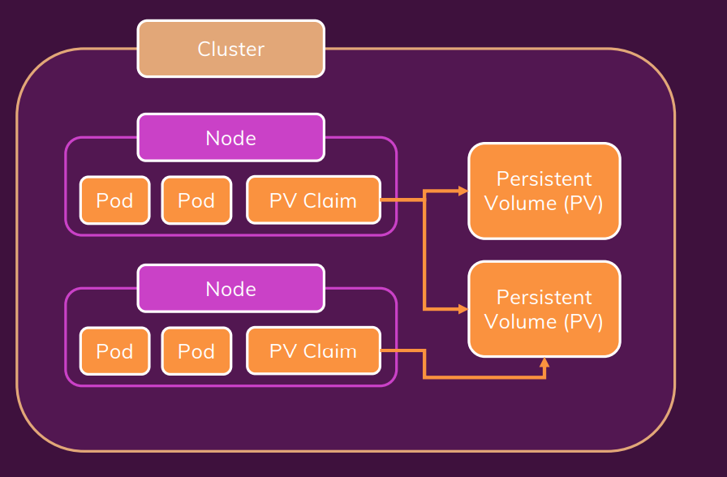

# Manage Data & Volumes

- [emptyDir](#emptydir)
- [hostPath](#hostpath)
- [Persistent Volume & Persistent Volume Claim](#persistent-volume--persistent-volume-claim)
- [Environment Variable](#environment-variable)

## emptyDir

```yaml
#...
spec:
    containers:
    - name: story
        image: academind/kub-data-demo:1
        volumeMounts:
        - mountPath: /app/story
            name: story-volume
    volumes:
    - name: story-volume
        emptyDir: {}
```

- For a Pod that defines an emptyDir volume, the volume is created when the Pod is assigned to a node.
- As the name says, the emptyDir volume is initially empty.
- All containers in the Pod can read and write the same files in the emptyDir volume, though that volume can be mounted at the same or different paths in each container.
- When a Pod is removed from a node for any reason, the data in the emptyDir is deleted permanently.

## hostPath

```yaml
#...
spec:
    containers:
    - name: story
        image: academind/kub-data-demo:1
        volumeMounts:
        - mountPath: /app/story
            name: story-volume
    volumes:
    - name: story-volume
        hostPath:
        path: /data
        type: DirectoryOrCreate

```

- **hostPath**: Là loại volume sử dụng hostPath để chia sẻ thư mục trên máy host với container trong Pod.
- **path**: */data*: Đây là đường dẫn trên máy host mà bạn muốn chia sẻ với container. Trong trường hợp này, /data là thư mục trên máy host.
- **type**: *DirectoryOrCreate*: Chỉ định loại của hostPath. Trong trường hợp này, nếu /data không tồn tại, Kubernetes sẽ tạo nó khi Pod được khởi tạo. Nếu /data đã tồn tại, Pod sẽ sử dụng nó.

## Persistent Volume & Persistent Volume Claim

- [For more](https://kubernetes.io/docs/concepts/storage/persistent-volumes/)

Ở đây do demo trên minikube chỉ có 1 node => dùng hostPath chứ thực tế khuyến cáo từ k8s là

*Warning: Using the hostPath volume type presents many security risks. If you can avoid using a hostPath volume, you should. For example, define a local PersistentVolume, and use that instead.*



- hostPath Persistent Volume

```yaml
apiVersion: v1
kind: PersistentVolume
metadata:
  name: host-pv
spec:
  capacity: 
    storage: 1Gi
  volumeMode: Filesystem
  storageClassName: standard
  accessModes:
    - ReadWriteOnce
  hostPath:
    path: /data
    type: DirectoryOrCreate
    
```

**storageClassName** là một cách để quản lý và xác định cách lưu trữ được cấp phát cho PVC và PV trong Kubernetes. Nó giúp kết nối giữa yêu cầu lưu trữ của PVC và khả năng cung cấp của PV thông qua việc sử dụng lớp lưu trữ cụ thể

- Persistent Volume Claim

```yaml
apiVersion: v1
kind: PersistentVolumeClaim
metadata:
  name: host-pvc
spec:
  volumeName: host-pv
  accessModes:
    - ReadWriteOnce
  storageClassName: standard
  resources:
    requests: 
      storage: 1Gi

```

- **accessModes**: ReadWriteMany, ReadOnlyMany, ReadWriteOnce (giữa pod của các node)

- Deployment yaml file

```yaml
#...
spec:
    containers:
    - name: story
      image: academind/kub-data-demo:2
      volumeMounts:
        - mountPath: /app/story
          name: story-volume
    volumes:
    - name: story-volume
        # emptyDir: {}
      persistentVolumeClaim:
      claimName: host-pvc

```

## Environment Variable

- env file

```yaml
apiVersion: v1
kind: ConfigMap
metadata:
  name: data-store-env
data:
  folder: 'story'
  # key: value..

```

- Use it in deployment yaml file

```yaml

spec:
    containers:
    - name: story
        image: academind/kub-data-demo:2
        env:
        - name: STORY_FOLDER #trong source link: process.env.STORY_FOLDER có giá trị là story
            # value: 'story' # có thể trực tiếp như này hoặc dùng env file
            valueFrom: #
            configMapKeyRef: #
                name: data-store-env #
                key: folder #
        volumeMounts:
        - mountPath: /app/story
            name: story-volume
    volumes:
    - name: story-volume
        # emptyDir: {}
        persistentVolumeClaim:
        claimName: host-pvc

```
