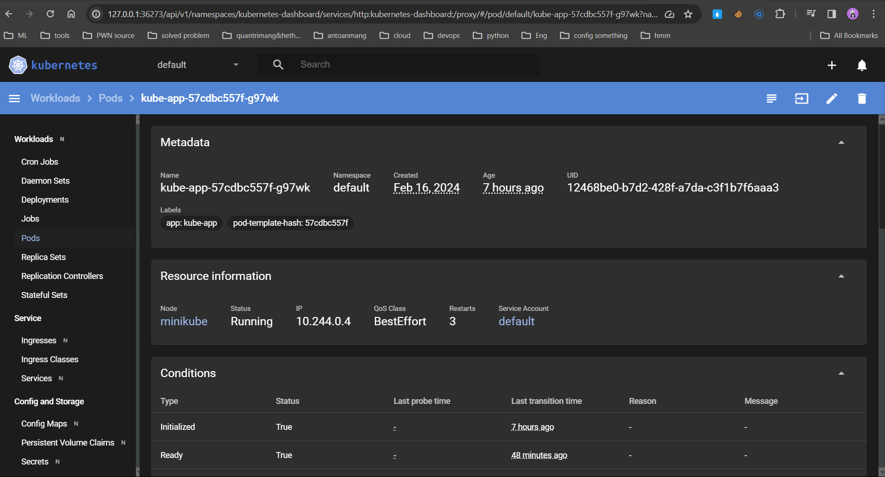
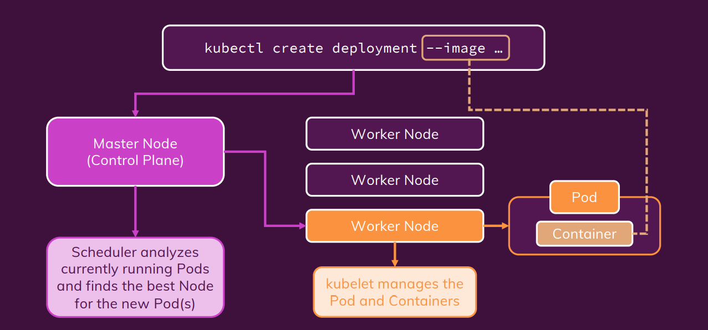
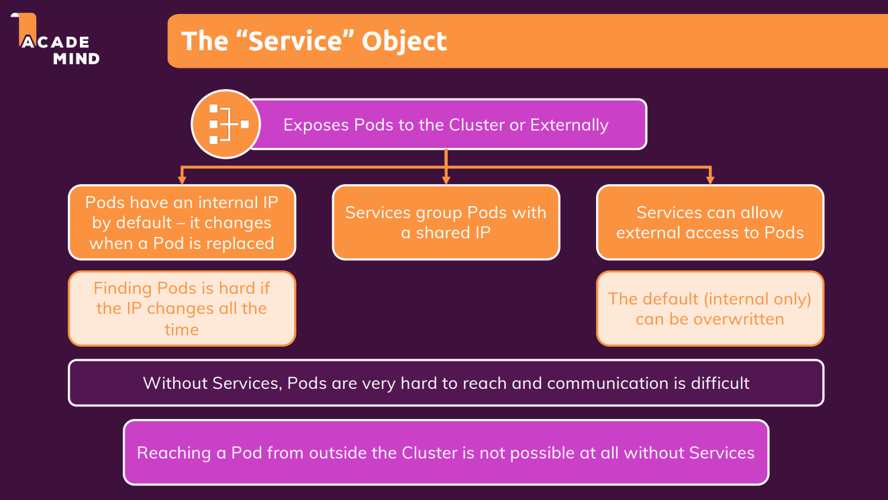
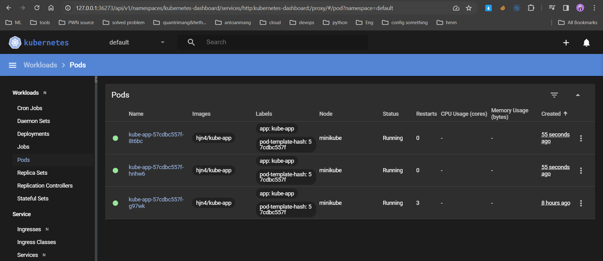
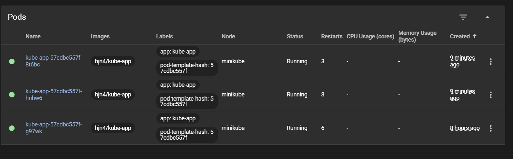
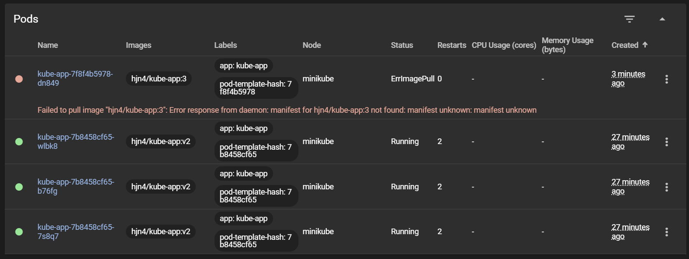

# MiniKube Deployment

- [Install MiniKube](#install-minikube)
- [Deploy](#deploy)
- [The "Service" Object](#the-service-object)
- [Scale](#scale)
- [Update new version](#update-new-version)
- [Rollback & history](#rollback--history)
  - [Tại sao không thấy downtime trong quá trình rollback](#tại-sao-không-thấy-downtime-trong-quá-trình-rollback)
  - [Delete](#delete)
- [Use config yaml file](#use-config-yaml-file)
  - [Update & Delete](#update--delete)
  - [Combine config yaml file](#combine-config-yaml-file)
  - [Liveness Probes](#liveness-probes)
  - [Configuration option](#configuration-option)

## Install MiniKube

```sh
sudo apt update -y
sudo apt upgrade -y

sudo reboot
sudo apt install -y curl wget apt-transport-https

curl -LO https://storage.googleapis.com/minikube/releases/latest/minikube-linux-amd64

sudo install minikube-linux-amd64 /usr/local/bin/minikube

minikube version

```

## Deploy

- Cần start minikube:

```sh
minikube start --driver=docker

minikube status
```

- Khi ta create 1 object, kubectl sẽ tự động gửi câu lệnh này cho virtual host, virtual host nó đi tìm image này nó sẽ tìm trên dockerhub, do đó ta cần push image lên dockerhub

> kubectl create deployment first-app --image=kube-test

Kiểm tra cho thấy create object không thành công:

```sh
➜ kub-action-01-starting-setup ⚡                                       20.8.0  07:29:45
▶ kubectl get deployment
NAME        READY   UP-TO-DATE   AVAILABLE   AGE
first-app   0/1     1            0           53s

➜ kub-action-01-starting-setup ⚡                                       20.8.0  07:29:55
▶ kubectl get pod
NAME                        READY   STATUS             RESTARTS   AGE
first-app-f975696fc-fhzqh   0/1     ImagePullBackOff   0          60s

# Do là chưa Ready nên cần push image lên 
➜ kub-action-01-starting-setup ⚡                                       20.8.0  07:30:02
▶ kubectl delete deployment first-app
deployment.apps "first-app" deleted

```

> minikube dashboard # for monitor



### How kubectl work?



## The "Service" Object



- "Service" Object có thể giúp các pod communicate với nhau thông qua name, giúp các service group pods có thể có 1 đại chỉ IP không đổi dù các pods bên trong có thay đổi

- Tạo service mới, nhằm tạo cách có thể truy cập đến một deployment cụ thể:

> kubectl expose deployment kube-app --type=LoadBalancer --port=8080

- **X**: ClusterIP, LoadBalancer, NodePort, ...
- **LoadBalancer** yêu cầu được tạo trước đó
- **--port=8080**: Mở cổng 8080 trên dịch vụ. Các yêu cầu được chuyển đến cổng này sẽ được chuyển tiếp đến các Pod thuộc Deployment "first-app" trên cổng mà Deployment đang lắng nghe (trong trường hợp này, cổng 8080).
- **ClusterIP**: Dịch vụ mặc định khi không chỉ định --type nào. Nó tạo ra một địa chỉ IP nội bộ trong cụm Kubernetes và chỉ có thể truy cập từ bên trong cụm. Đây là loại dịch vụ nhanh và phổ biến nhất.
- **ExternalName**: Liên kết dịch vụ với một tên DNS bên ngoài. Không tạo ra địa chỉ IP nội bộ và không có load balancing. Thường được sử dụng để kết nối với các dịch vụ bên ngoài cụm Kubernetes
- **LoadBalancer**: Tạo ra một LoadBalancer và gán một địa chỉ IP công cộng cho dịch vụ. Các yêu cầu được chuyển tiếp từ LoadBalancer đến các Pod thuộc dịch vụ.
- **NodePort**:
  - Khi bạn tạo một dịch vụ NodePort và kết nối nó với một Deployment, tất cả các Pod thuộc Deployment đó sẽ chia sẻ cùng một cổng NodePort trên mỗi node. Mỗi Pod không có cổng riêng lẻ được mở, và không có cách để yêu cầu từ một Pod cụ thể được chuyển tiếp đến một Pod khác trong cùng một Deployment thông qua cổng NodePort.
  - Ví dụ, nếu bạn có một Deployment với nhiều Pod, và tạo một dịch vụ NodePort cho Deployment đó, cổng NodePort sẽ chuyển tiếp yêu cầu đến bất kỳ Pod nào thuộc Deployment đó. Nó không sẽ chuyển tiếp yêu cầu từ một Pod cụ thể đến Pod khác cụ thể trong Deployment.

```sh
➜ kub-action-01-starting-setup ⚡                                       20.8.0  14:33:21
▶ kubectl expose deployment kube-app --type=LoadBalancer --port=8080
service/kube-app exposed

➜ kub-action-01-starting-setup ⚡                                       20.8.0  14:33:30
▶ kubectl get service
NAME         TYPE           CLUSTER-IP      EXTERNAL-IP   PORT(S)          AGE
kube-app     LoadBalancer   10.102.88.140   <pending>     8080:31310/TCP   34s
kubernetes   ClusterIP      10.96.0.1       <none>        443/TCP          3h4m

```

- ClusterIP is default
- Trong minikube thì đây là 1 virtual host do đó thì external-ip sẽ luôn pending như vậy.

```sh
➜ kub-action-01-starting-setup ⚡                                       20.8.0  14:34:05
▶ minikube service kube-app
|-----------|----------|-------------|---------------------------|
| NAMESPACE |   NAME   | TARGET PORT |            URL            |
|-----------|----------|-------------|---------------------------|
| default   | kube-app |        8080 | http://192.168.67.2:31310 |
|-----------|----------|-------------|---------------------------|
🏃  Starting tunnel for service kube-app.
|-----------|----------|-------------|------------------------|
| NAMESPACE |   NAME   | TARGET PORT |          URL           |
|-----------|----------|-------------|------------------------|
| default   | kube-app |             | http://127.0.0.1:43719 |
|-----------|----------|-------------|------------------------|
🎉  Opening service default/kube-app in default browser...

# or
➜ Application ⚡                                                                                                    15:34:59
▶ minikube service kube-app --url
http://127.0.0.1:43815
❗  Because you are using a Docker driver on linux, the terminal needs to be open to run it.

```

- Có khả năng tự restart nếu pod bị fail, để duy trì tính ổn định của ứng dụng.

## Scale

```sh
➜ ~ ⚡                                                                           19:40:47
▶ kubectl scale deployment/kube-app --replicas=3
deployment.apps/kube-app scaled

➜ ~ ⚡                                                                           19:40:53
▶ kubectl get pods
NAME                        READY   STATUS              RESTARTS      AGE
kube-app-57cdbc557f-8t6bc   0/1     ContainerCreating   0             2s
kube-app-57cdbc557f-g97wk   1/1     Running             3 (52m ago)   8h
kube-app-57cdbc557f-hnhw6   0/1     ContainerCreating   0             2s

➜ ~ ⚡                                                                           19:40:55
▶ kubectl get pods
NAME                        READY   STATUS    RESTARTS      AGE
kube-app-57cdbc557f-8t6bc   1/1     Running   0             19s
kube-app-57cdbc557f-g97wk   1/1     Running   3 (53m ago)   8h
kube-app-57cdbc557f-hnhw6   1/1     Running   0             19s

```



- Do là trước đó ta add service type LoadBalancer => các pods này cũng có load



## Update new version

***Note: không thể update image với 1 tên khác hay là 1 cái tech khác***

- Lệnh này được sử dụng để cập nhật image của container trong một Deployment trong Kubernetes. Trong trường hợp này, kube-app=/hjn4... kube-app ở đây là tên container

*Note: Cần lưu ý một vấn đề là tag version phải khác version trước, bởi vì nếu giống nhau nó sẽ k download về*

> kubectl set image deployment/kube-app kube-app=hjn4/kube-app:v2

```sh
➜ ~ ⚡                                                                           20:13:20
▶ kubectl set image deployment/kube-app kube-app=hjn4/kube-app:v2
deployment.apps/kube-app image updated

```

- Lệnh này được sử dụng để theo dõi trạng thái của quá trình triển khai (rollout) sau khi bạn đã thực hiện việc cập nhật image hoặc thay đổi khác trong một Deployment.

> kubectl rollout status deployment/kube-app

```sh
➜ ~ ⚡                                                                           20:13:56
▶ kubectl rollout status deployment/kube-app
Waiting for deployment "kube-app" rollout to finish: 1 out of 3 new replicas have been updated...
Waiting for deployment "kube-app" rollout to finish: 1 out of 3 new replicas have been updated...
Waiting for deployment "kube-app" rollout to finish: 1 out of 3 new replicas have been updated...
Waiting for deployment "kube-app" rollout to finish: 2 out of 3 new replicas have been updated...
Waiting for deployment "kube-app" rollout to finish: 2 out of 3 new replicas have been updated...
Waiting for deployment "kube-app" rollout to finish: 2 out of 3 new replicas have been updated...
Waiting for deployment "kube-app" rollout to finish: 1 old replicas are pending termination...
Waiting for deployment "kube-app" rollout to finish: 1 old replicas are pending termination...
deployment "kube-app" successfully rolled out

```

## Rollback & history

- Chúng ta giả lập version lỗi, update image với tag không tồn tại:

```sh
➜ ~ ⚡                                                                           20:14:10
▶ kubectl set image deployment/kube-app kube-app=hjn4/kube-app:3
deployment.apps/kube-app image updated
➜ ~ ⚡                                                                           20:37:52
▶ kubectl rollout status deployment/kube-app
Waiting for deployment "kube-app" rollout to finish: 1 out of 3 new replicas have been updated...
Waiting for deployment "kube-app" rollout to finish: 1 out of 3 new replicas have been updated...
Waiting for deployment "kube-app" rollout to finish: 1 out of 3 new replicas have been updated...
Waiting for deployment "kube-app" rollout to finish: 1 out of 3 new replicas have been updated...
Waiting for deployment "kube-app" rollout to finish: 1 out of 3 new replicas have been updated...
Waiting for deployment "kube-app" rollout to finish: 1 out of 3 new replicas have been updated...
Waiting for deployment "kube-app" rollout to finish: 1 out of 3 new replicas have been updated...

```



- Hoàn tác việc triển khai version mới nhất:

> kubectl rollout undo deployment/kube-app

- Check các version update và rollback về trạng thái chỉ định trong quá khứ:

- xem các trạng thái trước đó

> kubectl rollout history deployment/kube-app

- xem chi tiết 1 cụ thể 1 trạng thái

> kubectl rollout history deployment/kube-app --revision=1

```sh
➜ ~ ⚡                                                                           20:42:27
▶ kubectl rollout history deployment/kube-app
deployment.apps/kube-app
REVISION  CHANGE-CAUSE
1         <none>
3         <none>
4         <none>

➜ ~ ⚡                                                                           20:43:26
▶ kubectl rollout history deployment/kube-app --revision=1
deployment.apps/kube-app with revision #1
Pod Template:
  Labels:       app=kube-app
        pod-template-hash=57cdbc557f
  Containers:
   kube-app:
    Image:      hjn4/kube-app
    Port:       <none>
    Host Port:  <none>
    Environment:        <none>
    Mounts:     <none>
  Volumes:      <none>

```

- Rollback về quá khứ:

> kubectl rollout undo deployment/kube-app --to-revision=1

```sh
➜ ~ ⚡                                                                           20:44:22
▶ kubectl rollout undo deployment/kube-app --to-revision=1
deployment.apps/kube-app rolled back

```

### Tại sao không thấy downtime trong quá trình rollback

- **Rolling Update Strategy**: Kubernetes sử dụng chiến lược cập nhật cuộn (Rolling Update) mặc định khi bạn thực hiện các thay đổi trong một Deployment. Điều này có nghĩa là nó sẽ tạo ra các bản sao mới của Pods, loại bỏ từng Pod cũ một cách dần dần để đảm bảo rằng ít nhất một số lượng Pods luôn hoạt động trong suốt quá trình triển khai.
- **Pods Cũ Và Mới Hoạt Động Đồng Thời**: Trong quá trình cuộn chảy, có một khoảng thời gian khi cả các Pods cũ và mới đều hoạt động đồng thời. Kubernetes đảm bảo rằng số lượng Pods hoạt động không bao giờ giảm xuống dưới một mức nhất định, nhờ đó giảm thiểu hoặc loại bỏ downtime.
- **Health Checks**: Kubernetes sử dụng các kiểm tra sức khỏe (health checks) để đảm bảo rằng mỗi Pod mới được triển khai được xem là "sẵn sàng" trước khi loại bỏ một Pod cũ. Điều này giúp đảm bảo rằng chỉ có các Pods sẵn sàng và lành mạnh được giữ lại.
- **Pod Disruption Budgets**: Nếu bạn đã cấu hình Pod Disruption Budget trong Deployment, Kubernetes sẽ giữ lại một số lượng Pods hoạt động tối thiểu trong quá trình triển khai hoặc quay lại phiên bản trước đó.

### Delete

```sh
➜ ~ ⚡                                                                           20:45:57
▶ kubectl delete service kube-app
service "kube-app" deleted
➜ ~ ⚡                                                                           20:52:49
▶ kubectl delete deployment kube-app
deployment.apps "kube-app" deleted

➜ ~ ⚡                                                                           20:53:00
▶ kubectl get deployment
No resources found in default namespace.

➜ ~ ⚡                                                                           20:53:07
▶ kubectl get pod
NAME                        READY   STATUS        RESTARTS   AGE
kube-app-57cdbc557f-99ftg   1/1     Terminating   0          7m16s
kube-app-57cdbc557f-k8fx9   1/1     Terminating   0          7m10s
kube-app-57cdbc557f-z8nl9   1/1     Terminating   0          7m13s
➜ ~ ⚡                                                                           20:53:13
▶ kubectl get pod
No resources found in default namespace.
```

## Use config yaml file

```yaml
apiVersion: apps/v1
kind: Deployment
metadata:
  name: second-app-deployment
spec: # layer deployment
  replicas: 3 #số lượng pod trong node
  selector: # ngoài ra còn có matchExpressions
    matchLabels: #pod nào có label match với 2 label này sẽ được manage bởi deployment này
      app: second-app
      tier: backend
  template: #how to config pod
    metadata: 
      labels:
        app: second-app
        tier: backend
    spec: # layer container
      containers:
        - name: second-node #node-js
          image: academind/kub-first-app:2 #image on Dockerhub
        # - name: ...
        #   image: ...

```

Nếu như trên thì còn miss service:

```yaml
apiVersion: v1
kind: Service
metadata:
  name: backend
spec:
  selector: 
    app: second-app
  ports:
    - protocol: 'TCP'
      port: 80
      targetPort: 8080
    # - protocol: 'TCP'
    #   port: 443
    #   targetPort: 443
  type: LoadBalancer

```

- *Type*:
  - **ClusterIP**: trong nội bộ connect với nhau (vẫn có LoadBanlance) chứ không thể access từ bên ngoài cluster
  - **NodePort**: Có thể truy cập từ bên ngoài tuy nhiên dựa vào IP của Node => không tối ưu khi IP có thể thay đổi
  - **LoadBalancer**: có IP để truy cập từ bên ngoài cluster đến, độc lập với Pod, Node

```sh
minikube start --driver=docker
minikube status

kubectl apply -f=deployment.yaml -f=service.yaml
# kubectl apply -f=deployment.yaml,service.yaml

minikube service backend
```

### Update & Delete

- Chỉnh sửa file yaml rồi apply lại, *lưu ý với các image tag, nếu không chỉnh sửa yaml mà để nguyên thì nó sẽ không pull về image mới nhất (latest)*. Do đó ta cần thêm 1 option như sau:

- Delete base on label: **kubectl delete deployment,service -l group=test-hjn4**

```yaml
apiVersion: apps/v1
kind: Deployment
metadata:
  name: second-app-deployment
  labels: # apply label to service and deployment
    group: test-hjn4
spec:
  #...
```

- Delete base on yaml file: **kubectl delete -f=deployment.yaml -f=service.yaml**

### Combine config yaml file

Thêm **---** để ngăn cách, sau nó sẽ là cấu trúc file hoàn toàn mới k bị ảnh hưởng bởi phần còn lại. Nó sẽ tạo từ trên xuống dưới

```yaml
apiVersion: v1
kind: Service
metadata:
  name: backend
spec:
  selector: 
    app: second-app
  ports:
    - protocol: 'TCP'
      port: 80
      targetPort: 8080
    # - protocol: 'TCP'
    #   port: 443
    #   targetPort: 443
  type: LoadBalancer
---
apiVersion: apps/v1
kind: Deployment
metadata:
  name: second-app-deployment
spec:
  replicas: 1
  selector:
    matchLabels:
      app: second-app
      tier: backend
  template:
    metadata: 
      labels:
        app: second-app
        tier: backend
    spec: 
      containers:
        - name: second-node
          image: hjn4/kube-app:v2
        # - name: ...
        #   image: ...


```

> kubectl apply -f=combine_config.yaml

### Liveness Probes

```yaml
- name: second-node
  image: hjn4/kube-app:v2
  livenessProbe:
    httpGet:
      path: /
    periodSeconds: 10
    initialDelaySeconds: 5

```

- **livenessProbe**: Đây là một cách để Kubernetes kiểm tra xem container trong Pod có đang chạy đúng cách không. Nếu liveness probe thất bại, Kubernetes có thể tự động khởi động lại container hoặc thực hiện các hành động sửa lỗi.
- **httpGet**: Kiểm tra sự sống còn bằng cách thực hiện một HTTP GET request.
- **path**: */*: Đường dẫn được kiểm tra, trong trường hợp này là root path ("/").
- **periodSeconds**: *10*: Chu kỳ thời gian giữa các lần kiểm tra liveness probe là 10 giây.
- **initialDelaySeconds**: *5*: Thời gian chờ trước khi bắt đầu kiểm tra liveness probe, trong trường hợp này là 5 giây. Điều này giúp tránh việc kiểm tra ngay sau khi container khởi động.

### Configuration option

```yaml
containers:
  - name: second-node
    image: hjn4/kube-app:v2
    imagePullPolicy: Always # luôn luôn pull lại image dù cho file config không có gì thay đổi
    livenessProbe:
      #...
```
