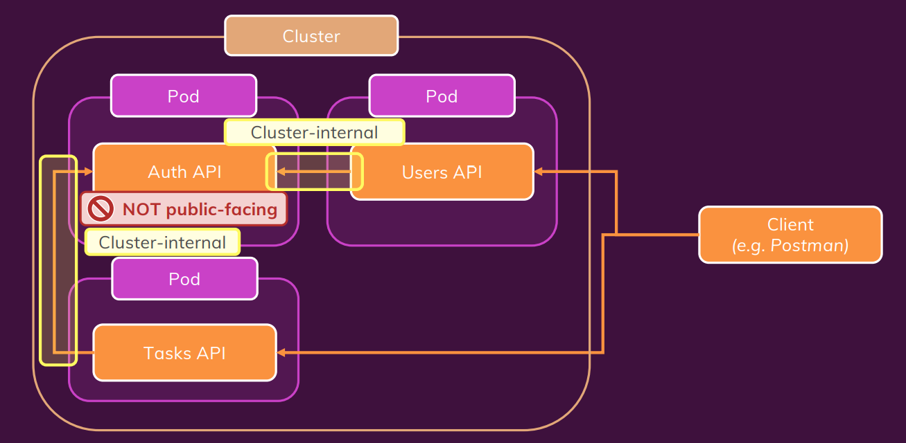
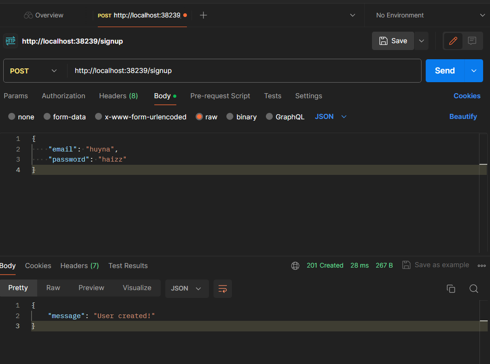
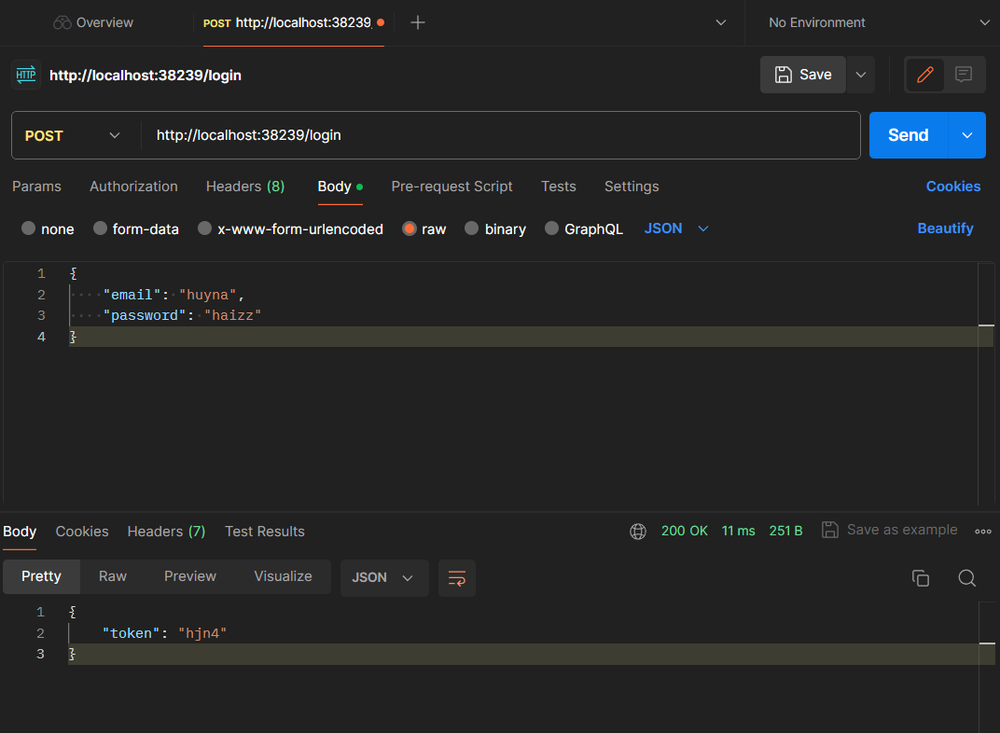
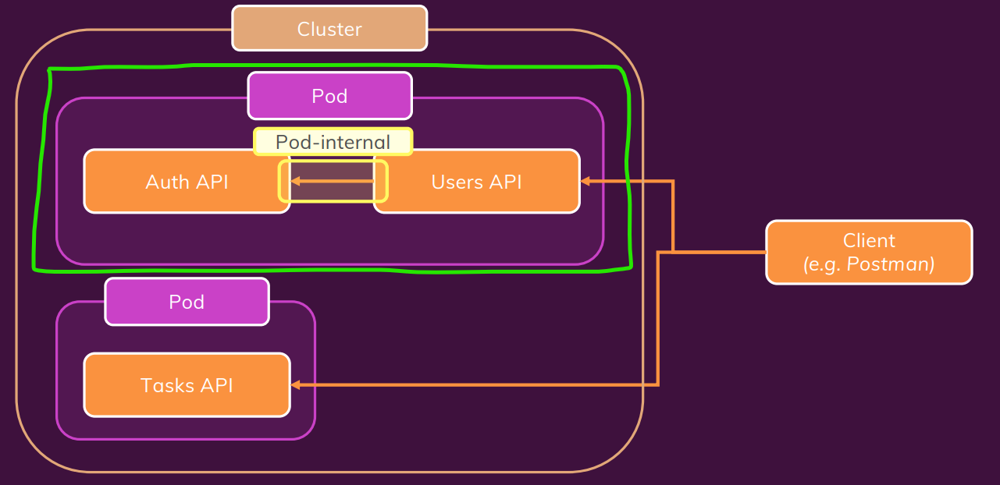
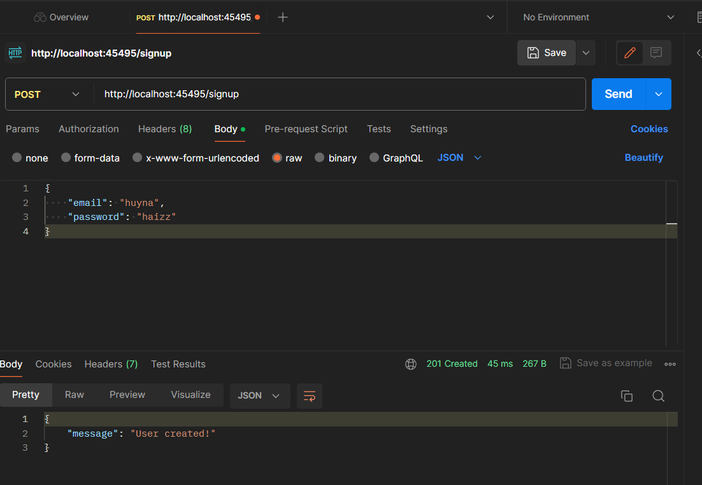
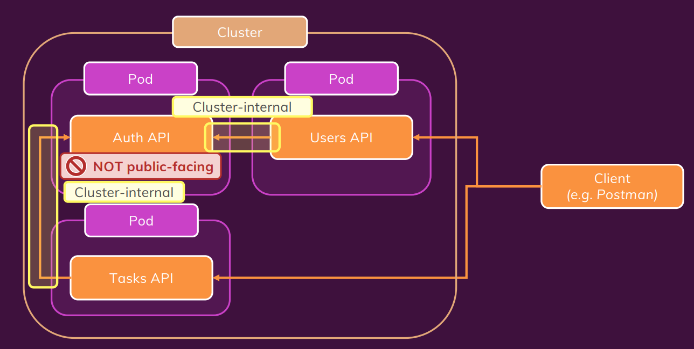

# Network

## Demo Application



## Triển khai độc lập api-user

### user-app-1

```js
const express = require('express');
const bodyParser = require('body-parser');
const axios = require('axios');

const app = express();

app.use(bodyParser.json());

app.post('/signup', async (req, res) => {
  // It's just a dummy service - we don't really care for the email
  const email = req.body.email;
  const password = req.body.password;

  if (
    !password ||
    password.trim().length === 0 ||
    !email ||
    email.trim().length === 0
  ) {
    return res
      .status(422)
      .json({ message: 'An email and password needs to be specified!' });
  }

  try {
    // const hashedPW = await axios.get('http://auth/hashed-password/' + password);
    const hashedPW = 'dummy text';
    // since it's a dummy service, we don't really care for the hashed-pw either
    console.log(hashedPW, email);
    res.status(201).json({ message: 'User created!' });
  } catch (err) {
    console.log(err);
    return res
      .status(500)
      .json({ message: 'Creating the user failed - please try again later.' });
  }
});

app.post('/login', async (req, res) => {
  // It's just a dummy service - we don't really care for the email
  const email = req.body.email;
  const password = req.body.password;

  if (
    !password ||
    password.trim().length === 0 ||
    !email ||
    email.trim().length === 0
  ) {
    return res
      .status(422)
      .json({ message: 'An email and password needs to be specified!' });
  }

  // normally, we'd find a user by email and grab his/ her ID and hashed password
  const hashedPassword = password + '_hash';
  // const response = await axios.get(
  //   'http://auth/token/' + hashedPassword + '/' + password
  // );
  const response = { status: 200, data: { token: 'hjn4' } };
  if (response.status === 200) {
    return res.status(200).json({ token: response.data.token });
  }
  return res.status(response.status).json({ message: 'Logging in failed!' });
});

app.listen(8080);

```

```dockerfile
FROM node:14-alpine
WORKDIR /app
COPY package.json .
RUN npm install
COPY . .
EXPOSE 8080
CMD [ "node", "users-app.js" ]

```

### deployment yaml file-1

```yaml
apiVersion: apps/v1
kind: Deployment
metadata:
  name: users-deployment
spec:
  replicas: 1
  selector: 
    matchLabels:
      app: users
  template:
    metadata:
      labels:
        app: users
    spec:
      containers:
        - name: users
          image: hjn4/kube-demo-users

```

### service yaml file-1

```yaml
apiVersion: v1
kind: Service
metadata:
  name: users-service
spec:
  selector:
    app: users
  type: LoadBalancer
  ports:
    - protocol: TCP
      port: 8080
      targetPort: 8080

```

### test with podman-1





## Multi Containers in One Pod



### user-app-2

```js
const express = require('express');
const bodyParser = require('body-parser');
const axios = require('axios');

const app = express();

app.use(bodyParser.json());

app.post('/signup', async (req, res) => {
  // It's just a dummy service - we don't really care for the email
  const email = req.body.email;
  const password = req.body.password;

  if (
    !password ||
    password.trim().length === 0 ||
    !email ||
    email.trim().length === 0
  ) {
    return res
      .status(422)
      .json({ message: 'An email and password needs to be specified!' });
  }

  try {
    const hashedPW = await axios.get(`http://${process.env.AUTH_ADDRESS}/hashed-password/` + password);
    // const hashedPW = 'dummy text';
    // since it's a dummy service, we don't really care for the hashed-pw either
    console.log(hashedPW, email);
    res.status(201).json({ message: 'User created!' });
  } catch (err) {
    console.log(err);
    return res
      .status(500)
      .json({ message: 'Creating the user failed - please try again later.' });
  }
});

app.post('/login', async (req, res) => {
  // It's just a dummy service - we don't really care for the email
  const email = req.body.email;
  const password = req.body.password;

  if (
    !password ||
    password.trim().length === 0 ||
    !email ||
    email.trim().length === 0
  ) {
    return res
      .status(422)
      .json({ message: 'An email and password needs to be specified!' });
  }

  // normally, we'd find a user by email and grab his/ her ID and hashed password
  const hashedPassword = password + '_hash';
  const response = await axios.get(
    `http://${process.env.AUTH_ADDRESS}/token/` + hashedPassword + '/' + password
  );
  // const response = { status: 200, data: { token: 'abc' } };
  if (response.status === 200) {
    return res.status(200).json({ token: response.data.token });
  }
  return res.status(response.status).json({ message: 'Logging in failed!' });
});

app.listen(8080);


```

- Ta có thể thấy biến môi trường **process.env.AUTH_ADDRESS** được sử dụng trong url. Ta sẽ khai báo trong yaml file config

```dockerfile
FROM node:14-alpine
WORKDIR /app
COPY package.json .
RUN npm install
COPY . .
EXPOSE 8080
CMD [ "node", "users-app.js" ]

```

### auth-app-2

```js
const express = require('express');
const bodyParser = require('body-parser');

const app = express();

app.use(bodyParser.json());

app.get('/verify-token/:token', (req, res) => {
  const token = req.params.token;

  // dummy verification!
  if (token === 'abc') {
    return res.status(200).json({ message: 'Valid token.', uid: 'u1' });
  }
  res.status(401).json({ message: 'Token invalid.' });
});

app.get('/token/:hashedPassword/:enteredPassword', (req, res) => {
  const hashedPassword = req.params.hashedPassword;
  const enteredPassword = req.params.enteredPassword;

  // dummy password verification!
  if (hashedPassword === enteredPassword + '_hash') {
    const token = 'abc';
    return res.status(200).json({ message: 'Token created.', token: token });
  }
  res.status(401).json({ message: 'Passwords do not match.' });
});

app.get('/hashed-password/:password', (req, res) => {
  // dummy hashed pw generation!
  const enteredPassword = req.params.password;
  const hashedPassword = enteredPassword + '_hash';
  res.status(200).json({ hashedPassword: hashedPassword });
});

app.listen(80);

```

```dockerfile
FROM node:14-alpine
WORKDIR /app
COPY package.json .
RUN npm install
COPY . .
EXPOSE 80
CMD [ "node", "auth-app.js" ]

```

### deployment yaml file-2

```yaml
apiVersion: apps/v1
kind: Deployment
metadata:
  name: users-deployment
spec:
  replicas: 1
  selector: 
    matchLabels:
      app: users
  template:
    metadata:
      labels:
        app: users
    spec:
      containers:
        - name: users
          image: hjn4/kube-demo-users:latest
          env:
            - name: AUTH_ADDRESS
              value: localhost
        - name: auth
          image: hjn4/kube-demo-auth:latest
```

Do là 2 container trong cùng 1 pod nên do đó dùng domain là **localhost**

### service yaml file-2

```yaml
apiVersion: v1
kind: Service
metadata:
  name: users-service
spec:
  selector:
    app: users
  type: LoadBalancer
  ports:
    - protocol: TCP
      port: 8080
      targetPort: 8080
```

Không cần public auth-app => nên service cứ giữ nguyên như ban đầu

### test with podman-2



## auth-user pod-pod

### user-app-3

```js
  try {
    const hashedPW = await axios.get(`http://${process.env.AUTH_ADDRESS}/hashed-password/` + password);
    // const hashedPW = 'dummy text';
    // since it's a dummy service, we don't really care for the hashed-pw either
    console.log(hashedPW, email);
    res.status(201).json({ message: 'User created!' });
  } catch (err) {
    //.................
  }
});

//.................

  // normally, we'd find a user by email and grab his/ her ID and hashed password
  const hashedPassword = password + '_hash';
  const response = await axios.get(
    `http://${process.env.AUTH_SERVICE_SERVICE_HOST}/token/` + hashedPassword + '/' + password
  );
    //.................
});

app.listen(8080);

```

### auth-app-3

```js
//như cũ
```

### user-service-yaml-3

```yaml
apiVersion: v1
kind: Service
metadata:
  name: users-service
spec:
  selector:
    app: users
  type: LoadBalancer
  ports:
    - protocol: TCP
      port: 8080
      targetPort: 8080 
```

### auth-service-yaml-3

```yaml
apiVersion: v1
kind: Service
metadata:
  name: auth-service
spec:
  selector:
    app: auth
  type: ClusterIP # Khong can public ra internet
  ports:
    - protocol: TCP
      port: 80
      targetPort: 80 # port trong code expose ra 
```

### user-deployment-yaml-3

```yaml
apiVersion: apps/v1
kind: Deployment
metadata:
  name: users-deployment
spec:
  replicas: 1
  selector: 
    matchLabels:
      app: users
  template:
    metadata:
      labels:
        app: users
    spec:
      containers:
        - name: users
          image: hjn4/kube-demo-users:latest
          env:
            - name: AUTH_ADDRESS
              # value: "10.99.104.252" #IP service tìm thủ công 
              value: "auth-service.default" #CoreDNS, "service-name" + ".default"
              # AUTH_SERVICE_SERVICE_HOST: là service name viết hoa, chuyển - => _, thêm vào _SERVICE_HOST
              # là env được tạo bởi k8s, => đểu là ip của service => giúp k phải tìm thủ công 
```

### auth-deployment-yaml-3

```yaml
apiVersion: apps/v1
kind: Deployment
metadata:
  name: auth-deployment
spec:
  replicas: 1
  selector: 
    matchLabels:
      app: auth
  template:
    metadata:
      labels:
        app: auth
    spec:
      containers:
        - name: auth
          image: hjn4/kube-demo-auth:latest
```

## user-auth-task



### tasks deployment yaml

```yaml
apiVersion: apps/v1
kind: Deployment
metadata:
  name: tasks-deployment
spec:
  replicas: 1
  selector: 
    matchLabels:
      app: tasks
  template:
    metadata:
      labels:
        app: tasks
    spec:
      containers:
        - name: tasks
          image: hjn4/kube-demo-tasks:latest
          env:
            - name: AUTH_ADDRESS
              # value: "10.99.104.252"
              value: "auth-service.default"
            - name: TASKS_FOLDER
              value: "tasks"
```

### tasks service yaml

```yaml
apiVersion: v1
kind: Service
metadata:
  name: tasks-service
spec:
  selector:
    app: tasks
  type: LoadBalancer
  ports:
    - protocol: TCP
      port: 8000
      targetPort: 8000
```
