# Basic Concepts

- [Cluster Architecture](#cluster-architecture)
- [Control Plane](#control-plane)
- [Data Plane](#data-plane)
- [YAML](#yaml)
- [POD](#pod)
- [ReplicaSets](#replicasets)
- [Deployment](#deployment)
- [Service](#service)
- [Label & Selector](#label--selector)
- [Namespace](#namespace)
- [ConfigMap](#configmap)
- [Secret](#secret)
- [Ingress](#ingress)
- [Install kubectl on ubuntu](#install-kubectl-on-ubuntu)

## Cluster Architecture

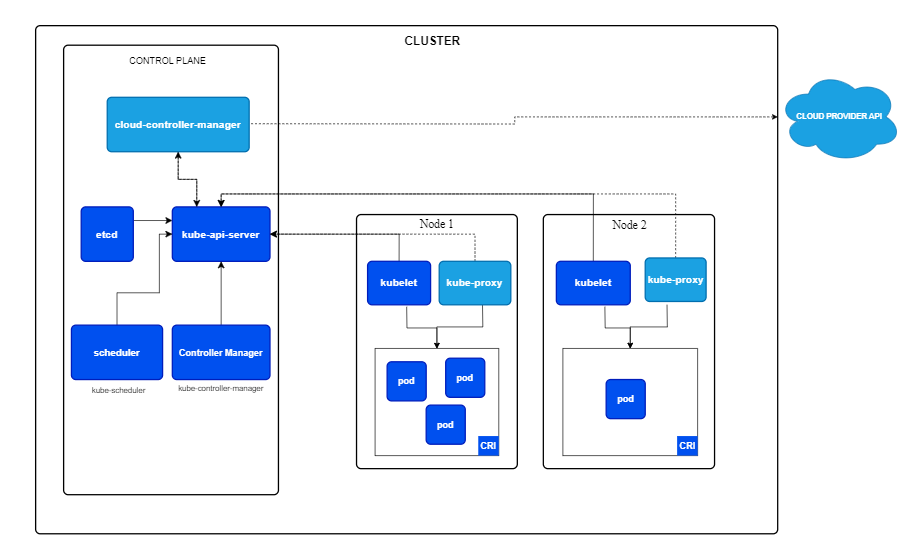

Cluster gồm 2 thành phần:  

- Control Plane: Có nhiệm vụ điều phối toàn bộ hoạt động của cluster
- Data Plane:
  - Giúp triển khai service
  - Gồm nhiều worker node

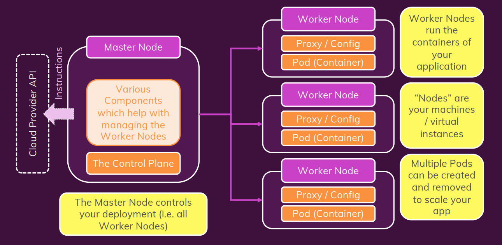

## Control Plane

- [Reference](https://kubernetes.io/docs/reference/command-line-tools-reference/)

- **kube-apiserver:**: Cho phép quản lý API trong cluster, khi client (CLI interface), Agents, gọi đến cluster, cần lấy thông tin trong cluster thì sẽ gọi đến API Server này. API Server sẽ tiến hành xác thực, phân quyền. Mọi thứ đều phải tương tác qua API Server
- **kube-controller-manager**: Bất kì một controler nào trong cluster k8s đều làm nhiệm vụ monitor một đối tượng nào đó rồi đưa ra hành động tương ứng. Example: quản lý replicaset
- **Scheduler**: Khi mà ta muốn chạy 1 service, thì scheduler sẽ tiến hành tìm các Node hợp lệ (thỏa mản các ràng buộc và có sẵn các tài nguyên cần thiết). Scheduler sẽ rank các valid nodes rồi gán Pod với node hợp lệ
- **etcd**: Như là 1 database chứa toàn bộ data của cluster (objects, resources,...) phục vụ cho mục đích truy cập và tra cứu
- **cloud-controller-manager**(*optional*): Khi mà ta tự tạo riêng 1 cái cluster k8s nhưng lại muốn sử dụng các tài nguyên như (EC2, S3, ...) trên cloud nói chung, AWS nói riêng thì ta cần đến CCM để có thể tương tác với các service của cloud
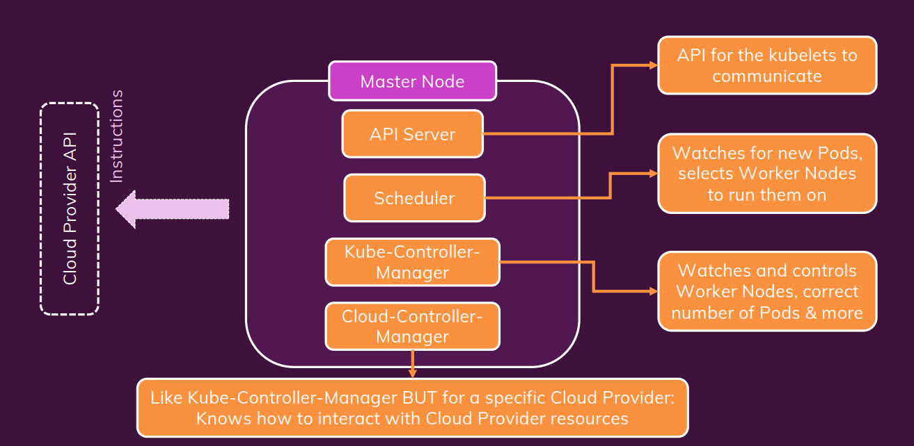

## Data Plane

Gồm nhiều woker node, trong các woker node thì có 2 thành phần chính:

- **Kubelet**: Như là 1 Agent có trách nhiệm checkin các resource chạy trên woker node(Pod,...) cập nhật thông tin lên API Server, nhận lệnh từ API Server và triển khai trên woker node. Đảm bảo các containers trên các Pod chạy ổn định
- **Kube-Proxy**: Tạo ra các rule để instance, pod connect với nhau
- **Container Runtime**: Container runtime là một phần mềm chịu trách nhiệm cho việc quản lý và chạy các container. Nó là một thành phần cụ thể của hệ thống có nhiệm vụ thực hiện các chức năng như tạo, khởi động, dừng và xóa container. Một số container runtime phổ biến trong cộng đồng Kubernetes bao gồm Docker, containerd, rkt, và CRI-O.
- **Container Runtime Interface**: CRI là một giao diện chuẩn để tương tác giữa Kubernetes và các container runtime. Nó giúp tách biệt logic quản lý container của Kubernetes với container runtime cụ thể, cho phép linh hoạt trong việc thay đổi hoặc sử dụng nhiều container runtime khác nhau.

## YAML

- Example Json:

```json
data = {
  "id": "AWcvsjx864kVeDHDi2gB",
  "timestamp": 1542693469197,
  "description": "This network device leaf2.abc.inc is unreachable from controller. The device role is ACCESS.",
  "actualServiceId": "10.10.20.82",
  "assignedTo": "",
  "enrichmentInfo": {
    "issueDetails": {
      "issue": [
        {
          "issueId": "AWcvsjx864kVeDHDi2gB",
          "issuePriority": "",
          "issueSummary": "Network Device 10.10.20.82 Is Unreachable From Controller",
          "issueTimestamp": 1542693469197,
          "suggestedActions": [
            {
              "message": "From the controller, verify whether the last hop is reachable.",
              "steps": []
            },
            {
              "message": "Verify access to the device.",
              "steps": []
            }
          ],
          "impactedHosts": [
            {
              "hostName": "DUT",
              "failedAttempts": 3,
              "location": {
                "siteId": "SanJose",
                "apsImpacted": []
              },
              "timestamp": 1542693469197
            }
          ]
        }
      ]
    },
    "connectedDevice": [
      {
        "deviceDetails": {
          "inventoryStatusDetail": "<status><general code=\"SNMP_TIMEOUT\"/></status>",
          "lastUpdateTime": 1542693255158,
          "errorDescription": "SNMP timeouts are occurring with this device. Either the SNMP credentials are not correctly provided to controller or the device is responding slow and snmp timeout is low. If its a timeout issue, controller will attempt to progressively adjust the timeout in subsequent collection cycles to get device to managed state. User can also run discovery again only for this device using the discovery feature after adjusting the timeout and snmp credentials as required. Or user can update the timeout and snmp credentials as required using update credentials.",
          "tagCount": "0",
          "lastUpdated": "2018-11-20 05:54:15",
          "id": "a7633ae5-d3c9-4aea-837d-c3ad5b19c802",
          "neighborTopology": [
            {
              "errorCode": 5000,
              "message": "An internal has error occurred while processing this request.",
            }
          ],
          "cisco360view": "https://10.10.20.22/dna/assurance/home#networkDevice/a7633ae5-d3c9-4aea-837d-c3ad5b19c802"
        }
      }
    ]
  }
}

```

- Convert from json to yaml

```js
{
  Servers: [
     {
        name: Server1
        owner: John
        created: 2021
        status: Active
     },
    {
        name: Server2
        owner: Huy 
        created: 2024
        status: Active
     }
  ]
}
```

```yaml
Servers:
  - name: Server1
    owner: John
    created: 2021
    status: Active
  - name: Server2
    owner: Huy
    created: 2024
    status: Active

```

- YAML thường được sử dụng làm ngôn ngữ định nghĩa cấu hình
- Data Structure:
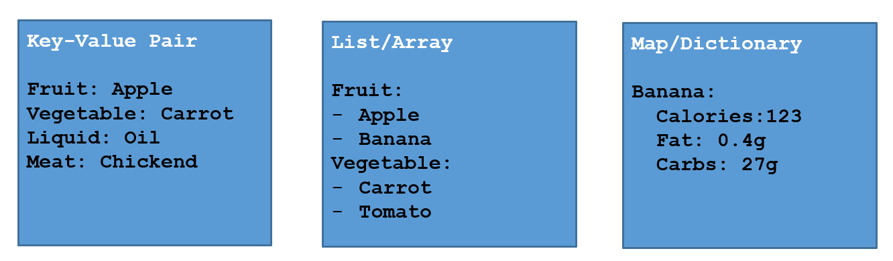
- YAML Ain't Markup Language (YAML) là tập cha của JSON, được thiết kế để dễ đọc hơn.
- Vì là tập cha của JSON nên các bộ phân tích YAML có thể phân tích các tệp JSON (nhưng ngược lại thì không).
- Do vậy, YAML tốt hơn JSON ở một số tác vụ, bao gồm việc nhúng trực tiếp mã JSON (có chứa dấu ngoặc kép) trong các file YAML.
- YAML sử dụng thụt lề để xác định phân cấp trong tệp.
- Maps và danh sách (list) cũng có thể được biểu diễn khá tương tự như trong JavaScript hoặc Python, dưới dạng gọi là “flow syntax” – cú pháp luồng.

```js
person:
  name: John
  age: 30
  city: New York

person: {name: John, age: 30, city: New York}
```

```js
fruits:
  - apple
  - orange
  - banana

fruits: [apple, orange, banana]
```

```js
people:
  - name: John
    age: 30
    city: New York
  - name: Jane
    age: 25
    city: London


people:
  - {name: John, age: 30, city: New York}
  - {name: Jane, age: 25, city: London}

```

## POD

- Là một đối tượng nhỏ nhất được tạo ra bởi k8s
- Dùng để đóng gói các Containers vào bên trong
- Là một instance của application
- Khi Pod đang running nó là thực thể không thể thay đổi (thêm, xóa, sửa)
- Scale workload => tăng Pod => tăng Host
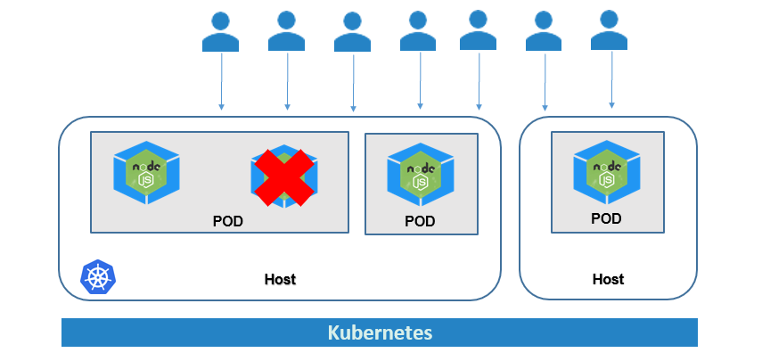
- Multiple Container in Pod
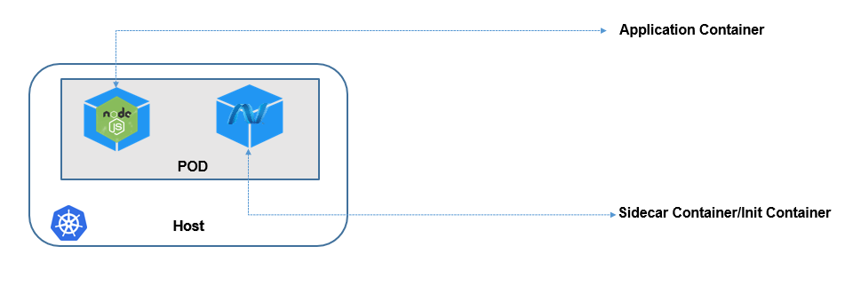
  - **Sidecar Container**: container running song song với container application
  - **Init Container**: container running trước container application
- Chỉ nên chạy 1 container trong 1 pod

## ReplicaSets

- ReplicaSet cho phép chạy nhiều bản sao của 1 POD trong Cluster để đảm bảo High Avalibility
- Khi application chạy 2 POD, RS cho phép đảm bảo luôn luôn có 2 POD running trong Cluster

## Deployment

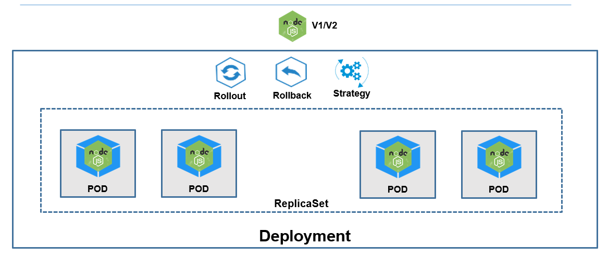

- Khi traffic tăng lên, Kuberentes sẽ không thêm containers vào trong các POD đang chạy mà sẽ thêm các POD khác
- POD được coi là immutable object, tức là khi running không thể edit bất cứ thông tin nào ngoại trừ **image**
- Khi traffic tiếp tục tăng lên và 1 node không thể xử lý được thì K8s sẽ tạo POD trên Host khác
- **Upgrade/Rollout**: tạo ra một Replicaset mới với các POD với version mới của application
- **Rollback**: recover lại các POD của replicaset version trước đó
- ***Deployment Strategy***:
  - **Recreate strategy** sẽ kill tất cả các POD của revision cũ trước khi tạo ra các revision mới, gây ra downtime cho application
  - **Rolling Update** thực hiện thay thế dần dần các POD của revision cũ và thay thế bằng các POD của revision mới

## Service

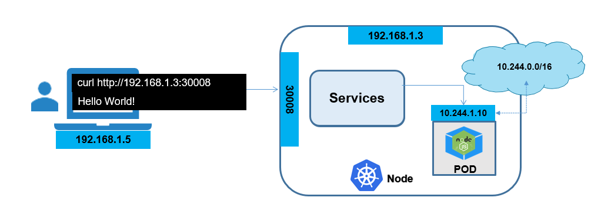

***In Kubernetes, a Service is a method for exposing a network application that is running as one or more Pods in your cluster.***

**Service types**

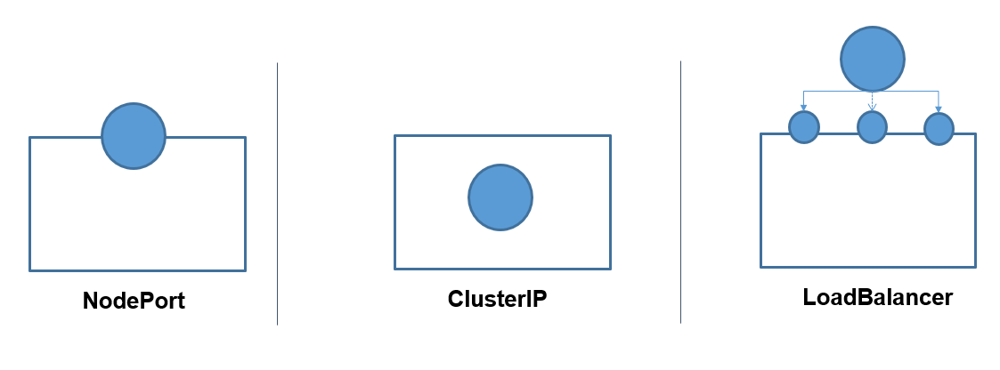

- **NodePort** cho phép truy cập vào một POD trong Cluster bằng cách mapping với 1 Port nằm trên Node.
- **ClusterIP** cho phép gắn một IP ảo (Virtual IP) vào Service và cho phép các service khác trong cluster có thể thương tác với service này qua IP đó
- **LoadBalancer** là service cung cấp bởi các Cloud Provider, nó cho phép truy cập vào service thông qua một LoadBalancer

### NodePort

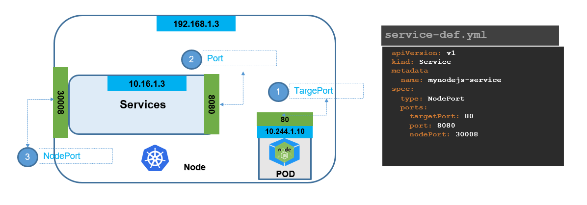

- Để định một NodePort service cần chỉ định rõ các Port trên Node (NodePort), Port lắng nghe của Service (Port) và Port lắng nghe của POD (targetPort)

- Khi tạo một Service với kiểu NodePort, một cổng cố định (NodePort) trên mỗi Node trong Cluster sẽ được mở ra để tiếp nhận yêu cầu. Cổng này là một cổng ngoại vi trên máy chủ vật lý hoặc ảo và có thể được truy cập từ bên ngoài Cluster.
- **Virtual IP (ClusterIP)**: Service cung cấp một địa chỉ IP ảo (ClusterIP) để đại diện cho tất cả các Pod thuộc selector của nó. Khi các yêu cầu đến địa chỉ IP của Service (ClusterIP), cổng NodePort trên Node sẽ chuyển hướng yêu cầu đó đến ClusterIP.
- **Forwarding đến các Pod**: Khi một yêu cầu được gửi đến cổng NodePort trên bất kỳ Node nào trong Cluster, nó sẽ được chuyển hướng đến địa chỉ IP của Service (ClusterIP). ClusterIP sau đó sẽ chuyển hướng yêu cầu đến các Pod phù hợp dựa trên selector theo một cơ chế Round Robin.
- **Round Robin Load Balancing**: Cơ chế Round Robin được sử dụng để chuyển hướng yêu cầu đến các Pod trong tập hợp. Mỗi lần yêu cầu mới đến, nó sẽ được chuyển đến Pod tiếp theo trong danh sách.

### ClusterIP

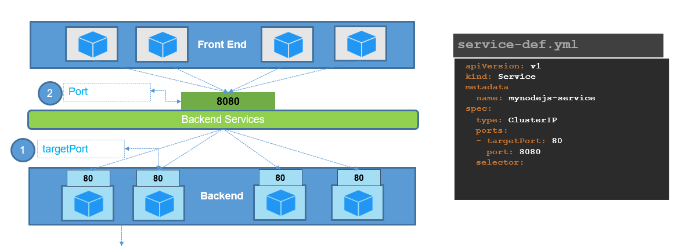

- Được sử dụng để tạo ra một địa chỉ IP ảo (Virtual IP) chỉ có thể truy cập từ bên trong Cluster. ClusterIP không cung cấp khả năng truy cập từ bên ngoài Cluster và thường được sử dụng để nhóm các Pod có cùng chức năng
- Khi triển khai một địch vụ thông thường sẽ bao gồm 3 thành phần cơ bản đó là FrontEnd, Backend và DB.
- Trong môi trường của Kubernetes, các thành phần này sẽ được triển khai thành các POD gọi là instance. Các POD này về bản chất được Kubernetes cấp cho 1 địa chỉ IP trong suốt vòng đời của nó, tuy nhiên khi POD bị thay thế bởi POD khác thì IP sẽ bị thay đổi.
- Vì vậy, kêt nối trực tiếp tới IP của POD là điều không thể. Do đó service ClusterIP được sinh ra như một giao diện đồng nhất cho phép nhóm tất cả các POD có cùng chức năng lại, điều đó khiến cho việc POD bị thay đổi IP sẽ không bị ảnh hưởng tới các thành phần tạo kết nối khác.

### LoadBalancer

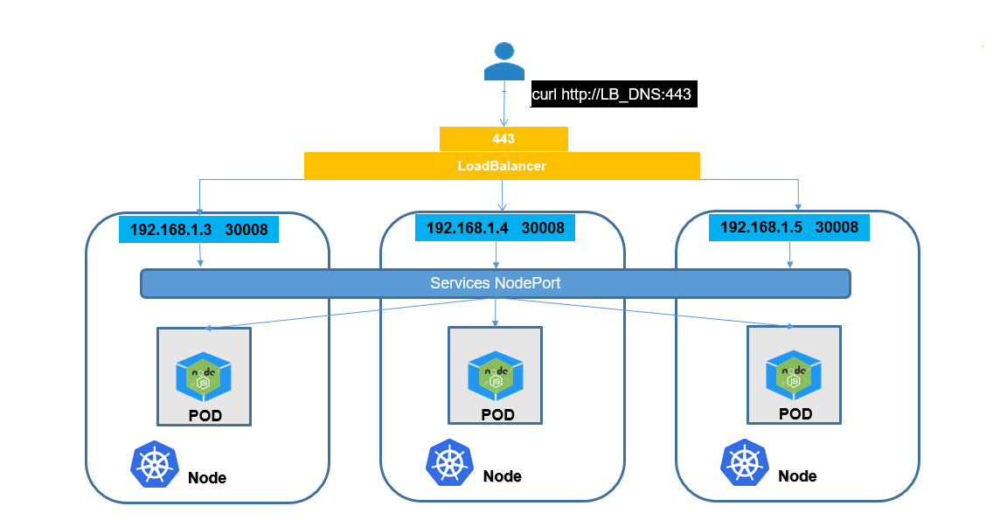

## Label & Selector

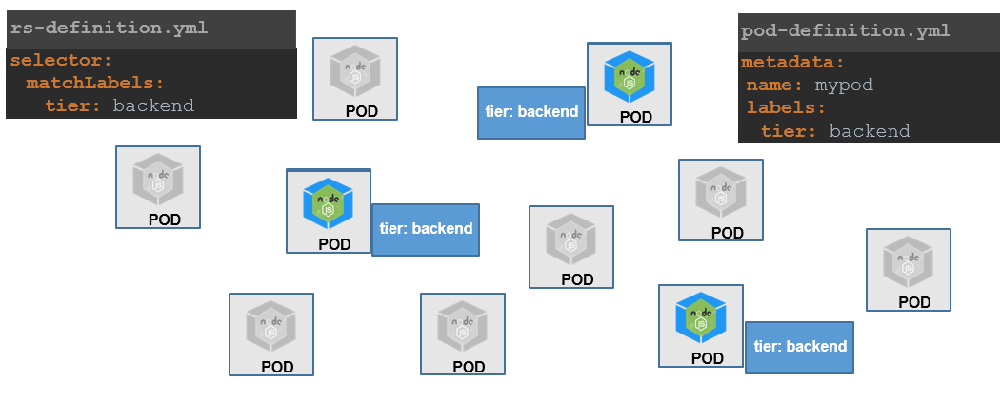

**Label**: Gán nhãn cho object
**Selector**: Lựa chọn loại object có nhãn nào để manage

## Namespace

- Namespace cho phép phân tách, tách biệt resources của một Kubernetes Cluster.
- Sử dụng Namespace khi cần chia K8s resources cho các team khác nhau, các mục đích khác nhau *(dev, test, prod,...)*
- Sử dụng Namespace có thể set các giới hạn về Resources phục vụ việc quản lý tài nguyên

## ConfigMap

- Các file cấu hình cho ứng dụng có thể được sử dụng trong Kubernetes dưới dạng ConfigMap
- ConfigMap được lưu dưới dạng Key-Value
- Ứng dụng có thể đọc các file cấu hình dưới dạng ConfigMap theo các cách sau:
  - Sử dụng biến môi trường Environment Variables (printenv)
  - Sử dụng Volumes
- ConfigMap có thể dùng để lưu một file cấu hình đầy đủ *(VD. nginx.conf, application.properties)*
- Sau đó ConfigMap được mount vào thư mục đặt file cấu hình của ứng dụng trong container sử dụng Volumes.Bằng cách này chúng ta có thể đưa file cấu hình vào trong Container mà không cần thay đổi gì với Container

- Generate ConfigMap sử dụng declarative yaml file

```yaml
apiVersion: v1
kind: ConfigMap
metadata:
  name: webapp-config-map
data:
  APP_COLOR: darkblue
  APP_OTHER: disregard

```

- Expose ConfigMap sử dụng Environment Variables

```yaml
# non configmap
- env:
    - name: APP_COLOR
      value: green
```

```yaml
# use configmap
- env:
    - name: APP_COLOR
      valueFrom:
        configMapKeyRef: 
          name: webapp-config-map
          key: APP_COLOR

```

## Secret

- Secrets là cách mà Kubernetes cung cấp để chia sẻ các thông nhạy cảm *(user/pass, token, key…)*, là cách đơn giản nhất để truyền các tham số nhạy cảm
- Ngoài Secrets còn có thể dùng dịch vụ khác thay thế như **Hashicorp Vault**

- Ứng dụng có thể sử dụng Secret theo các cách sau
  - Sử dụng Secret như là các biến môi trường (environment variables)
  - Sử dụng Secret như là một file: volumes để mount vào Container

Volume:

```yaml
spec:
  containers:
  - name: mynodejs
    image:  nodejs
    volumeMounts:
      - name: credential-volume
        mountPath: /etc/creds
  volumes:
    - name: credential-volume
      secret:
        secretName: db-secret
```

[For more](./commands.md)

## Ingress

- Ingress là một phương án để expose service ra bên ngoài thay thế cho NodePort hoặc LoadBalancer type
- Ingress cho phép định tuyến các traffic từ bên ngoài vào các service bên trong K8s theo các rule được định nghĩa:
  - Host name
  - URL Path

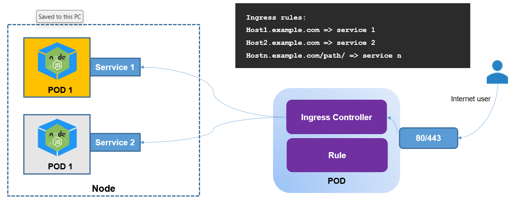

- **Ingress Resource** là Object cho phép định nghĩa cách các request từ bên ngoài vào được định tuyến tới các Service như thế nào trong K8s Cluster
- **Ingress Controller**:
  - Ingress Controller đóng vai trò là Proxy và thực hiện tiếp nhận request từ bên ngoài và chuyển hướng tới các dịch vụ Service bên trong Cluster K8s
  - Ingress Controller sẽ lắng nghe việc tạo ra các Ingress Resource và apply các rule định nghĩa trong Ingress Resource vào cấu hình Proxy của nó
  
- **Ingress Rules**:
  - Là một phần của Ingress Resources trong Kubernetes. Một Ingress Resources định nghĩa cách yêu cầu HTTP/HTTPS nên được điều hướng đến các dịch vụ trong cluster. Mỗi Ingress Rule chứa một hoặc nhiều quy tắc để xác định cách yêu cầu nên được xử lý.
  - Các quy tắc này được đặc tả trong trường spec.rules của Ingress Resources và có thể bao gồm các thông tin như địa chỉ đích, path, port, và backend service.

## Install kubectl on ubuntu or wsl2

```py
curl -LO "https://dl.k8s.io/release/$(curl -L -s https://dl.k8s.io/release/stable.txt)/bin/linux/amd64/kubectl"

sudo install -o root -g root -m 0755 kubectl /usr/local/bin/kubectl

kubectl version --client

```
