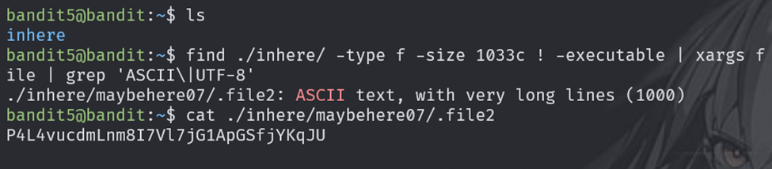
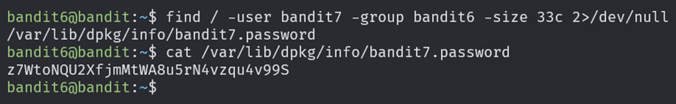
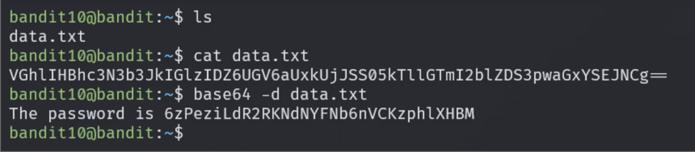
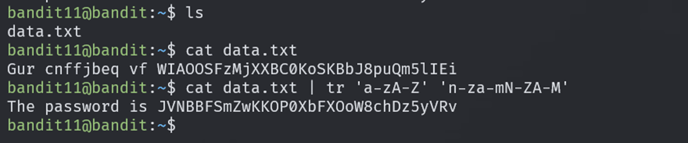
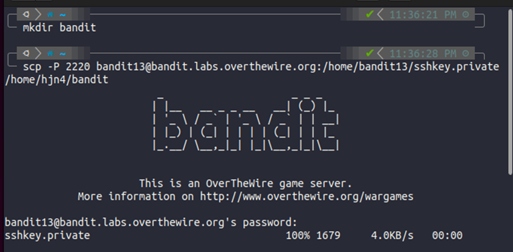
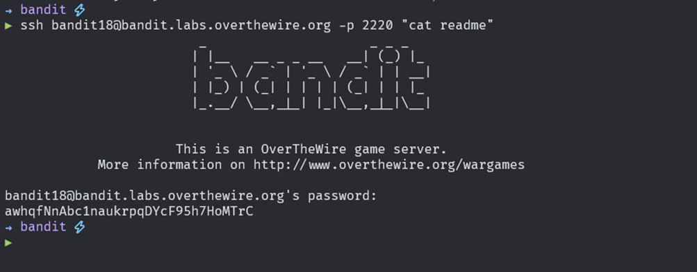
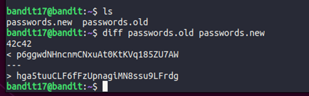

# Bandit challenge

Ở đây mình sẽ không tập trung vào việc giải các challs này. Mình sẽ note vài thứ cần lưu ý ở các chall thoi. Cuối cùng sẽ bê các thứ này nhưng ở version sâu hơn qua page khác note lại tiếp.

## Level 1

Việc đọc file nên dùng đường dẫn tương đối hoặc tuyệt đối sẽ tốt hơn để tránh các case đặt biệt

## Level 5 + 6

- Lệnh **find** với các option như trên sẽ tiến hành tìm các files trong thư mục tương ứng và các thư mục con của nó, file có kích thước là **1033 bytes**, **không có quyền thực thi**. Ứng với mỗi file đó sẽ trích xuất kiểu dữ liệu của nó. Và **grep** để lọc thứ ta cần

- Lại là 1 ví dụ khác với lệnh **find**

## Level 9

**strings** có thể trích xuất các chuỗi human readable có trong file

## Level 10 + 11

## Level 12

Giải nén file thì có nhiều loại lắm, sẽ note lại bên page khác kĩ hơn

## Level 13 + 18

**ssh -i filekeyssh  username@host -p PORT**

Lệnh này để vừa dùng ssh vừa thực hiện copy file ở vị trí cụ thể về local

## Level 17

## Level 21

Tìm hiểu file **/etc/cron.d/...**

## Level 25

Từ chế độ xem file của **more** ta có thể ấn **v** để mở sang  **vim** từ **vim** ta có thể dùng các lệnh tương tác trực tiếp với **shell**, ***cần tìm hiểu thêm***

## Level 27 + 28 + 29

Cần học thêm git

- **git log**
- **git show** \<id-commit>
- **git checkout** \<branch-name>
- **git tag**
- **git show** \<tag-name>
- **git add** \<file-name>
- **git commit -m** \<text>
- **git push origin**

## Level 32

- **$0** : đại diện cho tên shell đã dùng
