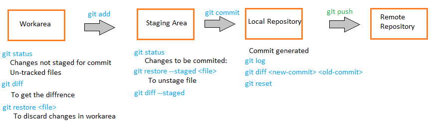
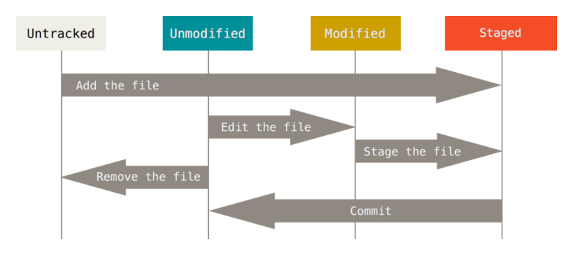

# Git command

Thề là nó nhiều kinh :)) dễ trầm kẻm vl. Nên mấy cái dùng thường xuyên mới nhớ lâu chứ còn lại toàn phải search. Note ra để biết nó có tồn tại :((

- [Config](#config)
- [Searching](#searching)
- [Working with file life circle](#working-with-file-life-circle)
- [Undo things](#undo-things)
- [Remote repository](#remote-repository)
- [Tag](#tag)
- [Alias for command](#alias-for-command)
- [Branch](#branch)
- [Branching workflow](#branching-workflow)

## Config

- git config --global user.name "John Doe"
- git config --global user.email <abc@gmail.com>
- git config list
- git config user.name

## searching

- git help \<option>
- git \<option> --help
- man git \<option>

## working with file life circle

- **git clone \<URL>**
- **git init**

- **git add \<file or dir>**
- **git status**
- **git commit -m** \<message>

- file **.gitignore**: git sẽ không monitor các file này

- **git diff --staged**

- **git rm --cached README.md** : xóa khỏi git nhưng còn trên hard disk
- **git rm \<file or dir>**

- **git mv \<file1> \<file2>**: thay vì rename và hơn thế nữa

- **git log**

## undo things

- **git commit --amend**: khi mà add file rồi commit, xong lại phải add file khác nhưng không muốn thêm 1 cái commit nữa thì có thể dùng nó

- **git reset HEAD \<file name>**  : muốn chuyển trạng thái 1 file từ **staged** (sau khi *add*)sang **unstaged**

- **git checkout -- \<file name>** : sau khi sửa => trạng thái modified tuy nhiên ta muốn quay lại version trc đó của file

## Remote repository

- **git remote** : return short name of remote repo which links to remote repo
- **git remote -v** : return url (fetch, push)

- **git remote add \<short name> \<URL>**

- **git fetch \<short name>** : để preview, cập nhật thông tin của remote repo, chứ không clone về

- **git pull \<short name> \<branch name>**

- **git remote show \<short name>**

- **git remote rename \<old short-name> \<new short-name>**

- **git remote rm \<short name>**
*Note: thường thì short name là origin*

## Tag

*tag là 1 cái name, pointer đến commit, như là 1 commit.*

*nên là sau khi create tag thì push lên server như 1 commit đại diện cho 1 thay đổi nào đấy. Có thể push từng tag lên remote*

- **git tag**

- **git tag -a \<tag name> -m \<message>** : tag có message
- **git show \<tag name>**

- **git tag \<tag name>** : chỉ có tag name k có message

- **git tag -a \<tag name> \<commit-id>** : gắn tag cho 1 commit cụ thể

- **git push \<short name> \<tag name>**
- **git push \<short name> --tags** : push all tags

- **git checkout -b \<new-branch-name> \<tag-name>** : tách ra 1 rank mới

- **git tag -d \<tag name>** : delete tag on local

- **git ls-remote --tags** : list all tags on remote
- **git push \<short name> --delete \<tag name>** : delete tag on remote

## Alias for command

Mình note để biết nó có tồn tại thoi chứ mình sẽ không ghi vô đây, và không dùng, mất thời gian có thể chả bao nhiêu giây, cơ mà lại làm mình lười đi và quên mọe cái bản chất của nó. Vừa thoi cái gì ngắn quá cũng k tốt bro :))

## Branch

- git branch \<new-branch-name> : tạo mới brancg
- git log --online --decorate
- git checkout \<branch-name>

- git merge \<branch-name> : đứng ở branch hiện tại và muốn merge branch khác vào
- git push --set-upstream \<short-name> \<branch-name>: để tạo branch trên remote, rồi push lên

- git branch --merged : xem nhánh nào đã được merge
- git branch --no-merged

- git branch -d \<branch-name> : xóa nhánh nếu nó đã được merge

- git branch -D \<branch-name> : xóa nhánh mặc dù nó chưa được merge

## Branching workflow

...

*update in the future*
