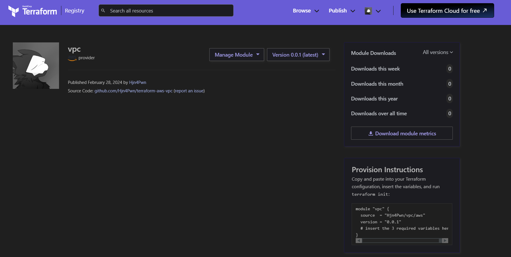

# Terraform Module: Create VPC on AWS

- [Create VPC non Module](#create-vpc-non-module)
  - [Get Started](#get-started)
  - [Reviewing knowledge](#reviewing-knowledge)
  - [Create VPC](#create-vpc)
  - [Create Subnet](#create-subnet)
  - [Create public, private subnet](#create-public-private-subnet)
  - [Create Internet Gateway](#create-internet-gateway)
  - [Create Route Table attach Internet Gateway](#create-route-table-attach-internet-gateway)
  - [Attach Route Table to Public Subnets](#attach-route-table-to-public-subnets)
  - [Create Nat Gateway](#create-nat-gateway)
  - [Create Route Table attach Nat Gateway](#create-route-table-attach-nat-gateway)
  - [Attach Route Table to Private Subnets](#attach-route-table-to-private-subnets)
  - [Full code](#full-code)
- [Module](#module)
  - [Using module](#using-module)
  - [Write module](#write-module)
    - [Create /vpc/variables.tf](#create-vpcvariablestf)
    - [Upate /vpc/main.tf](#upate-vpcmaintf)
    - [Update main.tf](#update-maintf)
  - [Publish module](#publish-module)

## Create VPC non Module

### Get Started

Đầu tiên tạo file main.tf:

```sh
provider "aws" {
  region = "ap-southeast-1"
}

```

> terraform init

### Reviewing knowledge

- **VPC**: Là một service cho phép tạo mạng ảo, có thể control network in/out của mạng đó. Bên trong nó chứa các service khác, như 1 network on-premise
- **Internet Gateway**: là cánh cửa giúp access 2 chiều từ internet vào trong các service bên trong VPC và ngược lại
- **Nat Gateway**: là cánh cửa tuy nhiên chỉ có phép service trong VPC access ra ngoài internet, không accept chiều ngược lại
- **Route Table**: Định tuyến traffic trong subnet hoặc gateway sẽ được điều hướng đi đâu. Route Table sẽ quyết định một subnet sẽ là Private hay Public. Subnet được gọi là Public khi có route đi tới Internet Gateway và ngược lại.

### Create VPC

```sh
provider "aws" {
  region = "ap-southeast-1"
}

resource "aws_vpc" "vpc" {
  cidr_block           = "10.0.0.0/16"
  enable_dns_hostnames = true

  tags = {
    "Name" = "custom"
  }
}

```

- Ở trên ta sẽ tạo một VPC mới với CIDR là *10.0.0.0/16* và tên là *Custom*. CIDR của VPC sẽ có các giá trị nằm trong khoảng sau:
  - 10.0.0.0/16 -> 10.0.0.0/28
  - 172.16.0.0/16 -> 172.16.0.0/28
  - 192.168.0.0/16 -> 192.168.0.0/28

### Create Subnet

- Subnet sẽ chia VPC thành nhiều sub network nhỏ hơn. Mỗi subnet sẽ nằm trong một AZ. Và các service của ta sẽ được launch ở trong subnet này.

```sh
#...
resource "aws_subnet" "private_subnet_2a" {
  vpc_id     = aws_vpc.vpc.id
  cidr_block = "10.0.1.0/24"
  availability_zone = "ap-southeast-1a"

  tags = {
    "Name" = "private-subnet"
  }
}

```

### Create public, private subnet

```sh
...
locals {
  private  = ["10.0.1.0/24", "10.0.2.0/24", "10.0.3.0/24"]
  public = ["10.0.4.0/24", "10.0.5.0/24", "10.0.6.0/24"]
  zone    = ["ap-southeast-1a", "ap-southeast-1b", "ap-southeast-1c"]
}

resource "aws_subnet" "private_subnet" {
  count = length(local.private)

  vpc_id            = aws_vpc.vpc.id
  cidr_block        = local.private[count.index]
  availability_zone = local.zone[count.index % length(local.zone)]

  tags = {
    "Name" = "private-subnet"
  }
}

resource "aws_subnet" "public_subnet" {
  count = length(local.public)

  vpc_id            = aws_vpc.vpc.id
  cidr_block        = local.public[count.index]
  availability_zone = local.zone[count.index % length(local.zone)]

  tags = {
    "Name" = "public-subnet"
  }
}

```

### Create Internet Gateway

```sh
...
resource "aws_internet_gateway" "ig" {
  vpc_id = aws_vpc.vpc.id

  tags = {
    "Name" = "custom"
  }
}

```

### Create Route Table attach Internet Gateway

```sh
...
resource "aws_internet_gateway" "ig" {
  vpc_id = aws_vpc.vpc.id

  tags = {
    "Name" = "custom"
  }
}

resource "aws_route_table" "public" {
  vpc_id = aws_vpc.vpc.id

  route {
    cidr_block = "0.0.0.0/0"
    gateway_id = aws_internet_gateway.ig.id
  }

  tags = {
    "Name" = "public"
  }
}


```

### Attach Route Table to Public Subnets

```sh
#...
resource "aws_route_table_association" "public_association" {
  for_each       = { for k, v in aws_subnet.public_subnet : k => v }
  subnet_id      = each.value.id
  route_table_id = aws_route_table.public.id
}

```

### Create Nat Gateway

```sh
...
resource "aws_eip" "nat" {
  vpc = true
}

resource "aws_nat_gateway" "public" {
  depends_on = [aws_internet_gateway.ig]

  allocation_id = aws_eip.nat.id
  subnet_id     = aws_subnet.public_subnet[0].id

  tags = {
    Name = "Public NAT"
  }
}

```

### Create Route Table attach Nat Gateway

```sh
...
resource "aws_route_table" "private" {
  vpc_id = aws_vpc.vpc.id

  route {
    cidr_block = "0.0.0.0/0"
    gateway_id = aws_nat_gateway.public.id
  }

  tags = {
    "Name" = "private"
  }
}

```

### Attach Route Table to Private Subnets

```sh
...
resource "aws_route_table_association" "private_association" {
  for_each       = { for k, v in aws_subnet.private_subnet : k => v }
  subnet_id      = each.value.id
  route_table_id = aws_route_table.private.id
}

```

### Full code

[Full code](https://github.com/Hjn4Pwn/Terraform-file/tree/master/create-vpc-module)

## Module

- Một module cơ bản sẽ gồm 3 file sau đây:
  - **main.tf** chứa code.
  - **variables.tf** chứa input vào của module.
  - **outputs.tf** chưa giá trị đầu ra của module.

### Using module

- Để sử dụng module, ta dùng resource tên là module như sau:

```sh
module <module_name> {
  source = <source>
  version = <version>

  input_one = <input_one>
  input_two = <input_two>
}

```

- **source**: có thể là dường dẫn local hoặc một url trên mạng
- **version**: chỉ định version của module
- **input_one**: là các giá trị input ta định nghĩa trong file variables.tf.

### Write module

- Ta tạo folder với cấu trúc như sau.

```sh
.
├── main.tf
└── vpc
    ├── main.tf
    ├── outputs.tf
    └── variables.tf

```

- Ta cần xác định các giá trị động mà ta sẽ truyển vào module
- Với code trên thì ta có các giá trị động là:
  - VPC CIDR Block
  - Region
  - AZ
  - Subnet

#### Create /vpc/variables.tf

```sh
variable "region" {
  type    = string
  default = "ap-southeast-1"
}

variable "vpc_cidr_block" {
  type    = string
  default = "10.0.0.0/16"
}

variable "private_subnet" {
  type = list(string)
}

variable "public_subnet" {
  type = list(string)
}

variable "AZ" {
  type = list(string)
}

```

#### Upate /vpc/main.tf

```sh
provider "aws" {
  region = var.region
}

# Create VPC
resource "aws_vpc" "vpc" {
  cidr_block           = var.vpc_cidr_block
  enable_dns_hostnames = true

  tags = {
    "Name" = "custom"
  }
}

# Create public, private subnet
locals {
  private = ["10.0.1.0/24", "10.0.2.0/24", "10.0.3.0/24"]
  public  = ["10.0.4.0/24", "10.0.5.0/24", "10.0.6.0/24"]
  zone    = ["ap-southeast-1a", "ap-southeast-1b", "ap-southeast-1c"]
}

resource "aws_subnet" "private_subnet" {
  count = length(var.private_subnet)

  vpc_id            = aws_vpc.vpc.id
  cidr_block        = var.private_subnet[count.index]
  availability_zone = var.AZ[count.index % length(var.AZ)]

  tags = {
    "Name" = "private-subnet"
  }
}

resource "aws_subnet" "public_subnet" {
  count = length(var.public_subnet)

  vpc_id            = aws_vpc.vpc.id
  cidr_block        = var.public_subnet[count.index]
  availability_zone = var.AZ[count.index % length(var.AZ)]

  tags = {
    "Name" = "public-subnet"
  }
}

# Create Internet Gateway
resource "aws_internet_gateway" "ig" {
  vpc_id = aws_vpc.vpc.id

  tags = {
    "Name" = "custom"
  }
}

# Create Route Table attach Internet Gateway
resource "aws_route_table" "public" {
  vpc_id = aws_vpc.vpc.id

  route {
    cidr_block = "0.0.0.0/0"
    gateway_id = aws_internet_gateway.ig.id
  }

  tags = {
    "Name" = "public"
  }
}

# Attach Route Table to Public Subnets
resource "aws_route_table_association" "public_association" {
  for_each       = { for k, v in aws_subnet.public_subnet : k => v }
  subnet_id      = each.value.id
  route_table_id = aws_route_table.public.id
}

# Create Nat Gateway
resource "aws_eip" "nat" {
  domain = "vpc"
}

resource "aws_nat_gateway" "public" {
  depends_on = [aws_internet_gateway.ig]

  allocation_id = aws_eip.nat.id
  subnet_id     = aws_subnet.public_subnet[0].id

  tags = {
    Name = "Public NAT"
  }
}

# Create Route Table attach Nat Gateway
resource "aws_route_table" "private" {
  vpc_id = aws_vpc.vpc.id

  route {
    cidr_block = "0.0.0.0/0"
    gateway_id = aws_nat_gateway.public.id
  }

  tags = {
    "Name" = "private"
  }
}

# Attach Route Table to Private Subnets
resource "aws_route_table_association" "private_association" {
  for_each       = { for k, v in aws_subnet.private_subnet : k => v }
  subnet_id      = each.value.id
  route_table_id = aws_route_table.private.id
}

```

#### Update main.tf

```sh
provider "aws" {
  region = "ap-southeast-1"
}

module "VPC" {
  source         = "./VPC"
  vpc_cidr_block = "10.0.0.0/16"
  private_subnet = ["10.0.1.0/24", "10.0.2.0/24", "10.0.3.0/24"]
  public_subnet  = ["10.0.4.0/24", "10.0.5.0/24", "10.0.6.0/24"]
  AZ             = ["ap-southeast-1a", "ap-southeast-1b", "ap-southeast-1c"]
}

```

### Publish module

- Tạo repo trên github:
  - Name syntax: **terraform-\<provider\>-\<name\>**
    - Ex: *terraform-aws-vpc*
  - Gắn tag syntax: **v\<XXXXX\>**
    - Ex: *v0.0.1*
- Truy cập [Registry](https://registry.terraform.io) bằng github account
- Vào **Public** -> **Module**:
    
- Sau đó sẽ có hướng dẫn dùng module đó:
    

- Và giờ ta chỉ việc dùng config tí:

```sh
  source  = "Hjn4Pwn/vpc/aws"
  version = "0.0.1"

  region         = "ap-southeast-1"
  vpc_cidr_block = "10.0.0.0/16"
  private_subnet = ["10.0.1.0/24", "10.0.2.0/24", "10.0.3.0/24"]
  public_subnet  = ["10.0.4.0/24", "10.0.5.0/24", "10.0.6.0/24"]
  AZ             = ["ap-southeast-1a", "ap-southeast-1b", "ap-southeast-1c"]
}

```

***Tuy nhiên đã có sẵn các module như này, cơ mà còn chi tiết hơn nữa nên là, trc khi tạo gì đó ta có thể search module mà dùng thay vì ngồi gõ sml***
