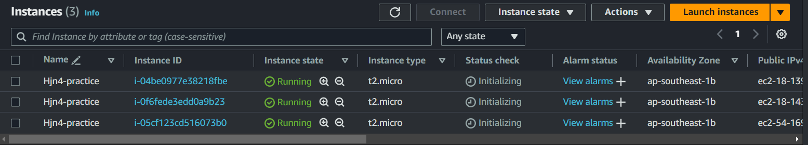

# Functional Programming

- [Example](#example)
- [Input Variables](#input-variables)
- [Gán giá trị cho variable](#gán-giá-trị-cho-variable)
- [Validating variables](#validating-variables)
- [Output](#output)
- [Count parameter](#count-parameter)
- [For expressions](#for-expressions)
- [Format function](#format-function)
- [Demo](#demo)
- [Static Web S3 Bucket](#static-web-s3-bucket)
- [Local values](#local-values)

## Example

```sh
provider "aws" {
  region = "us-west-2"
}

data "aws_ami" "ubuntu" {
  most_recent = true

  filter {
    name   = "name"
    values = ["ubuntu/images/hvm-ssd/ubuntu-focal-20.04-amd64-server-*"]
  }

  owners = ["099720109477"]
}

resource "aws_instance" "hello" {
  ami           = data.aws_ami.ubuntu.id
  instance_type = "t2.micro"
}

```

Với file config trên ta phải dùng hardcode, khá bất tiện do đó ta sẽ dùng **variable**

## Input Variables

Ta có thể định nghĩa trong main.tf hoặc tạo riêng 1 file variable.tf khác:

```sh
variable "instance_type" {
  type = string
  description = "Instance type of the EC2"
}

```

- **Type**: bắt buộc phải khai báo
- **Basic type**: string, number, bool
- **Complex type**: list(), set(), map(), object(), tuple()
- Trong terraform, *type number* và *type bool* sẽ được convert thành *type string* khi cần thiết. *Nghĩa là 1 sẽ thành "1", true sẽ thành "true"*
- Thay vì gán cứng => **instance_type = var.instance_type**

Đây chỉ là mới khởi tạo variable thoi, ta cần gán giá trị cho nó nữa

## Gán giá trị cho variable

- Để gán giá trị cho biến, ta sẽ tạo một file tên là **terraform.tfvars**:

```sh
instance_type = "t2.micro"
```

- Khi ta chạy **terraform apply** thì file **terraform.tfvars** sẽ được terraform sử dụng mặc định để load giá trị cho biến
- Nếu không muốn set mặc định như thế, thì ta tạo 1 file khác ví dụ **production.tfvars** với nội dung tương tự:

> terraform apply -var-file="production.tfvars"

## Validating variables

Ta có thể chỉ định những giá trị *được phép* của variable bằng cách:

```sh
variable "instance_type" {
  type = string
  description = "Instance type of the EC2"

  validation {
    condition = contains(["t2.micro", "t3.small"], var.instance_type)
    error_message = "Value not allow."
  }
}

```

## Output

Giá trị của output block sẽ được in ra terminal, cú pháp của output như sau.

- Để in được giá trị public IP của EC2, ta thêm vào file main.tf đoạn code sau:

```sh
#...
output "ec2" {
  value = {
    public_ip = aws_instance.hello.public_ip
  }
}
```

## Count parameter

- Là một thuộc tính trong terraform chứ **không phải** của **Resource type block** thuộc provider
- **Resource type block** chỉ có chứa các thuộc tính mà provider cung cấp
- **Meta argument** là thuộc tính của terraform => nghĩa là ta có thể sử dụng nó ở bất kì resource block nào.
- Cập nhật lại file **main.tf** mà sẽ tạo ra **5 EC2** như sau:

```sh
provider "aws" {
  region = "us-west-2"
}

data "aws_ami" "ubuntu" {
  most_recent = true

  filter {
    name   = "name"
    values = ["ubuntu/images/hvm-ssd/ubuntu-focal-20.04-amd64-server-*"]
  }

  owners = ["099720109477"]
}

resource "aws_instance" "hello" {
  count         = 5
  ami           = data.aws_ami.ubuntu.id
  instance_type = var.instance_type
}

output "ec2" {
  value = {
    public_ip1 = aws_instance.hello[0].public_ip
    public_ip2 = aws_instance.hello[1].public_ip
    public_ip3 = aws_instance.hello[2].public_ip
    public_ip4 = aws_instance.hello[3].public_ip
    public_ip5 = aws_instance.hello[4].public_ip
  }
}

```

## For expressions

> for \<value\> in \<list\> : \<return value\>

- Ví dụ dùng for:
  - Tạo ra một array mới với giá trị của array mới sẽ được upper: **[for s in var.words : upper(s)]**
  - Tạo ra một object mới với value của object được upper: **{ for k, v in var.words : k => upper(s) }**

- Ta sẽ dùng for để rút gọn phần output IP của EC2. Cập nhật lại file **main.tf**:

```sh
#...
resource "aws_instance" "hello" {
  count         = 5
  ami           = data.aws_ami.ubuntu.id
  instance_type = var.instance_type
}

output "ec2" {
  value = {
    public_ip = [ for v in aws_instance.hello : v.public_ip ]
  }
}

```

*Phần output trên sẽ in ra cho ta giá trị public_ip là một mảng IP của tất cả EC2 được tạo ra. Còn nếu muốn in output ra theo kiểu { public_ip1: \<value\>, public_ip2: \<value\> } thì ta có thể dùng format function.*

## Format function

```sh
#...
resource "aws_instance" "hello" {
  count         = 5
  ami           = data.aws_ami.ubuntu.id
  instance_type = var.instance_type
}

output "ec2" {
  value = { for i, v in aws_instance.hello : format("Public_IP %d: ", i + 1) => v.public_ip }
}

```

## Demo

***Tạo 3 EC2 instances, với các thứ đã học ở trên.***

### main.tf

```sh
terraform {
  required_providers {
    aws = {
      source  = "hashicorp/aws"
      version = "~> 5.38"
    }
  }
}

provider "aws" {
  region = "ap-southeast-1"
}

data "aws_ami" "ubuntu" {
  most_recent = true

  filter {
    name   = "name"
    values = ["ubuntu/images/hvm-ssd/ubuntu-focal-20.04-amd64-server-*"]
  }

  owners = ["099720109477"]
}

resource "aws_instance" "hello" {
  count         = 3
  ami           = data.aws_ami.ubuntu.id
  instance_type = var.instance_type
  tags = {
    Name = "Hjn4-practice"
  }
}

output "ec2" {
  value = { for i, v in aws_instance.hello : format("Public_IP%d", i + 1) => v.public_ip }
}

```

### variable.tf

```sh
variable "instance_type" {
  type        = string
  description = "Instance type of the EC2"

  validation {
    condition = contains(["t2.micro"], var.instance_type)
    error_message = "Just allow t2.micro"
  }

}

```

### terraform.tfvars

```js
instance_type = "t2.micro"

```

### Result

```sh
#...
aws_instance.hello[0]: Creation complete after 32s [id=i-0f6fede3edd0a9b23]
aws_instance.hello[2]: Creation complete after 32s [id=i-04be0977e38218fbe]
aws_instance.hello[1]: Creation complete after 32s [id=i-05cf123cd516073b0]

Apply complete! Resources: 3 added, 0 changed, 0 destroyed.

Outputs:

ec2 = {
  "Public_IP1" = "18.143.78.17"
  "Public_IP2" = "54.169.140.195"
  "Public_IP3" = "18.139.110.75"
}

```



## Static Web S3 Bucket

*Sẽ quay lại đọc hiểu code của phần push file lên S3*

- Tham khảo và kết hợp 2 source:
  - [Viblo series terraform](https://viblo.asia/p/terraform-series-bai-2-life-cycle-cua-mot-resource-trong-terraform-RnB5pOMDlPG)
  - [AWS Community Builders](https://dev.to/aws-builders/how-to-create-a-simple-static-amazon-s3-website-using-terraform-43hc)

- **main.tf**:

```sh
# provider "aws" {
#   region     = var.region
#   access_key = var.access_key
#   secret_key = var.secret_key
# }

# Creating Random String for bucket name
# resource "random_string" "random" {
#   length  = 6
#   special = false
#   upper   = false
# }

# provider "aws" {
#   region = "ap-southeast-1"
# }

# Creating S3 Bucket 
resource "aws_s3_bucket" "bucket" {
  bucket = "terraform-learn-bucket-hjn4" #${random_string.random.result}"
  # force_destroy = true
}

resource "aws_s3_bucket_website_configuration" "static_web" {
  bucket = aws_s3_bucket.bucket.id
  index_document {
    suffix = "index.html"
  }
  error_document {
    key = "error/index.html"
  }
}

resource "aws_s3_bucket_policy" "bucket_policy" {
  bucket = aws_s3_bucket.bucket.id
  policy = file("s3_static_web_policy.json")
}

# Public Access
resource "aws_s3_bucket_public_access_block" "public_access_block" {
  bucket                  = aws_s3_bucket.bucket.id
  block_public_acls       = false
  block_public_policy     = false
  ignore_public_acls      = false
  restrict_public_buckets = false
}

locals {
  mime_types = {
    html  = "text/html"
    css   = "text/css"
    scss  = "text/x-scss"
    md    = "text/markdown"
    MD    = "text/markdown"
    ttf   = "font/ttf"
    woff  = "font/woff"
    woff2 = "font/woff2"
    otf   = "font/otf"
    js    = "application/javascript"
    map   = "application/javascript"
    json  = "application/json"
    jpg   = "image/jpeg"
    png   = "image/png"
    svg   = "image/svg+xml"
    eot   = "application/vnd.ms-fontobject"
  }
}

# will upload all the files present under HTML folder to the S3 bucket
resource "aws_s3_object" "upload_object" {
  for_each     = fileset(path.module, "static-web/**/*")
  bucket       = aws_s3_bucket.bucket.id
  key          = replace(each.value, "static-web", "")
  source       = each.value
  etag         = filemd5("${each.value}")
  content_type = lookup(local.mime_types, split(".", each.value)[length(split(".", each.value)) - 1])
}

```

- **s3_static_web_policy.json**:

```js
{
    "Version": "2012-10-17",
    "Statement": [
        {
            "Sid": "PublicReadGetObject",
            "Effect": "Allow",
            "Principal": "*",
            "Action": [
                "s3:GetObject"
            ],
            "Resource": [
                "arn:aws:s3:::terraform-learn-bucket-hjn4/*"
            ]
        }
    ]
}

```

- **outputs.tf**:

```js
output "s3_bucket_id" {
  value = aws_s3_bucket_website_configuration.static_web.website_endpoint
}

```

- Lần đầu plan ta không bị báo lỗi gì cả
- Tuy nhiên sau đó ta apply thì error:

```sh
│ Error: putting S3 Bucket (terraform-learn-bucket-hjn4) Policy: operation error S3: PutBucketPolicy, https response error StatusCode: 403, RequestID: XS5Z24E8SPP069YE, HostID: r/WDyVv2jIMYw7V0ueTKf2HguRPsD1hBpBgvb9yc6DKdM5QIMD5/HrRssxVuaGk+FxINZiZ+JfY=, api error AccessDenied: Access Denied
│ 
│   with aws_s3_bucket_policy.bucket_policy,
│   on main.tf line 34, in resource "aws_s3_bucket_policy" "bucket_policy":
│   34: resource "aws_s3_bucket_policy" "bucket_policy" {
```

- Lúc này bucket đã được tạo tuy nhiên vẫn chưa có policy, access denied, do đó ta sẽ **apply** lại 1 lần nữa để put policy:

```sh
aws_s3_bucket_policy.bucket_policy: Creating...
aws_s3_bucket_policy.bucket_policy: Creation complete after 1s [id=terraform-learn-bucket-hjn4]

Apply complete! Resources: 1 added, 0 changed, 0 destroyed.

Outputs:

s3_bucket_id = "terraform-learn-bucket-hjn4.s3-website-ap-southeast-1.amazonaws.com"
```

**file("s3_static_policy.json")**: được dùng để load cả content file
**for_each = fileset(path.module, "static-web/\*\*/\*")**: tải toàn bộ subdirs, files trong thư mục  

- Tạm thời chưa cần hiểu code phần **aws_s3_bucket_object**
- Phần quan trọng ở đây là **fileset function**, thay vì chỉ tải một file, thì **fileset** sẽ tải toàn bộ file trong thư mục đó lên theo dạng **set**.

## Local values

- Không giống như **variable block**, ta cần phải khai báo type, thì **locals block** ta sẽ gán thẳng giá trị cho nó. Ví dụ như sau:

```js
locals {
  one = 1
  two = 2
  name = "max"
  flag = true
}

```

- Để truy cập giá trị local thì ta dùng cú pháp local.\<KEY\>
