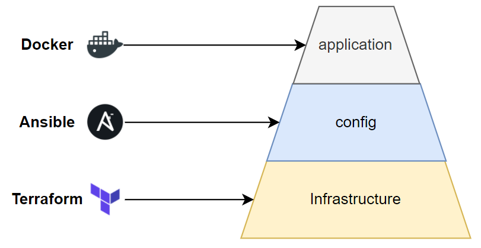
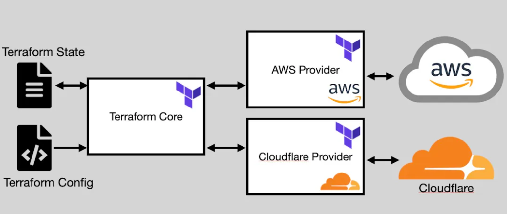

# Overview

- [Follow Series Vi](https://viblo.asia/p/terraform-series-bai-1-infrastructure-as-code-va-terraform-maGK7Bqa5j2)

*tuy đã có 1 series khá chi tiết, cơ mà vẫn nên note lại vài thứ*

- [Install Terraform](#install-terraform)
- [Authen with AWS](#authen-with-aws)
- [Basic deploy](#basic-deploy)
- [Basic Terraform Configuration](#basic-terraform-configuration)
- [Terraform Provider](#terraform-provider)
- [Resource drift](#resource-drift)
- [CI/CD support](#cicd-support)

## Install Terraform

> brew tap hashicorp/tap

> brew install hashicorp/tap/terraform

OR [For WSL](https://dev.thanaism.com/2021/08/install-terraform/) OR [For More](https://developer.hashicorp.com/terraform/tutorials/aws-get-started/install-cli)

## Authen with AWS

- Create non-root user

- Attach policy:
  - AmazonRDSFullAccess
  - AmazonEC2FullAccess
  - IAMFullAccess
  - AmazonS3FullAccess
  - AmazonDynamoDBFullAccess
  - AmazonRoute53FullAccess
- Install CLI AWS
- Create access key, connect AWS by access key

## Basic deploy



Dùng Terraform để tạo hạ tầng, sau đó dùng Ansible để setup những thứ cần thiết cho server, như install docker chẳng hạn, setup CI tool trên server. Sau đó thì ta dùng docker hoặc kubernetes để chạy ứng dụng.

## Basic Terraform Configuration

```js
terraform {
  required_providers {
    aws = {
      source  = "hashicorp/aws"
      version = "~> 5.38"
    }
  }
}

provider "aws" {
  region = "ap-southeast-1"
}

resource "aws_instance" "example" {
  ami           = "ami-07a6e3b1c102cdba8" // Amazon Linux 2023 AMI ami-07a6e3b1c102cdba8 (64-bit (x86)
  instance_type = "t2.micro"
  tags = {
    Name = "Hjn4-practice"
  }
}

```

- **terraform init**:
  - Lệnh này được sử dụng để khởi tạo một project Terraform.
  - Nó tải về và cài đặt các plugins cần thiết cho provider (như AWS, Azure) được định nghĩa trong config file.
  - Thường chỉ cần run một lần khi bắt đầu một project mới hoặc khi thêm hoặc thay đổi provider.
- **terraform plan**:
  - Lệnh này dùng để xác định những thay đổi sẽ được thực hiện khi triển khai infra.
  - Terraform so sánh trạng thái hiện tại của infra với định nghĩa trong config file và hiển thị kết quả dự kiến của các thay đổi mà nó sẽ thực hiện.
  - Điều này giúp xác nhận trước rằng những gì đang triển khai đúng như mong đợi.
- **terraform apply**:
  - Lệnh này thực hiện các thay đổi được xác định trong quá trình terraform plan.
  - Terraform sẽ triển khai cơ sở hạ tầng và áp dụng những thay đổi đã được xác nhận.

- **terraform destroy**:
  - Lệnh này được sử dụng để hủy và xóa toàn bộ cơ sở hạ tầng đã triển khai.
  - Điều này giúp đảm bảo rằng tất cả các tài nguyên đã triển khai không còn tồn tại, tránh lãng phí tài nguyên.

## Terraform Provider



- **Terraform state** là giúp theo dõi trạng thái của cơ sở hạ tầng mà nó quản lý. Terraform state lưu trữ thông tin về các tài nguyên đã tạo bởi Terraform, giúp nó xác định sự thay đổi giữa cấu hình mong muốn và trạng thái hiện tại của hạ tầng.
- **Terraform Configuration**: là phần chính của Terraform, đó là các file cấu hình được viết bằng ngôn ngữ HashiCorp Configuration Language (HCL) hoặc JSON. File cấu hình này mô tả cơ sở hạ tầng mà ta muốn triển khai.
- **Terraform Core**: Provides the engine for parsing configurations and state files
- **Providers**: Connects Terraform Core with specific cloud services

## Resource drift

- Resource drift là vấn đề khi config resource của ta bị thay đổi bên ngoài terraform, với AWS thì có thể là do ai đó dùng Web Console của AWS để thay đổi config gì đó của resource mà được ta deploy bằng terraform.
- Khi thay đổi trên console thì terraform nó không detect được
- khi ta chạy câu lệnh apply, nó sẽ phát hiện thay đổi và update lại như file config. Chạy câu lệnh plan trước để xem.
- Terraform sẽ phát hiện được resource đã bị thay đổi bên ngoài terraform, nó in ra câu **Note: Objects have changed outside of Terraform** để báo ta biết việc đó.
-Tùy thuộc vào thuộc tính bị thay đổi bên ngoài terraform là **force new** hay **normal update** thì terraform sẽ thực hiện re-create hay update bình thường.

## CI/CD support

- Khi ta chạy câu lệnh *apply*, thì terraform sẽ chạy câu lệnh *plan* lại trước, cho ta review resource, và nó sẽ hiện chỗ để hỏi ta là có muốn tạo những resource này không, nếu có thì bạn nhập '*yes*', chỉ khi ta nhập đúng giá trị này thì resource của ta mới được tạo ra.

- Nếu bạn thấy ủa sao câu lệnh *apply* cũng chạy *plan*, thì ta chạy câu lệnh *plan* trước làm quái gì cho mệt vậy? Thì thật ra những câu lệnh trên được thiết kế cho quá trình CI/CD. Ta có thể chạy câu lệnh *plan* trước, với **-out** option, để review resource, sau đó ta sẽ chạy câu lệnh *apply* với kết quả của *plan* trước đó, như sau:

> terraform plan -out plan.out

> terraform apply "plan.out"

- Khi ta chạy câu lệnh **apply** hoặc **deploy** nó sẽ có thêm bước xác nhận và bắt ta nhập vào *yes*, nếu bạn muốn bỏ qua bước xác nhận thì khi chạy ta thêm vào **-auto-approve**:

> terraform apply -auto-approve

> terraform destroy -auto-approve
